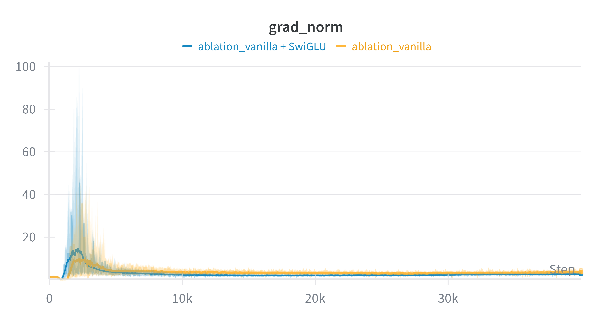

# CS336 作业 1：从零构建 Transformer 语言模型

本项目实现了一个 GPT 风格的 Decoder-only Transformer 语言模型，使用 PyTorch 原生构建（避免使用 `nn.Transformer` 等封装模块）。该项目旨在探索大语言模型（LLM）架构的演变，通过对比 2017 年最初的 Transformer 设计与现代 Llama 风格的改进。

## 核心特性

- **分词器 (Tokenizer)**：在 TinyStories/OpenWebText 数据集上训练的自定义字节对编码（BPE）分词器。
- **模型架构**：
  - **现代组件**：RoPE（旋转位置编码）、RMSNorm、SwiGLU 激活函数。
  - **传统支持**：可配置支持绝对可学习位置编码/正余弦位置编码、LayerNorm 和 ReLU。
- **优化**：自定义实现的 `AdamW` 优化器和带有数值稳定性技巧的交叉熵损失函数（Cross-Entropy Loss）。
- **效率**：支持 `torch.compile` 和混合精度训练（AMP）。

## 消融实验与洞察

我们在 OpenWebText数据集上进行了一些消融实验，以理解现代架构选择的影响。

###  实验基准设置 (Experimental Setup)

为了确保对比的公平性，所有消融实验均基于以下基准超参数进行（除非特定实验中另有说明）：

- **数据集**: OpenWebText (Subset)

- **模型规模**: ~16M 参数

  - $d_{model} = 256$, $n_{layers} = 4$, $n_{heads} = 4$

- **训练配置**:

  - Context Length: 256 (用于快速迭代) / 1024 (用于验证长序列性能)

  - Max Steps: 40,000

  - Batch Size: 64

  - Weight_Tying: True

  - Max Learning Rate: 3e-4 (Cosine Schedule with Warmup)

    

### 架构演进分析 (Architectural Evolution Analysis)

Transformer 架构自 2017 年提出以来，经历了从原始设计（Vanilla）到现代主流（Modern, e.g., Llama）的显著演进。为了直观地展示这种演进的价值，我们首先对比了完全体的“现代架构”与“原始架构”在小参数下的性能：


<p align="center">(上图对比了现代架构（Modern）与原始架构（Vanilla）的验证集 Loss 和梯度范数。可以看到现代架构在收敛速度和训练稳定性上具有压倒性优势。)<p>


这种演进并非偶然，而是为了解决**训练稳定性**和**模型表达能力**这两个核心痛点。下面的实验旨在解构这一过程：

1. **稳定性的博弈：Post-Norm vs. Pre-Norm** 原始 Transformer 采用 **Post-Norm** 结构（`Norm(x + attn(x))`），理论上保留了更强的梯度流，但在深层网络初始化阶段极易导致梯度爆炸或消失，使得训练对超参数（如学习率、Warmup）极其敏感。现代架构普遍转向 **Pre-Norm**（`x + attn(Norm(x))`），配合 **RMSNorm**，通过将归一化置于残差分支内，创造了梯度的“高速公路”，显著提升了训练初期的稳定性。

2. **位置感知的进化：绝对 vs. 相对** 从**绝对位置编码**（Sinusoidal/Learned）转向**旋转位置编码（RoPE）**是另一大飞跃。绝对位置编码将位置信息强加于 Token Embedding，存在“冷启动”问题且难以捕捉长距离的相对关系。RoPE 通过旋转操作将相对位置信息注入 Attention 机制，赋予了模型更强的长度外推能力和更快的收敛速度。

3. **激活函数的效能** 从 **ReLU** 到 **SwiGLU** 的转变，通过引入门控机制（Gating），增加了非线性变换的丰富度，虽然参数量略有增加，但换来了更优的收敛效果。

   

### 1. 训练稳定性：Post-Norm 与 Pre-Norm 对比

**假设**：与 Pre-Norm（GPT-2/Llama 采用）相比，Post-Norm 架构（原始 Transformer 采用）在早期训练阶段容易出现梯度不稳定的问题。


<center>上图展示了训练过程中的loss和梯度范数。</center>

**观察**：橙色线条**(原生/Post-Norm)**在预热（warmup）结束后表现出剧烈的不稳定性和梯度尖峰，而蓝色线条**(现代/Pre-Norm)**则保持稳定。这证实了 Post-Norm 在深层网络训练初期的不稳定性。


### 2. 位置编码策略对比分析：RoPE, NoPE, Sinusoidal 与 Learned

**背景**：在原始 Transformer（Post-Norm）的基础上，控制其他变量不变，对比了四种位置编码配置的效果：RoPE（旋转位置编码）、NoPE（无位置编码）、Sinusoidal（正余弦绝对位置）和 Learned（可学习绝对位置）。


<p align="center">上图从上到下依次为：训练集 Loss、验证集 Loss、梯度范数。</p>


**观察**： 

**A. Loss 曲线分析 (Training & Validation Loss)** 观察验证集 Loss 曲线，我们可以看到明显的性能分层：

1. **RoPE (绿色, Green)**：收敛速度最快，最终 Loss 最低。证明了将相对位置信息注入注意力机制的有效性。
2. **NoPE (深蓝, Dark Blue)**：令人惊讶的是，在当前实验设置（较短上下文长度 256）下，不使用任何显式位置编码的模型表现优于传统的绝对位置编码。这表明因果掩码 (Causal Mask) 本身已泄露了足够的隐式位置信息供模型学习。
3. **Sinusoidal (橙色, Orange)**：作为 Baseline，表现中规中矩。
4. **Learned Absolute (浅蓝, Light Blue)**：表现最差，收敛最慢。这体现了“冷启动”问题——模型需要消耗早期的训练步数来从零学习位置向量的顺序关系，拖慢了语义学习的进程。

**B. 梯度范数分析 (Gradient Norm)** 观察梯度范数曲线，出现两极分化的现象：

1. **不稳定组 (Additive PE)**：**Sinusoidal (橙色)** 和 **Learned (浅蓝)** 都使用了加性位置编码（`x + pos_emb(x)`）。它们在训练初期（Warmup 结束时）都出现了剧烈的梯度震荡和尖峰。这表明将位置向量直接**相加**到词嵌入中，显著增加了 Post-Norm 架构中残差流的方差，导致优化困难。
2. **稳定组 (Non-Additive)**：**RoPE (绿色)** 和 **NoPE (深蓝)** 的梯度范数都极其平稳。RoPE 采用旋转（乘性）操作，不改变向量模长；NoPE 则完全没有引入额外的位置向量干扰。

**结论**：RoPE 结合了“乘性操作的训练稳定性”和“显式的相对位置几何信息”，因此在该组对比中取得了最佳的综合性能。


### 3. 权重绑定 (Weight Tying) 的影响

**分析**：将嵌入层（Embedding layer）和语言模型头（LM Head/输出层）的权重绑定可以显著减少参数量，但也可能限制表示能力。我们的实验表明... [在此添加您的发现]


### 4. 激活函数影响

在原始Transformer的基础上，控制参数量和其他因素不变，对比了几种激活函数对性能的影响

**假设**：SwiGLU（SiLU + 门控机制）相比于传统的 ReLU，通过引入门控线性单元增加了非线性表达能力，通常能带来更优的收敛效果。




<p align="center">上图对比了 SwiGLU (蓝色) 与原始 ReLU (橙色) 的训练与验证 Loss。</p>

**观察**：

1. **收敛优势**：从 Loss 曲线可以看出，**SwiGLU (蓝色)** 相比 **ReLU (橙色)** 具有更快的收敛速度和更低的最终 Loss。这验证了门控机制在提升模型性能方面的有效性。
2. **规模效应 (Scale Effect)**：值得注意的是，虽然 SwiGLU 表现更优，但在当前的小参数规模（~17M）下，其带来的性能提升幅度相比于位置编码（RoPE）的改进显得较小。
   - 这可能是因为在小模型中，参数量的限制使得模型难以充分利用 SwiGLU 带来的额外表达能力。通常在更大规模的模型（如 Llama-70B）中，SwiGLU 的优势会更加显著。

## 使用方法

### 1. 环境设置 (Setup)

官方推荐使用 `uv` 进行环境管理以确保可复现性。

```bash
# 安装 uv (如果尚未安装)
pip install uv

# 从uv.lock同步环境，如果是5090需要手动安装最新的torch和相应库
uv sync
```

### 2. 运行测试 (Run Unit Tests)

本项目包含Stanford官方给出的完整的单元测试，用于验证各个组件（Attention, RMSNorm 等）的正确性，编写代码的时候，调整adapter.py中的接口，并运行下方命令即可

Windows环境下需要注释掉tests/test_tokenizer.py 的 import resource语句

另外，由于Windows与Linux的多进程运行方式不同，Windows上由于多进程分发耗时原因无法通过官方 1.5s speed test, 在Linux环境中speed_test用时在0.4-0.6秒左右。

```
uv run pytest # 一次性运行全部测试
uv run pytest -k test_{name}.py # 测试单个场景
```


### 3. 数据准备与解压 (Download Data)

在开始训练之前，需要下载 TinyStories 和 OpenWebText 数据集。请运行以下命令：

```bash
mkdir -p data
cd data

# 下载 TinyStories (用于快速实验)
wget https://huggingface.co/datasets/roneneldan/TinyStories/resolve/main/TinyStoriesV2-GPT4-train.txt
wget https://huggingface.co/datasets/roneneldan/TinyStories/resolve/main/TinyStoriesV2-GPT4-valid.txt

# 下载 OpenWebText 样本 (用于进阶实验)
wget https://huggingface.co/datasets/stanford-cs336/owt-sample/resolve/main/owt_train.txt.gz
gunzip owt_train.txt.gz
wget https://huggingface.co/datasets/stanford-cs336/owt-sample/resolve/main/owt_valid.txt.gz
gunzip owt_valid.txt.gz

cd ..
```


### 4. 分词器训练 (Train BPE)

前后实现了两版BPE，分别为朴素版和优化版

环境：15 vCPU Intel(R) Xeon(R) Platinum 8474C，使用14进程，80GB RAM，ubuntu22.04

#### 编码

| 数据集文件                       | Token 总数    | 版本       | 总耗时 (秒) | 吞吐量 (k tokens/s) | 加速比 (相比朴素版) |
| -------------------------------- | ------------- | ---------- | ----------- | ------------------- | ------------------- |
| **TinyStoriesV2-GPT4-train.txt** | 547,725,817   | 朴素版     | 219.56      | 2,494.62            | -                   |
|                                  |               | **优化版** | **31.42**   | **17,430.98**       | **~6.99x**          |
|                                  |               |            |             |                     |                     |
| **TinyStoriesV2-GPT4-valid.txt** | 5,532,654     | 朴素版     | 4.84        | 1,142.19            | -                   |
|                                  |               | **优化版** | **3.12**    | **1,773.08**        | **~1.55x**          |
|                                  |               |            |             |                     |                     |
| **owt_train.txt**                | 2,704,046,552 | 朴素版     | N/A         | N/A                 | -                   |
|                                  |               | **优化版** | **174.79**  | **15,470.62**       | -                   |
|                                  |               |            |             |                     |                     |
| **owt_valid.txt**                | 65,853,560    | 朴素版     | N/A         | N/A                 | -                   |
|                                  |               | **优化版** | **11.66**   | **5,649.66**        | -                   |

#### 训练

**朴素版测试结果**

upcoming...


##### 优化版测试结果

训练语料: TinyStoriesV2-GPT4-train.txt (59933个不同单词/预分词片段)  

词表大小: 10000 ,

运行时长: **13s**, 内存占用峰值**6.5GB**   vs   (官方预期<30min, <30GB RAM)


训练语料: owt_train.txt (6601892个不同单词/预分词片段)  

词表大小: 32000

运行时长: **8m 31s**, 内存占用峰值 **26.13GB**  vs  (官方预期<12hours , <100GB RAM)


训练方法: 在run_train_bpe.sh中指定好语料文件和词表长度，然后运行bash文件即可

```bash
chmod +x ./run_train_bpe.sh # 给予脚本文件权限
./run_train_bpe.sh
```


### 5. 数据预处理

为了提高训练效率，需要将原始文本文件（`.txt`）转换为二进制格式（`.bin`），其中包含分词器 encode 得到的 token ID序列。

运行下方脚本可以多进程预处理数据，其中在bash脚本中指定分词器读取文件的前缀和进程数量，在preprocess_training_data.py中修改要encode的文件列表

```
./preprocess_corpus.sh
```


### 6.训练与配置 (Training & Config)

模型可以通过 YAML 文件进行完全配置，配置文件存放于`configs`文件夹中。详细参数说明参见 `base_config.yaml`。

**训练一个现代 Llama 风格(PreNorm, RMSNorm, RoPE)的模型：**

```
python Train.py --config base_modern.yaml
```

**训练一个“复古”的 2017 风格模型（Post-Norm, ReLU, Sinusodial PE）：**

```
python Train.py --config base_vanilla.yaml
```

**运行消融实验：**

```
python Train.py --config experiments/ablation_{}.yaml
```


## 项目结构

├── asset/                                                                               # 实验记录与可视化 (WandB 曲线图等)
├── configs/                                                                           # 模型与训练配置文件
│   ├── base_modern.yaml                                                 # 现代架构基准配置 (Llama-style, RoPE, SwiGLU)
│   ├── base_vanilla.yaml                                                    # 原始架构配置 (Post-Norm, Sinusoidal PE, ReLU)
│   └── experiments/
│       └── ablation_{ablation_name}.yaml                                           # 用于消融实验的独立配置
├── cs336_basics/                                                                 # 核心源代码库
│   ├── model.py                                                                   # Transformer 核心组件 (Attention, RoPE, RMSNorm)
│   ├── optimizer.py                                                             # 手写 AdamW 优化器
│   ├── utils.py                                                                       # 基础工具 (Softmax, CrossEntropy, LR Schedule)
│   ├── checkpointing.py                                                     # 模型检查点保存与加载
│   ├── train.py                                                                      # 主训练循环 (集成 WandB)
│   ├── bpe_baseline.py                                                       # BPE 分词器 (Baseline 实现)
│   ├── bpe_fast.py                                                               # BPE 分词器 (优化版实现)
│   ├── profile_bpe.py                                                          # 对原始或优化的分词器进行效率分析
│   ├── train_bpe.py                                                             # BPE 训练入口脚本
│   ├── data.py                                                                      # 单进程 Dataloader (Memory Mapping)
│   ├── fast_data.py                                                              # 多进程 Dataloader
│   ├── preprocess_training_data.py                                 # 语料预处理与二进制化脚本
│   ├── pretokenization_example.py                                 # 官方给出的多进程文本分块边界处理代码
│   ├── generation_utils.py                                                  # 文本生成核心逻辑 (Top-k, Temp)
│   └── generate.py                                                               # 推理生成入口脚本
├── tests/                                                                                # 单元测试目录
│   ├── adapter.py                                                                 # 官方测试接口适配器
│   └── ...                                                                                 # 官方测试用例
├── cs336_spring2025_assignment1_basics.pdf             # 官方作业 Handout (英文)
├── [翻译]cs336_spring2025_assignment1_basics.pdf   # 作业 Handout (中文翻译)
├── run_train.sh                                                                    # 启动脚本：模型训练
├── run_generate.sh                                                            # 启动脚本：文本生成
├── run_train_bpe.sh                                                           # 启动脚本：分词器训练
└── uv.lock                                                                             # Python 环境依赖锁定文件,在较新的 (如Blackwell架构) GPU上不适配


## 参考文献

- Vaswani et al., "Attention Is All You Need" (2017)
- Su et al., "RoFormer: Enhanced Transformer with Rotary Position Embedding" (2021)
- Touvron et al., "LLaMA: Open and Efficient Foundation Language Models" (2023)
