[](README.md)   

# CS336 作业 1：从零构建 Transformer 语言模型

本项目实现了一个 GPT 风格的 Decoder-only Transformer 语言模型，使用 PyTorch 原生构建（避免使用 `nn.Transformer` 等封装模块）。该项目旨在探索大语言模型（LLM）架构的演变，通过对比 2017 年最初的 Transformer 设计与现代 Llama 风格的改进。

## 核心特性

- **分词器 (Tokenizer)**：在 TinyStories/OpenWebText 数据集上训练的自定义字节对编码（BPE）分词器。

- **模型架构**：
  
  - **现代组件**：RoPE（旋转位置编码）、RMSNorm、SwiGLU 激活函数。
  - **传统支持**：可配置支持绝对可学习位置编码/正余弦位置编码、LayerNorm 和 ReLU。
  
- **优化**：自定义实现的 `AdamW` 优化器和带有数值稳定性技巧的交叉熵损失函数（Cross-Entropy Loss）。

- **效率**：支持 `torch.compile` 和混合精度训练（AMP）。

  

## 消融实验与洞察

在 OpenWebText数据集上基于Transformer架构进行了一些消融实验，以理解现代架构选择的影响。

###  实验基准设置 (Experimental Setup)

为了确保对比的公平性，所有消融实验均基于以下基准超参数进行（除非特定实验中另有说明）：

- **数据集**: OpenWebText (Subset)

- **模型规模**: ~16M 参数

  - $d_{model} = 256$, $n_{layers} = 4$, $n_{heads} = 4$

- **训练配置**:

  - Context Length: 256 (用于快速迭代) / 1024 (用于验证长序列性能)

  - Max Steps: 40,000

  - Batch Size: 64

  - Weight_Tying: True

  - Max Learning Rate: 3e-4

  - Min Learning Rate:  3e-5
  
    

### 架构演进分析 (Architectural Evolution Analysis)

Transformer 架构自 2017 年提出以来，经历了从原始设计（Vanilla）到现代主流（Modern, e.g., Llama）的显著演进。为了直观地展示这种演进的价值，我们首先对比了完全体的“现代架构”与“原始架构”在小参数下的性能：

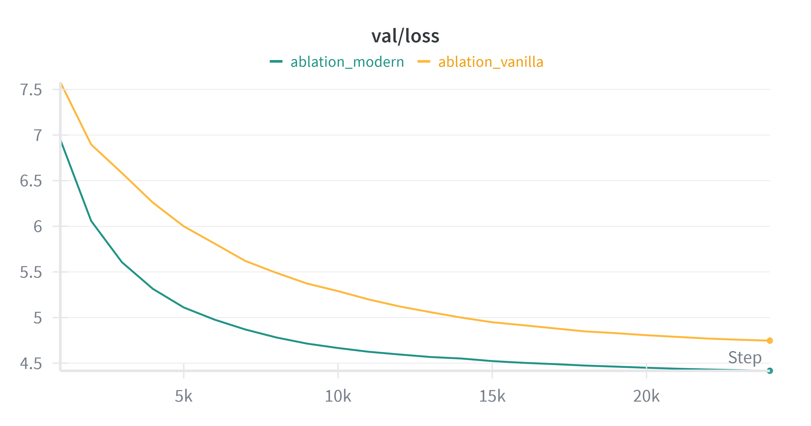

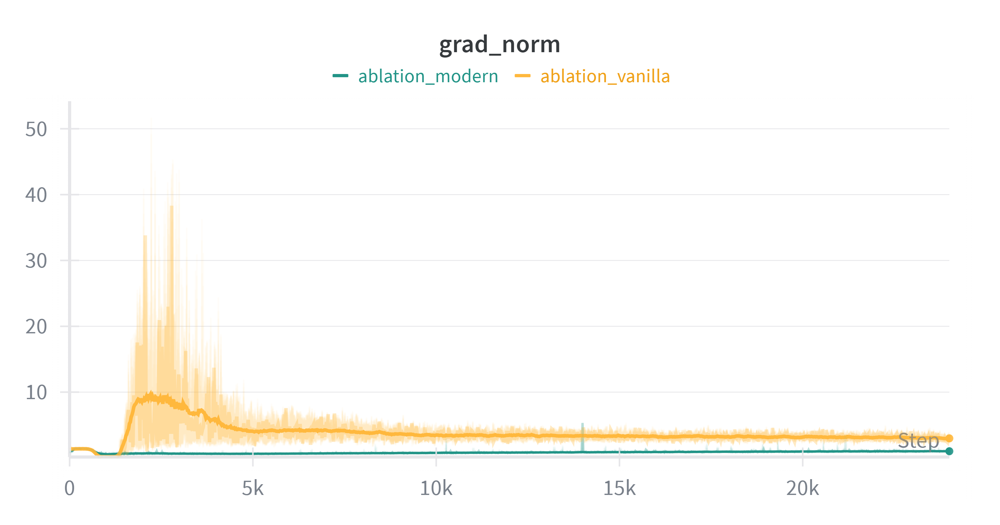

<p align="center">(上图对比了现代架构（Modern）与原始架构（Vanilla）的验证集 Loss 和梯度范数。可以看到现代架构在收敛速度和训练稳定性上具有压倒性优势。)<p>


这种演进并非偶然，而是为了解决**训练稳定性**和**模型表达能力**这两个核心痛点。下面的实验旨在解构这一过程：

1. **稳定性的博弈：Post-Norm vs. Pre-Norm** 原始 Transformer 采用 **Post-Norm** 结构（`Norm(x + attn(x))`），理论上保留了更强的梯度流，但在深层网络初始化阶段极易导致梯度爆炸或消失，使得训练对超参数（如学习率、Warmup）极其敏感。现代架构普遍转向 **Pre-Norm**（`x + attn(Norm(x))`），配合 **RMSNorm**，通过将归一化置于残差分支内，创造了梯度的“高速公路”，显著提升了训练初期的稳定性。

2. **位置感知的进化：绝对 vs. 相对** 从**绝对位置编码**（Sinusoidal/Learned）转向**旋转位置编码（RoPE）**是另一大飞跃。绝对位置编码将位置信息强加于 Token Embedding，存在“冷启动”问题且难以捕捉长距离的相对关系。RoPE 通过旋转操作将相对位置信息注入 Attention 机制，赋予了模型更强的长度外推能力和更快的收敛速度。

3. **激活函数的效能** 从 **ReLU** 到 **SwiGLU** 的转变，通过引入门控机制（Gating），增加了非线性变换的丰富度，配合调整隐藏层的维度，在参数量少量增加的条件下换来了更优的收敛效果。

   

### 1. 训练稳定性：Post-Norm 与 Pre-Norm 对比

**假设**：与 Pre-Norm（GPT-2/Llama 采用）相比，Post-Norm 架构（原始 Transformer 采用）在早期训练阶段容易出现梯度不稳定的问题。

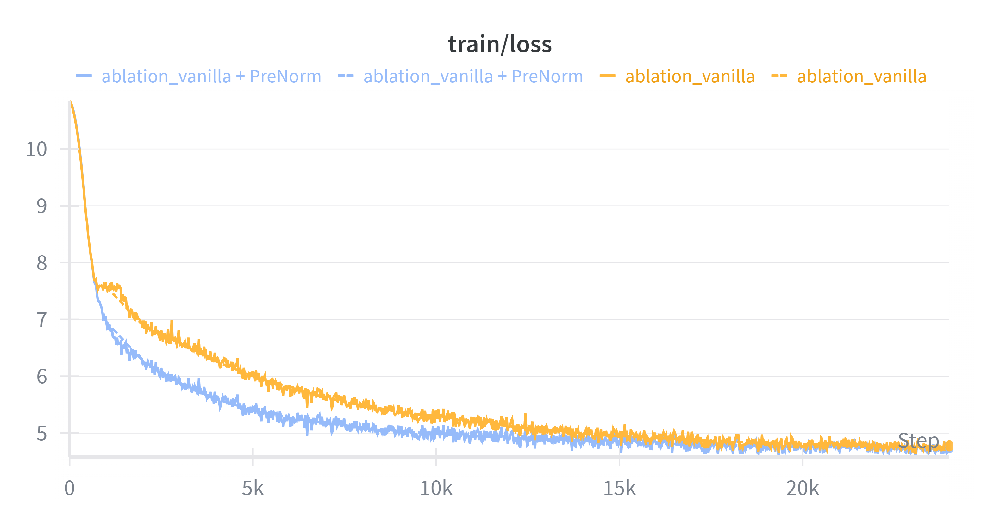


<center>上图展示了训练过程中的loss和梯度范数。</center>

**观察**：橙色线条**(原生/Post-Norm)**在预热结束后表现出剧烈的不稳定性和梯度尖峰，而蓝色线条**(现代/Pre-Norm)**则保持稳定。这证实了 Post-Norm 在深层网络训练初期的不稳定性。


### 2. 位置编码策略对比分析：RoPE, NoPE, Sinusoidal 与 Learned

**实验设置**：在原始 Transformer（Post-Norm）的基础上，控制其他变量不变，对比了四种位置编码配置的效果：RoPE（旋转位置编码）、NoPE（无位置编码）、Sinusoidal（正余弦绝对位置）和 Learned（可学习绝对位置）。

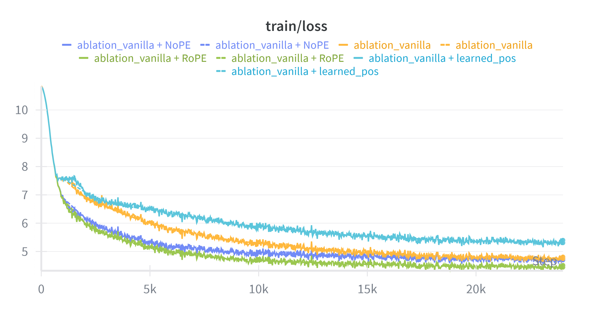

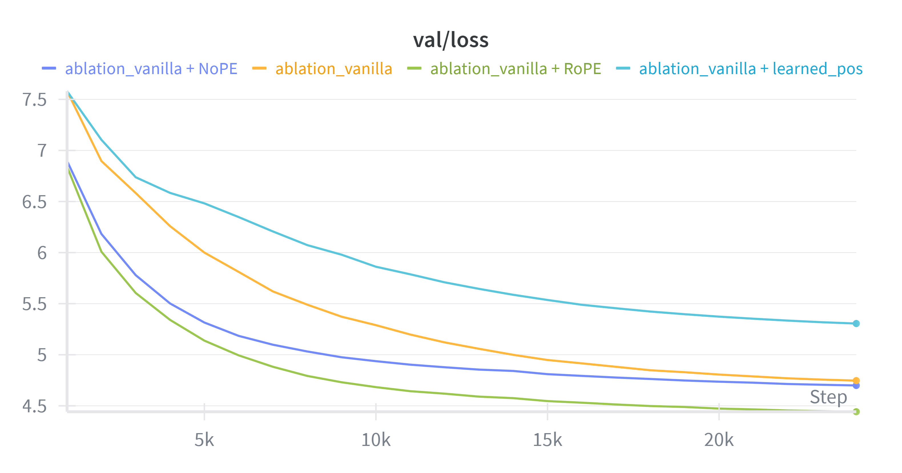

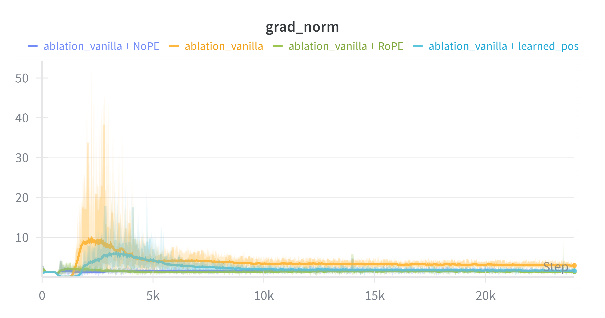

<p align="center">上图从上到下依次为：训练集 Loss、验证集 Loss、梯度范数。</p>


**观察**： 

**A. Loss 曲线分析 (Training & Validation Loss)** 观察验证集 Loss 曲线，我们可以看到明显的性能分层：

1. **RoPE (绿色, Green)**：收敛速度最快，最终 Loss 最低。证明了将相对位置信息注入注意力机制的有效性。
2. **NoPE (深蓝, Dark Blue)**：令人惊讶的是，在当前实验设置（较短上下文长度 256）下，不使用任何显式位置编码的模型表现优于传统的绝对位置编码。这表明因果掩码 (Causal Mask) 本身已泄露了足够的隐式位置信息供模型学习。
3. **Sinusoidal (橙色, Orange)**：作为 Baseline，表现中规中矩。
4. **Learned Absolute (浅蓝, Light Blue)**：表现最差，收敛最慢。这体现了“冷启动”问题——模型需要消耗早期的训练步数来从零学习位置向量的顺序关系，拖慢了语义学习的进程。

**B. 梯度范数分析 (Gradient Norm)** 观察梯度范数曲线，出现两极分化的现象：

1. **不稳定组 (Additive PE)**：**Sinusoidal (橙色)** 和 **Learned (浅蓝)** 都使用了加性位置编码（`x + pos_emb(x)`）。它们在训练初期（Warmup 结束时）都出现了剧烈的梯度震荡和尖峰。这表明将位置向量直接**相加**到词嵌入中，显著增加了 Post-Norm 架构中残差流的方差，导致优化困难。
2. **稳定组 (Non-Additive)**：**RoPE (绿色)** 和 **NoPE (深蓝)** 的梯度范数都极其平稳。RoPE 采用旋转（乘性）操作，不改变向量模长；NoPE 则完全没有引入额外的位置向量干扰。

**结论**：RoPE 结合了“乘性操作的训练稳定性”和“显式的相对位置几何信息”，因此在该组对比中取得了最佳的综合性能。


### 3. 权重绑定 (Weight Tying) 的影响

**实验设置**：本实验在 Vanilla (Post-Norm) 架构基础上，对比了两种嵌入层策略，即**Tied (黄色)**: 输入 Embedding 与输出 LM Head 共享参数，和**unTied (红色)**: 输入与输出使用两个独立的矩阵。Tied配置下参数量为28.9M，UnTied配置下为16M。

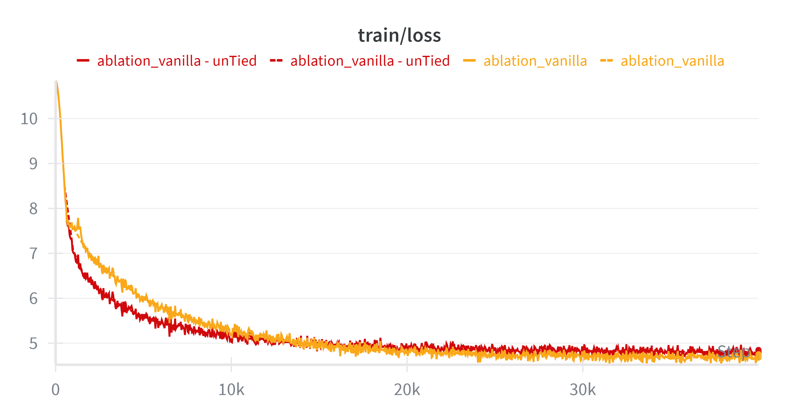

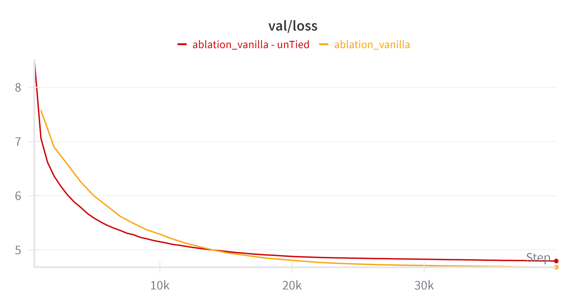

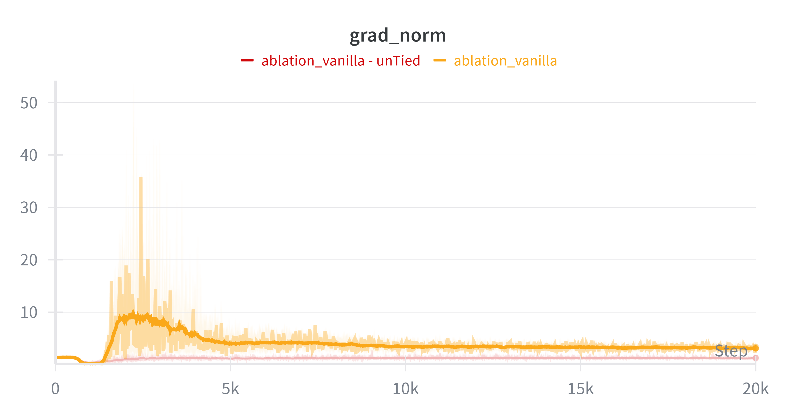

**观察**：

1. **泛化性上绑定的最终胜利**：观察 `val/loss` 曲线，**Tied 模型 (黄色)** 最终收敛到的 Loss (4.67) 明显低于 **Untied 模型 (红色)** (4.79)。这表明权重绑定有效地充当了正则化手段，通过减少参数量防止了过拟合，提升了模型在验证集上的表现。

 2. **梯度稳定性的代价**：观察 `grad_norm` 曲线，发现了一个反直觉的现象：**Untied 模型 (红色)** 的梯度范数在整个训练过程中异常平稳，几乎没有波动，而**Tied 模型 (黄色)** 在训练初期（Warmup 阶段）经历了剧烈的 **梯度尖峰 (Gradient Spikes)**，表现出显著的不稳定性。

    

**分析**：

在当前小模型，数据受限的情况下，模型表现出了解除绑定时梯度更稳，而绑定时结果更好的特征。可以尝试从梯度传播和模块职责的角度进行分析。

1. **梯度传播角度：结构解耦与缓冲**

   在权重非绑定（Untied）的配置下，输入嵌入层与输出分类层在物理上实现了结构解耦。反向传播时，源自输出端的预测误差梯度不会直接回传并冲击输入表征，这种物理隔断为优化过程提供了天然的缓冲，从而赋予了模型极佳的初期训练稳定性。而在在权重绑定（Tied）配置下，同一组参数必须同时承载来自网络“头”（特征提取）和“尾”（对数概率预测）的双重梯度流，这种直接的反馈回路导致了训练初期梯度方差的剧烈波动。

2. **模块职责角度：多目标优化的摩擦**

   在 Tied 配置中，绑定的嵌入矩阵必须同时满足两个目标：既要作为输入提供稳健的连续语义空间，又要作为输出提供精细可分的离散分类边界。在训练初期，这两个目标的梯度方向往往可能存在正交甚至冲突的趋势，导致了观察到的梯度震荡现象。

3. **小规模场景分析：归纳偏置的红利**

   在当前模型规模较小且训练数据多样性受限的实验环境下，权重绑定策略虽然牺牲了初期稳定性，但引入了至关重要的归纳偏置——即假设输入语义空间与输出语义空间是同构的。这种强约束迫使模型在受限的参数空间内学习更紧凑、更本质的语义表示，从而有效地起到了正则化作用，转化为在当前数据范围下更优的泛化能力。

4. **大规模场景推演：语义异构的必要性**

   然而若扩展至海量数据驱动的大模型训练场景，输入文本的上下文语义与预测目标的分布语义可能存在细微的语义偏差。此时，非绑定策略（Untied）不再受限于同构约束，且拥有更大的参数容量去独立建模这种输入输出的非对称性。在数据极其充足的情况下，这种更高的表达自由度有望捕捉更广泛的语义特征，从而在长程训练中取得超越绑定策略的性能上限。

**结论**：

综上所述，权重绑定不应被简单视为一种单纯的架构优劣选择，而是一种取决于“数据-参数规模”的战略性权衡。本质上，权重绑定是一种**强正则化手段**，它通过强制输入输出空间的同构性，以牺牲训练初期的优化稳定性为代价，换取了小样本/小参数下的泛化收益。在资源受限（如本实验）的场景下，这种“归纳偏置”是防止过拟合、提升数据效率的关键，其收益远超优化摩擦带来的成本。而在资源充沛的大模型场景下，解除这种结构性束缚可能才是释放模型最大表达潜力、逼近更高性能上限的必要路径。


### 4. 激活函数影响

**实验设置**：为了探究激活函数对模型性能的独立影响，我们在控制模型参数量（**~77M/16M for SwiGLU vs. ~76M/16M for ReLU**）的前提下，对比了 **SwiGLU** (SiLU + 门控机制) 与传统 **ReLU** 在两种不同架构基座（Modern vs. Vanilla）上的表现

**假设**：SwiGLU（SiLU + 门控机制）相比于传统的 ReLU，通过引入门控线性单元增加了非线性表达能力，通常能带来更优的收敛效果。

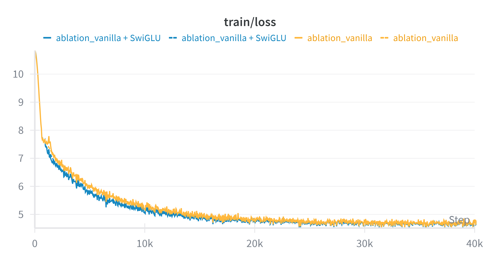

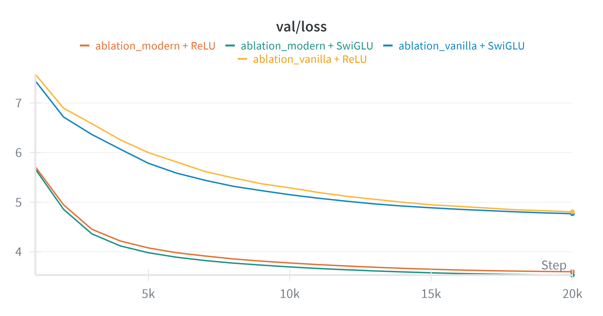

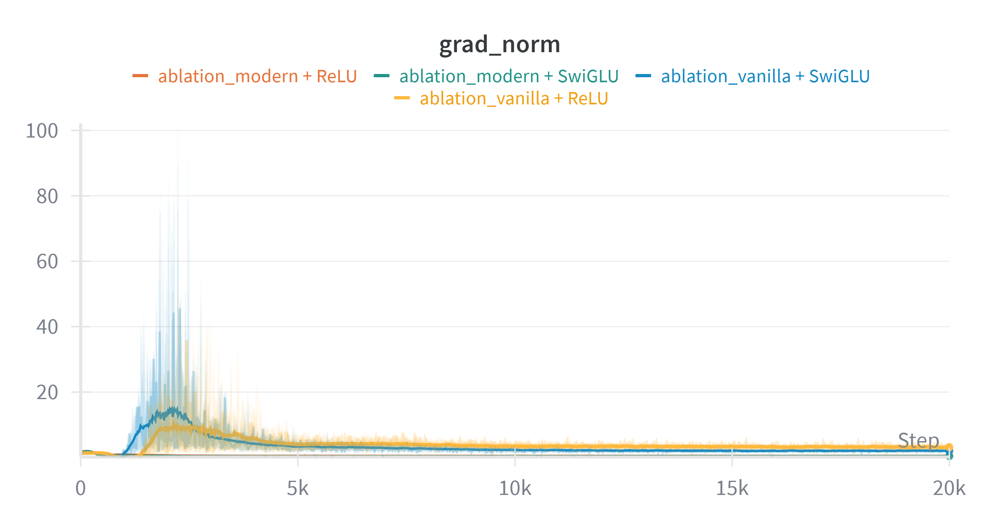

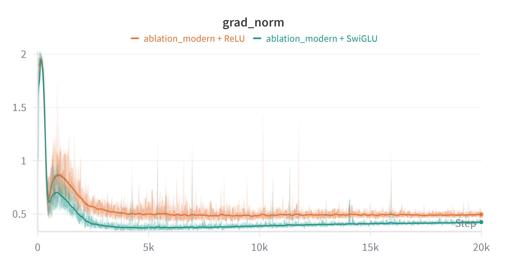

<p align="center">上图对比了两种基底参数下的不同激活函数的表现</p>
<p align="center">包括基于原始Transformer架构的SwiGLU (蓝色) 与ReLU (黄色) 的训练与验证 Loss以及梯度范数。</p>
<p align="center">和基于现代Transformer架构的SwiGLU (墨绿) 与ReLU (橙色) 的训练与验证 Loss以及梯度范数。</p>

**观察**：

**1. 收敛性能的绝对优势 (Performance Superiority)**

​	**等参数下的性能提升**: 在几乎相同的参数规模下，搭载 **SwiGLU** 的模型（绿色/蓝色曲线）在验证集 Loss 上始终显著优于 **ReLU** 模型（橙色/黄色曲线）。

​	**Gap 的一致性**: 这种性能优势在 Modern 架构下尤为明显。**Modern + SwiGLU (绿色)** 展现出了最陡峭的下降斜率和最低的收敛值，证明了门控线性单元（GLU）在同等计算预算下具有更高的**信息编码效率**。

**2. 梯度稳定性的优势 (Gradient Stability Advantage)**

- **架构的基准作用**: 首先，`grad_norm` 图表证实了 Modern (Pre-Norm) 架构（绿/橙）成功消除了 Vanilla (Post-Norm) 架构（蓝/黄）在训练初期剧烈的梯度尖峰，验证了 Pre-Norm 在深层网络优化中的必要性。

- **SwiGLU 的“稳压器”效应**: 更值得注意的是，即使在已经很稳定的 Modern 架构内部，**SwiGLU (绿色)** 的梯度范数依然比 **ReLU (橙色)** 更低且更平滑。

  - 通常认为引入更复杂的门控结构可能会增加优化的复杂性，但实验表明，SwiGLU 的乘性交互似乎创造了更平滑的地形，使得模型在更新参数时更加稳健。

    

**结论**：实验较有力地证明了 SwiGLU 的优势并非源于参数量的增加（已控制在 ~76M vs ~77M 与 16M vs 16M），而是源于其结构本身。SwiGLU 不仅通过特征门控机制提升了模型的**非线性表达能力**，还意外地带来了**额外的梯度稳定性收益**。这使其成为现代 LLM 架构中无可争议的首选激活函数。


### 基础设施(BPE)效率测试

本次实验实现并对比了朴素版（Naive）与优化版（Fast）两套 BPE 。两者在算法设计上存在根本差异，并体现于训练时的合并策略与编码时的推断效率上。

#### 环境：

15 vCPU Intel(R) Xeon(R) Platinum 8474C，使用14进程，80GB RAM，ubuntu22.04


#### 1. 训练阶段 (Training Phase)

训练过程的核心瓶颈在于统计词频与执行成千上万次 Merge 操作。

- **朴素版实现**：
  - **串行预分词**：使用单进程进行正则匹配与统计，受限于 Python GIL，无法利用多核性能。
  - **全量扫描与更新**：在每一轮 Merge 中，算法需要遍历整个 `pair_counts` 寻找最高频对（$O(|P|)$），确定合并对后，又需**遍历整个词表**（Vocabulary）来定位并更新包含该 Pair 的单词。这种双重遍历导致复杂度随词表与 Merge 数量线性增长，效率极低。
- **优化版实现**：
  - **并行预分词**：引入 `multiprocessing` 模块，利用多个 Worker 并行处理文件切片，显著突破了 I/O 与正则计算瓶颈。
  - **倒排索引与桶排序**：
    1. 构建 **倒排索引 (`_pair_index`)**：维护 `Pair -> List[Word]` 的映射。合并时仅需 $O(1)$ 时间索引到特定单词进行局部更新，避免了全表扫描。
    2. 引入 **频率桶 (`_freq_buckets`)**：动态维护不同频率的 Pair 集合，将“寻找最佳合并对”的时间复杂度从线性的 $O(|P|)$ 降低至 $O(1)$。

##### **耗时测试**

分别在小规模 (10MB) 和中规模 (100MB) 数据集上进行了端到端测试。对于耗时过长的朴素版100M语料实验，采用了基于前 5% 进度的线性外推估算。

| 数据集 (大小)           | 目标词表 | 版本       | 预分词耗时 | BPE合并速度      | 总耗时    | 加速比     |
| :---------------------- | :------- | :--------- | :--------- | :--------------- | :-------- | :--------- |
| **TinyStories** (10MB)  | 4096     | 朴素版     | 3.99s      | 309 merge/s      | 16.42s    | -          |
|                         |          | **优化版** | **0.17s**  | **6233 merge/s** | **0.98s** | **~16.8x** |
|                         |          |            |            |                  |           |            |
| **OpenWebText** (100MB) | 32000    | 朴素版     | 30.02s     | ~7 merge/s       | > 1.2h*   | -          |
|                         |          | **优化版** | **1.46s**  | **1440 merge/s** | **29.8s** | **~166x**  |

> \* *注：OpenWebText 朴素版总耗时基于 7 merge/s 的平均速度进行估算。完整运行预计超过 1.3 小时，而优化版仅需 30 秒。*

##### **性能加速分析**

* **预分词加速 (Pre-tokenization)**: 得益于 `multiprocessing` 多进程并行与正则引擎优化，预分词阶段实现了 **~20x** 的加速 (30s $\to$ 1.5s @ 100MB)。
* **合并算法优化 (Merge Algorithm)**: 在大词表 (32k) 场景下，朴素算法因频繁的全量扫描导致性能衰减至 **个位数 (7 merge/s)**。优化版通过维护统计缓存与高效数据结构，在大规模合并后期依然保持了 **1440 merge/s** 的吞吐量，实现了 **~200倍** 的算法级加速。


**另外，根据handout的实验配置对优化版分词器进行测试，结果如下**

训练语料: TinyStoriesV2-GPT4-train.txt (59933个不同单词/预分词片段)  

词表大小: 10000 

运行时长: **13s**, 内存占用峰值 **6.5GB**   vs   (官方预期<30min, <30GB RAM)


训练语料: owt_train.txt (6601892个不同单词/预分词片段)  

词表大小: 32000

运行时长: **8m 31s**, 内存占用峰值 **26.13GB**  vs  (官方预期<12hours , <100GB RAM)


#### 2. 编码阶段 (Encoding Phase)

编码是将新文本转化为 Token ID 的过程，需根据 Merge 规则不断合并字符。

- **朴素版实现**：
  - 对每个单词的字符序列，通过循环反复遍历当前所有可能的相邻 Pair，比对优先级并执行合并。对于长文本或高频词，这种重复计算存在大量冗余。
- **优化版实现**：
  - **最小堆加速 (Min-Heap)**：在处理单个单词内部的合并逻辑时，使用优先队列（Min-Heap）动态管理相邻 Pair 的合并优先级，极大减少了无效的扫描次数。
  - **缓存机制 (Caching)**：实现了 LRU 风格的 `cache`，存储常见单词（Word）到 Token ID 序列的映射。对于语料中重复出现的高频词，直接查表返回结果，跳过复杂的计算过程。


##### 吞吐量测试

| 数据集文件                       | Token 总数    | 版本       | 总耗时 (秒) | 吞吐量 (k tokens/s) | 加速比 (相比朴素版) |
| -------------------------------- | ------------- | ---------- | ----------- | ------------------- | ------------------- |
| **TinyStoriesV2-GPT4-train.txt** | 547,725,817   | 朴素版     | 219.56      | 2,494.62            | -                   |
|                                  |               | **优化版** | **31.42**   | **17,430.98**       | **~6.99x**          |
|                                  |               |            |             |                     |                     |
| **TinyStoriesV2-GPT4-valid.txt** | 5,532,654     | 朴素版     | 4.84        | 1,142.19            | -                   |
|                                  |               | **优化版** | **3.12**    | **1,773.08**        | **~1.55x**          |
|                                  |               |            |             |                     |                     |
| **owt_train.txt**                | 2,704,046,552 | 朴素版     | 2169.38     | 1246.46             | -                   |
|                                  |               | **优化版** | **174.79**  | **15,470.62**       | **~12.46x**         |
|                                  |               |            |             |                     |                     |
| **owt_valid.txt**                | 65,853,560    | 朴素版     | 39.48       | 1,661.13            | -                   |
|                                  |               | **优化版** | **11.66**   | **5,649.66**        | **~3,40x**          |


## 使用方法

### 1. 环境设置 (Setup)

官方推荐使用 `uv` 进行环境管理以确保可复现性。

```bash
# 安装 uv (如果尚未安装)
pip install uv

# 从uv.lock同步环境，如果是5090需要手动安装最新的torch和相应库
uv sync
```

### 2. 运行测试 (Run Unit Tests)

本项目包含Stanford官方给出的完整的单元测试，用于验证各个组件（Attention, RMSNorm 等）的正确性，编写代码的时候，调整adapter.py中的接口，并运行下方命令即可

Windows环境下需要注释掉tests/test_tokenizer.py 的 import resource语句

另外，由于Windows与Linux的多进程运行方式不同，Windows上由于多进程分发耗时原因无法通过官方 1.5s speed test, 在Linux环境中speed_test用时在0.4-0.6秒左右。

```
uv run pytest # 一次性运行全部测试
uv run pytest -k test_{test_name}.py # 测试单个场景
```


### 3. 数据准备与解压 (Download Data)

在开始训练之前，需要下载 TinyStories 和 OpenWebText 数据集。请运行以下命令：

```bash
mkdir -p data
cd data

# 下载 TinyStories (用于快速实验)
wget https://huggingface.co/datasets/roneneldan/TinyStories/resolve/main/TinyStoriesV2-GPT4-train.txt
wget https://huggingface.co/datasets/roneneldan/TinyStories/resolve/main/TinyStoriesV2-GPT4-valid.txt

# 下载 OpenWebText 样本 (用于进阶实验)
wget https://huggingface.co/datasets/stanford-cs336/owt-sample/resolve/main/owt_train.txt.gz
gunzip owt_train.txt.gz
wget https://huggingface.co/datasets/stanford-cs336/owt-sample/resolve/main/owt_valid.txt.gz
gunzip owt_valid.txt.gz

cd ..
```


### 4. 分词器训练 (Train BPE)

训练方法: 在run_train_bpe.sh中指定好语料文件和词表长度，然后运行bash文件即可

```bash
chmod +x ./run_train_bpe.sh # 给予脚本文件权限
./run_train_bpe.sh
```


### 5. 数据预处理

为了提高训练效率，需要将原始文本文件（`.txt`）转换为二进制格式（`.bin`），其中包含分词器 encode 得到的 token ID序列。

运行下方脚本可以多进程预处理数据，其中在bash脚本中指定分词器读取文件的前缀和进程数量，在preprocess_training_data.py中修改要encode的文件列表

```
./preprocess_corpus.sh
```


### 6.训练与配置 (Training & Config)

模型可以通过 YAML 文件进行完全配置，配置文件存放于`configs`文件夹中。详细参数说明参见 `base_config.yaml`。

**训练一个现代 Llama 风格(PreNorm, RMSNorm, RoPE)的模型：**

```
python Train.py --config base_modern.yaml
```

**训练一个“复古”的 2017 风格模型（Post-Norm, ReLU, Sinusodial PE）：**

```
python Train.py --config base_vanilla.yaml
```

**运行消融实验：**

```
python Train.py --config experiments/ablation_{}.yaml
```


## 项目结构

```text
.
├── asset/                                          # 实验记录与可视化 (WandB 曲线图等)
├── configs/                                        # 模型与训练配置文件
│   ├── base_modern.yaml                            # 现代架构基准配置 (Llama-style, RoPE, SwiGLU)
│   ├── base_vanilla.yaml                           # 原始架构配置 (Post-Norm, Sinusoidal PE, ReLU)
│   └── experiments/
│       └── ablation_{ablation_name}.yaml           # 用于消融实验的独立配置
├── cs336_basics/                                   # 核心源代码库
│   ├── model.py                                    # Transformer 核心组件 (Attention, RoPE, RMSNorm)
│   ├── optimizer.py                                # 手写 AdamW 优化器
│   ├── utils.py                                    # 基础工具 (Softmax, CrossEntropy, LR Schedule)
│   ├── checkpointing.py                            # 模型检查点保存与加载
│   ├── train.py                                    # 主训练循环 (集成 WandB)
│   ├── bpe_baseline.py                             # BPE 分词器 (Baseline 实现)
│   ├── bpe_fast.py                                 # BPE 分词器 (优化版实现)
│   ├── profile_bpe.py                              # 对原始或优化的分词器进行效率分析
│   ├── train_bpe.py                                # BPE 训练入口脚本
│   ├── data.py                                     # 单进程 Dataloader (Memory Mapping)
│   ├── fast_data.py                                # 多进程 Dataloader
│   ├── preprocess_training_data.py                 # 语料预处理与二进制化脚本
│   ├── pretokenization_example.py                  # 官方给出的多进程文本分块边界处理代码
│   ├── generation_utils.py                         # 文本生成核心逻辑 (Top-k, Temp)
│   └── generate.py                                 # 推理生成入口脚本
├── tests/                                          # 单元测试目录
│   ├── adapter.py                                  # 官方测试接口适配器
│   └── ...                                         # 官方测试用例
├── cs336_spring2025_assignment1_basics.pdf         # 官方作业 Handout (英文)
├── [翻译]cs336_spring2025_assignment1_basics.pdf    # 作业 Handout (中文翻译)
├── run_train.sh                                    # 启动脚本：模型训练
├── run_generate.sh                                 # 启动脚本：文本生成
├── run_train_bpe.sh                                # 启动脚本：分词器训练
└── uv.lock                                         # Python 环境依赖锁定文件,在较新的 (如Blackwell架构) GPU上不适配
```


## 参考文献

- Vaswani et al., "Attention Is All You Need" (2017)
- Su et al., "RoFormer: Enhanced Transformer with Rotary Position Embedding" (2021)
- Touvron et al., "LLaMA: Open and Efficient Foundation Language Models" (2023)
