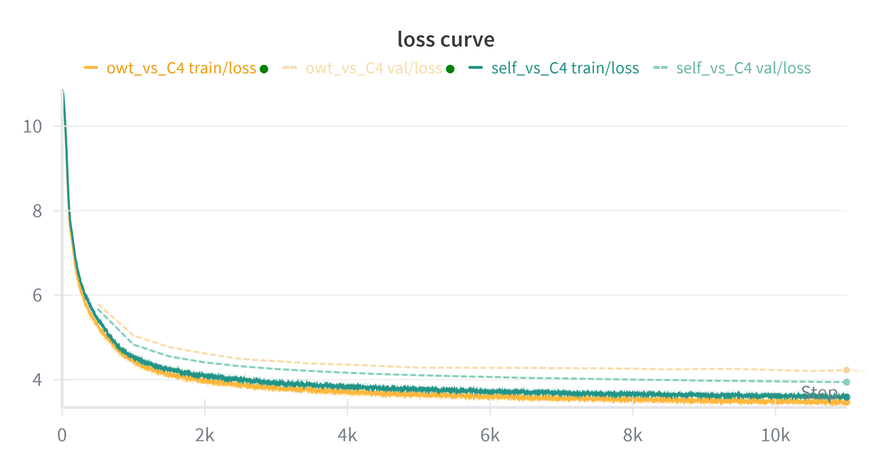

[](README.md)   

# CS336 作业4：语言模型数据过滤流水线


## 1. 项目概述

本项目旨在实现一个完整的、端到端的数据处理流水线，用于从 Common Crawl（通用爬取）语料库的原始网页数据中，清洗和筛选出适用于训练大型语言模型（LLM）的高质量数据集。该流水线采用模块化设计，涵盖了文本提取、多阶段内容与质量过滤，以及大规模数据去重等关键步骤。

本流水线的**架构设计**优化了对大规模数据集的处理能力，构建了一个**基于多进程并行（Multi-processing）的高并发系统**。核心改进包括：

1. **并行化架构**: 利用 ProcessPoolExecutor 对文本提取、过滤、签名计算及去重验证等计算密集型任务实现了全链路并行加速。

2. **内存优化**: 针对去重阶段的海量N-gram数据，引入了**惰性加载（Lazy Loading）**机制和Linux下的写时复制（COW）特性，在保证验证精度的同时显著降低了内存峰值。

3. **模块化与解耦**: 将核心算法（如MinHash、LSH、并查集聚类）封装为独立库，既支持单机高效运行，也为未来迁移至分布式集群（如Slurm/Submitit）预留了接口。

   

## 2. 核心概念与流水线设计

本项目的核心是构建一个模块化的数据处理流水线，旨在从海量的Common Crawl原始文本中，提炼出高质量语料。设计遵循“廉价过滤先行，昂贵处理置后”的效率原则，并在去重阶段采用了多种工程优化手段。


### 2.1 数据源策略 

本管道处理两种主要数据源，它们在流程中扮演不同角色：

**主要处理对象：Common Crawl (CC)**: 这是构成最终语言模型训练语料的主体。本项目的流水线被设计用于处理大规模的CC WET文件。

**高质量参照系：维基百科外部链接 (Wiki-cited Pages)**: 这部分数据作为训练**高质量文本分类器**的“黄金标准”（正样本），用于定义和筛选出互联网上信息密度和可信度较高的内容。


### 2.2 关键策略：对比学习的质量分类器

为了超越简单的启发式规则，**本项目的关键策略在于**训练了一个自定义的质量分类器。该分类器的训练旨在学习区分两种都算“良好”的文本，而不仅仅是“好”与“坏”：

*   **正样本 (`__label__wiki`)**: 来源于维基百科外部链接，且**通过了**一系列严格的初步筛选（语言、Gopher规则、内容安全等）。
*   **负样本 (`__label__cc`)**: 来源于通用的Common Crawl，但**同样也通过了**上述严格的筛选。

​	这种 **“精英 vs. 良好”** 的训练策略（由 `dataset_builder.py` 实现样本筛选，`train_quality_classifier.py` 执行训练）迫使模型去学习区分“引用级”文本和普通高质量网页之间，那些更深层次的文体、结构和词汇模式。这个分类器因此成为了整个流水线中体现**数据质量偏好**和**筛选目标**的核心。


### 2.3 主过滤流水线

流水线逻辑由 `pipeline.py` 编排，通过高度并行的策略执行以下核心步骤：

1. **并行初步过滤 (Parallel Filtering)**:
   - 采用 ProcessPoolExecutor 并发处理WET文件。
   - 每个文档独立经过**语言识别**、**NSFW/Toxic内容检测**、**Gopher规则**以及**自定义质量分类器**的筛选。
   - 使用  fastwarc 和 xxhash 库加速基础IO与哈希计算，确保“廉价过滤”阶段的高吞吐。
2. **全局精确行去重 (Exact Line Deduplication)**:
   - **目标**: 移除跨文档出现的“样板文字”（Boilerplate），如导航栏、页脚版权信息、通用广告语等。
   - **策略**: 采用两阶段算法。第一阶段并行扫描所有文档，通过哈希构建全局行频计数器；第二阶段重写文档，仅保留全局出现频率为 1 的行。这意味着任何重复出现的句子都会被剔除，从而大幅提升语料的独特性密度。
3. **模糊去重 (Fuzzy Deduplication - MinHash + LSH)**:
   - 针对内容高度相似但非完全一致的文档（如带有不同时间戳的新闻转载）。
   - **签名生成**: 并行计算文档的 n-gram MinHash 签名。
   - **LSH 候选发现**: 使用局部敏感哈希（LSH）将高维签名映射到哈希桶中，将$O(N^2)$的全量比较降维为仅对桶内冲突元素进行比较。
   - **惰性精确验证 (Lazy Jaccard Verification)**: 这是**内存优化的关键**。在验证LSH产生的候选对时，不预加载巨大的 N-gram 映射表到内存中，而是传递文件路径。子进程在验证时按需重新读取文件（Lazy Load）并现场计算 Jaccard 相似度。这种“以计算换内存”的策略消除了大规模去重时的内存瓶颈。
   - **聚类与筛选**: 使用并查集（Union-Find）将重复文档聚类，并按确定性规则（保留ID最小者）筛选出唯一文档。

4. **并行分片输出 (Parallel Sharding)**:

   - 不生成单一的巨大文本文件，而是将最终清洗干净的数据**并行写入**多个分片文件（Shards, e.g. corpus_shard_001.txt）。

   - 文档之间使用 <|endoftext|> 分隔符连接，直接适配大多数LLM训练框架（如GPT-NeoX, Megatron-LM），以及assignment1训练模型的数据加载需求。


## 3. 流水线成果与数据分析

本节展示了数据处理流水线在样本数据集上运行后的关键统计数据，并对其进行分析。这些数据量化了每个过滤阶段对原始Common Crawl数据的筛选效果，并验证了本管道设计的有效性。


### 3.1 小规模过滤阶段观察

以下数据是在一个包含 **545,744** 个文档的Common Crawl WET文件样本上，运行**并行初步过滤**后得到的统计结果：

| 过滤步骤                                | 移除的文档数 | 剩余文档数 | (移除)占余量的百分比 | 占总数的百分比 | 备注                       |
| :-------------------------------------- | :----------: | :--------: | :------------------: | :------------: | :------------------------- |
| **短文本过滤** (`short_count < 100`)    |    11,928    |  533,816   |        ~2.19%        |     ~2.19%     | 移除内容过少的页面         |
| **语言过滤** (`lang_failed`)            |   494,663    |   39,153   |       ~92.67%        |  **~90.64%**   | 过滤非英语或低置信度文本   |
| **NSFW内容过滤** (`nsfw_failed`)        |     129      |   39,024   |        ~0.33%        |    ~0.023%     | 移除NSFW内容               |
| **有害言论过滤**(`toxic_failed`)        |     264      |   38,760   |        ~0.67%        |    ~0.048%     | 移除Toxic内容              |
| **Gopher规则** (`gopher_failed`)        |    3,573     |   35,187   |        ~9.22%        |     ~0.65%     | 移除结构性低质量文本       |
| **自定义质量分类器** (`quality_failed`) |    29,362    |   5,825    |       ~83.44%        |     ~5.38%     | 移除“良好”但非“卓越”的文本 |
| **最终保留** (`kept`)                   |  **5,825**   |     -      |          -           |   **~1.07%**   | -                          |

#### 分析

1. CC原始数据的信噪比极低

   实验数据明确表明，原始Common Crawl数据中超过 **98%** 的内容不符合高质量标准。约 **1%** 的最终保留率与业界在构建大规模高质量语料库（如C4, RefinedWeb）时的发现高度一致，证明了本管道严格筛选的必要性和有效性。

2. 过滤器的作用分工明确

    **语言过滤器**是最高效的“粗筛”工具，仅此一项就剔除了绝大部分不相关的文档（~**90.64%**），符合 Common Crawl (CC) 原始分布。作为全网抓取的数据，CC包含了大量非英语、乱码、或者无法识别编码的网页。而其他过滤器（Gopher、有害内容等）作为重要的补充，捕捉了特定类型的低质量内容。

    **自定义质量分类器**则是最后但最关键的“精筛”工具。在所有通过了基础检查的文档中，它移除了超过八成（~83.44%）被判定为“非引用级”质量的内容，完美体现了本项目“精英 vs. 良好”的核心筛选策略。

   

### 3.2 规模化性能验证

为了验证流水线在处理实际生产级批次数据时的吞吐量与稳定性，采取官方的数据规模，选取了 Common Crawl 的一个**五千文件子集**进行规模化压力测试。旨在确立单节点在全负载状态下的性能基准。

#### 3.3.1 测试环境与配置

- **输入数据**: 5,000 个 Common Crawl WET 文件（包含约 1.34 亿条原始网页记录，原始压缩体积约 375GB）。
- **硬件环境**:
  - CPU: 32 vCPU (Intel Xeon Platinum)
  - RAM: 120GB
  - 并发进程数: 30
- **处理策略（严格模式）**:
  - 语言过滤 (FastText): 阈值 **0.9** (仅保留置信度极高的英文)
  - 内容安全: NSFW/Toxic 阈值 **0.99**
  - 去重参数: Jaccard **0.8**, N-grams **13**, Hash Functions **128**, Bands **20**

#### 3.3.2 处理流程与耗时分析

整个处理流水线共耗时约 **3小时 46分钟**，各阶段详细性能数据如下：

**1. 并行过滤阶段 (Filtering)**
该阶段对原始 WET 数据进行流式读取、语言识别及质量分类。

- **耗时**: 1小时 35分 05秒
- **内存峰值**: ~14 GB
- **数据流转**: 134,078,978 (原始) →1,464,040 (留存)
- **留存率**: **1.09%**
- **过滤详情**:
  - **语言过滤 (LangID)**: 剔除 1.20 亿条 (89.61%) —— *注：高阈值导致非完美英语被大量丢弃。*
  - **质量过滤 (Quality/Short)**: 剔除约 1150 万条 (8.59%)。
  - **安全过滤 (Gopher/NSFW/Toxic)**: 剔除约 96 万条 (0.7%)。

**2. 精确行去重阶段 (Exact Line Deduplication)**

该阶段构建全局行级哈希表，移除所有在语料库中出现超过一次的重复行（如导航栏、页脚）。

- **耗时**: 14分 37秒 (统计 43s + 重写 13m 54s)

- **内存峰值**: 27 GB

- **处理效能**:
  - 原始行数: 1.97 亿行
  - 留存行数: 5765 万行
  - **移除率**: **70.79%** —— *注：极高的移除率表明网页中包含大量模版化噪音。*

**3. 模糊去重阶段 (MinHash + LSH)**

针对经过行去重后的文档进行基于 Jaccard 相似度的模糊去重。

- **总耗时**: 1小时 56分 27秒
  - 签名生成: 1小时 08分 16秒 (内存: 21GB → 31GB)
  - 候选对筛选: 25分钟 (内存峰值: **53GB**)
  - 精确验证: 23分 11秒
- **去重结果**:
  - 输入文档: 1,411,697
  - 候选对数量: 1.94 亿对 (Candidates Explosion)
  - 最终留存: 1,411,349
  - **移除率**: **0.01%**

#### 3.3.3 结果分析与讨论

本轮实验采用了极其严格的筛选策略，体现了以下特征：

1. **极高的数据纯度与稀疏度**: 语言过滤器（阈值 0.9）与行级去重（移除 70% 内容）共同作用，导致进入 MinHash 阶段的数据已经是“原子级”的孤本片段，因此 MinHash 的最终去重率仅为 0.01%。
2. **LSH 参数敏感性**: 在 Bands=20 的设置下，产生了 1.9 亿个候选对（平均每文档匹配 138 个候选），导致候选筛选阶段内存飙升至 53GB。这表明在文档已经被行去重高度清洗的情况下，宽松的 LSH 参数会引入大量无效的低相似度候选计算，需在后续优化中调整 Bands 参数以平衡计算开销。
3. **系统瓶颈**: 当前配置下，内存峰值出现在 LSH 候选生成阶段，是限制单节点处理更大规模数据的主要瓶颈。


### 4.下游模型性能评估

#### **4.1 实验设置**

采用官方同样的参数配置

- **模型架构**: LLaMA-like Decoder-Only语言模型 (SwiGLU, RoPE, RMSNorm)。
  - n_layers: 12, n_heads: 12, d_model: 768, d_ff: 2048, context_length: 512, num_params: ~122M。
- **训练配置**: 11K iterations, 1 GPU(5090), batch size 128。
- **基线对比 (Baseline)**: OpenWebText (代表人工筛选的高质量Reddit外链数据)。
- **实验组(Ours)**: 基于 Common Crawl 构建的严选数据集 (Self-Dataset)。
- **评估指标**: Validation Loss / Perplexity on **C4 (en) validation set**。


#### 4.2 训练动态对比



如图所示，在保持模型架构（LLaMA-like）与超参数完全一致的前提下，对比了自建数据集（Self-Dataset, 青色曲线）与 OpenWebText 基线（OWT, 黄色曲线）在前 11k 步的训练动态。实验呈现出以下显著的统计学现象：

1. **更优的域外泛化能力 (Superior Out-of-Distribution Generalization)**：
   在 C4 验证集（Validation Set）上，自建数据集的 Loss 曲线（青色虚线）从训练早期（约 2k 步起）便持续低于 OWT 基线（黄色虚线）。尽管两者都未完全收敛，但这种持续性的性能优势（Performance Gap）表明，经过自动化流水线清洗的数据在分布上更接近高质量通用语料，具有更强的泛化能力。
2. **训练集与验证集的“剪刀差”现象**：
   值得注意的是，可以观察到一个反直觉但极具价值的现象：**自建数据集的训练 Loss（实线）始终高于 OWT，但验证 Loss（虚线）却始终低于 OWT。**
   - **高 Training Loss** 表明训练数据“更难学”。这归功于 MinHash 和精确行去重策略彻底移除了简单的重复模式（Boilerplate）和冗余片段，迫使模型无法通过“死记硬背”来降低 Loss，而必须学习深层的语言规律。
   - **低 Validation Loss** 表明模型“学得更对”。这证明了模型在“啃硬骨头”的过程中学到的特征具有更强的迁移能力。
3. **极高的数据训练效率 (Data Efficiency)**：
   性能差距在训练极早期（前 10% 进度，约 2,000 steps）即已确立并逐渐扩大。这意味着自建数据集具有更高的**信息密度（Information Density）**。模型利用更少的计算资源（Compute Budget）和 Token 消耗，即可达到超越人工筛选数据集（OWT）的性能水平。

<p align='center'>表：自建数据集 (Self) 与 OpenWebText (OWT) 的训练动态对比</p>

| 训练步数 (Steps)   | **Training Loss**  |                  | **Validation Loss (C4)** |                      | Perplexity (C4)    |                      |
| ------------------ | ------------------ | ---------------- | ------------------------ | -------------------- | ------------------ | -------------------- |
|                    | **OWT** (Baseline) | **Self** (Ours)  | **OWT** (Baseline)       | **Self** (Ours)      | **OWT** (Baseline) | **Self** (Ours)      |
| **2,000** (Early)  | 3.94               | 4.15             | 4.62                     | **4.40**             | 101.6              | 82.2                 |
| **5,000** (Mid)    | 3.68               | 3.83             | 4.29                     | **4.10**             | 79.7               | 60.7                 |
| **8,000**          | 3.52               | 3.63             | 4.26                     | **4.00**             | 71.0               | 54.7                 |
| **11,000** (Final) | 3.47               | 3.58             | 4.23                     | **3.94**             | 68.5               | 51.5                 |
| **`Δ` (Final)**    | -                  | *+0.11 (Higher)* | -                        | ***-0.10 (Better)*** |                    | ***-17.0 (Better)*** |


## 5. 项目结构

本项目的核心逻辑被统一组织在 `cs336_data` 这个Python包中，实现了可复用库代码与可执行脚本的分离。

```
·
├── cs336_data/                                # 核心Python包，包含所有功能实现
│   ├── __init__.py                            # 包初始化文件
│   ├── dataset_builder.py                     # [可执行] 构建质量分类器训练集的核心脚本
│   ├── deduplication.py                       # [库] 精确行去重与MinHash+LSH近似去重的核心逻辑
│   ├── extraction.py                          # [库] 从HTML中进行稳健的文本提取
│   ├── download_c4_subset.py                  # [可执行] 流式加载allenai/c4 en验证集
│   ├── filter.py                              # [库] 包含所有过滤组件：语言、Gopher、NSFW/Toxic及高质量判断函数
│   ├── pipeline.py                            # [可执行] 最终的端到端数据处理流水线主脚本
│   ├── prepare_wiki_data.py                   # [可执行] 从维基百科URL清单中抽样，并生成下载脚本
│   ├── quality_classifier.py                  # [库] QualityClassifier类，用于加载模型并执行预测
│   ├── sample_cc_paths.py                     # [可执行] 从Common Crawl路径清单中抽样，并生成下载脚本
│   ├── sample_data_from_warc.py               # [可执行] 用于生成样本CSV以供分析和确定阈值的探索性脚本
│   ├── train_quality_classifier.py            # [可执行] 使用YAML配置训练质量分类器的主脚本
│   ├── UF.py                                  # [库] 并查集（Union-Find）数据结构的实现
│   └── utils.py                               # [库] 通用辅助函数，如文本标准化
│
├── data/                                      # (此目录被.gitignore忽略) 存放所有数据
│   ├── cc_path/                               # 存放Common Crawl的路径清单文件
│   ├── classifiers/                           # 存放预训练的fastText分类器模型
│   ├── classifiers_dataset/                   # 存放生成的用于训练质量分类器的数据集
│   ├── crawls/                                # 存放下载的WARC/WET样本文件
│   ├── dataset/                               # 存放清洗后的数据文件	
│   ├── my_classifiers/                        # 存放自己训练好的质量分类器模型
│   ├── wiki/                                  # 存放下载的维基百科页面WARC文件
│   └── wiki_links/                            # 存放维基百科的URL清单文件
│
├── scripts/                                   # 便捷的Bash执行脚本
│   ├── build_fasttext_dataset.sh              # 调用 dataset_builder.py 的封装脚本
│   ├── download_requirings.sh                 # 一键下载所有必需的清单文件和预训练Fasttext模型
│   ├── download_wet_file.sh                   # (由sample_cc_paths.py生成) 下载WET文件的脚本
│   ├── download_wiki_pages.sh                 # (由prepare_wiki_data.py生成) 下载维基百科页面的脚本
│   └── train_fasttext_classifier.sh           # 调用 train_quality_classifier.py 的封装脚本
│
├── classifier_config.yaml                     # fasttext分词器训练YAML配置文件
│
├── configs/
│   ├── test_pipeline.yaml                     # 用于测试流水线是否能完整工作的小批量配置
│   └── 5000_scale_config.yaml                 # 5000 wet 文件样本规模配置
│   
├── tests/
│   ├── adapters.py                            # 官方测试接口适配器
│   └── ...                                    # 官方测试用例
│
├── cs336_spring2025_assignment4_data.pdf      # 官方handout
├── [双语]cs336_spring2025_assignment4_data.pdf # 原文与翻译混合文件
└── uv.lock                                    # 官方环境依赖锁定文件,在较新的 (如Blackwell架构) GPU上不适配
```

## 5. 使用工作流

本项目的工作流被设计为一系列清晰、独立的步骤。推荐按以下顺序执行脚本，以完成从数据准备到模型训练的完整流程。

### **步骤一：准备网页数据 (Data Preparation)**

此步骤的目标是从海量的原始清单文件中，抽样并下载后续步骤所需的网页数据（WARC/WET格式）。

**A. 准备维基百科页面 (用于正样本)**

首先，从维基百科的URL清单中抽样，并生成下载脚本。

1. **抽样URL**:
   运行 `prepare_wiki_data.py` 采样URL，并使用其输出的txt链接列表配合 `wget` 下载对应的WARC文件。

   ```bash
   # 确保 enwiki-20240420-extracted_urls.txt.gz 文件已下载至 data/wiki/ 目录
   python -m cs336_data.prepare_wiki_data --num-samples 15000 # 指定采样数量
   ```

   命令会生成一个名为 `data/wiki/subsampled_positive_{num_samples}_urls.txt` 的文本文件，其中包含了指定数量个待下载的URL。

   

2. **创建并进入 `tmux` 会话**:

   为下载任务创建一个名为 `download` 的新会话。

   ```bash
   tmux new -s download_wiki_pages
   ```

   

3. **在 `tmux` 会话中执行下载**:

   在弹出的新`tmux`窗口中，运行下载连接的bash脚本

   ```bash
   chmod +x scripts/download_wiki_pages.sh
   scripts/download_wiki_pages.sh
   # <ctrl + b> + d 退出会话
   ```
   
   

   如果需要重新接入会话，运行以下命令

   ```bash
   # 重新接入会话
   tmux attach -t download_wiki_pages
   ```
   
   

   下载完成后，杀死会话

   ```bash
   # 杀死会话
   tmux kill-session -t download_wiki_pages
   ```

​	

**B. 准备Common Crawl页面 (用于负样本和管道测试)**

`sample_cc_paths.py` 脚本用于从Common Crawl的路径清单中抽样，由于抽样脚本的随机种子固定，脚本支持**增量下载**，以避免多次下载时下载大量重复的wet文件。

1.  **首次抽样**:
    ```bash
    # 从 wet.paths.gz 清单中抽样20个WET文件链接，并生成下载脚本 download_cc_batch_1.sh
    # 默认只下载WET文件, 如要下载对应的warc.gz文件，在后面添上 "--download_warc"
    python -m cs336_data.sample_cc_path data/cc_path/wet.paths.gz -n 100 --output-script scripts/download_cc_batch_1.sh # --download_warc
    ```
2.  **后续增量抽样**:
    如果需要更多不重复的样本，可以使用 `--skip` 参数。
    
    ```bash
    # 在已抽样20个的基础上，再抽样100个全新的文件链接
    python -m cs336_data.sample_cc_paths data/cc_path/wet.paths.gz -n 100 --skip 20  --output-script scripts/download_cc_batch_2.sh
    ```
3.  **执行下载**:
    对每个生成的脚本执行后台下载任务。
    ```bash
    chmod +x scripts/download_cc_batch_1.sh
    nohup scripts/download_cc_batch_1.sh > cc_download_1.log 2>&1 &
    ```

### **步骤二：构建与训练质量分类器**

1.  **构建训练集**:
    此脚本会根据“精英 vs. 良好”策略，从指定的WARC文件与wiki外部页面文件中采样并生成 `.train` 和 `.valid` 数据集。
    
    ```bash
    # 脚本会寻找data/wiki和data/crawls下的wiki和warc数据源，需要根据具体路径修改脚本配置
    chmod +x scripts/build_fasttext_dataset.sh
    scripts/build_fasttext_dataset.sh
    ```
2.  **训练模型**:
    使用YAML配置文件来训练分类器。
    ```bash
    python -m cs336_data.train_quality_classifier --config classifier_config.yaml
    ```

### **步骤三：运行完整数据过滤流水线**

在质量分类器训练完成后，执行主流水线脚本来处理下载好的**WET**文件。
```bash
# 脚本将处理 data/crawls/wet 目录下的所有WET文件
python -m cs336_data.pipeline --config configs/{config_name}.yaml
```

## 6. 环境设置与安装

1.  **使用 `uv` 创建并同步虚拟环境:**
    ```bash
    uv venv
    source .venv/bin/activate
    
    uv sync # 较新的GPU，如Blackwell架构可能不支持官方给出的torch版本，需要手动升级torch与相关依赖
    
    uv pip install xxhash  # 精确行去除使用了xxhash中的哈希函数，以最大化效率
    
    uv pip install datasets # 用于下载c4验证集
    
    sudo apt-get install tmux # 安装tmux用于长时间会话
    ```
    
    
    
2.  下载所需数据

    ```bash
    # 本项目所需的所有外部数据（CC样本、预训练分类器、维基百科URL列表）均可通过一个脚本下载。
    chmod +x scripts/download_requirings.sh
    scripts/download_requirings.sh
    ```
    

## 7. 关键依赖

*   `fastwarc`: 用于高效地读取WARC/WET文件。
*   `fasttext`: 用于训练和运行文本分类器。
*   `numpy`: 用于数值计算，尤其是在MinHash签名中。
*   `mmh3`: 用于高性能的非加密哈希算法 (MurmurHash3)。
*   `nltk`: 用于 `ngrams` 等文本处理工具。
*   `tqdm`: 用于生成友好的进度条。
*   `pyyaml`: 用于解析YAML配置文件。