# Project R1-Lite: 1.5B 模型单卡推理强化学习复现与算法适配研究

<a id="toc-anchor"></a>

## 目录
1. [Chapter 1 摘要](#section-1)
    - [1.1 项目概述](#section-1-1)
    - [1.2 核心战绩](#section-1-2)
    - [1.3 技术策略与算法适配](#section-1-3)
    - [1.4 奖励机制与评估标准](#section-1-4)
    - [1.5 评测协议与口径统一性](#section-1-5)
2. [Chapter 2 训练流水线设计：从行为模仿到逻辑内化](#section-2)
    - [2.0 Prompt设计](#section-2-0)
    - [2.1 阶段一：格式对齐与冷启动](#section-2-1)
    - [2.2 阶段二：逻辑强化与演进](#section-2-2)
    - [2.3 行为演化观测](#section-2-3)
3. [Chapter 3 SFT 数据治理](#section-3)
    - [3.1 SFT 数据策略演变与影响](#section-3-1)
    - [3.2 SFT前后格式变化表 (选取format reward为1的部分)](#section-3-2)
    - [3.3 惯性与语义的冲突——Prompt修正实验](#section-3-3)
    - [3.4 SFT阶段结论](#section-3-4)
4. [Chapter 4 强化学习算法思辨：无偏估计与泛化性的博弈](#section-4)
    - [4.1 引言：1.5B模型的泛化困境与算法选择](#section-4-1)
    - [4.2 实验设计：有限容量下的有偏训练与全面评测](#section-4-2)
    - [4.3 核心发现：单卡 1.5B 模型在压力下的性能分化](#section-4-3)
5. [Chapter 5 泛化真相：基于“推理留存率”的行业多维诊断](#section-5)
    - [5.1 AIME 24 vs. AIME 25: 一个揭示泛化真相的“自然实验”](#section-5-1)
    - [5.2 指标构建：推理留存率的定义与经济学释义](#section-5-2)
    - [5.3 实证分析：主流 LLMs 的留存率分布特征](#section-5-3)
6. [Chapter 6 算法收敛逻辑的解构：无偏估计与归纳摩擦的权衡](#section-6)
7. [Chapter 7 多阶段模型Pass@k能力测试](#section-7)
    - [7.1 性能实测：从基础算术到竞赛难题](#section-7-1)
    - [7.2 Pass@K曲线动态分析](#section-7-2)
8. [Chapter 8 行为特征观察：推理长度、格式规范与解题“性价比”](#section-8)
9. [Chapter 9 模式坍塌现象分析](#section-9)
10. [10. 未来展望](#section-10)
11. [11. 项目结构](#section-11)
12. [12. 使用工作流](#section-12)
13. [13. 环境设置与安装](#section-13)

## TL;DR: 1.5B 参数下的“R1”推理能力演进

本项目在单卡 4090 (48G) 资源约束下，复现了类 DeepSeek-R1 的推理能力演进逻辑。通过对 **Dr.GRPO 算法的无偏适配** 与 **“白金级”数据治理**，成功验证了小参数模型在复杂逻辑任务上的涌现潜力与泛化边界。

#### 1. 核心实战战绩 (Verified Metrics)

- **MATH-500 潜力兑现**：Pass@1 从 Baseline 的 **14.4%** 提升至 **60.6%** (RL w/o std 变体)；其知识上限 **Pass@64 达到 93.6%**，几乎完全追平官方 Instruct 模型的 93.8%。

- **竞赛级逻辑跨越**：在 AIME 2024 中实现 **40.0%** 的 Pass@64 解决率；在 AIME 2025 压力测试下维持 **36.7%** 的 Pass@64 性能。

- **全梯度难度对齐**：基础任务 GSM8K Pass@1 达到 **80.6%**；中程推理任务 AMC12 Pass@1 从 2.4% 跃升至 **36.1%**。

  

#### 2. 核心技术 Insight

- **Dr.GRPO 无偏适配**：针对单卡小 Batch 场景，通过**移除标准差归一化 (std-norm)** 解决了奖励信号震荡问题。实验显示，该改进在高难度 AIME 任务中使采样上限性能显著提升 (40.0% vs. 标准 GRPO 30.0%) 。

- **数据极简主义**：摒弃万级噪声数据，仅通过 **3,000 条逻辑蒸馏的“白金样本”** 完成 SFT 冷启动。通过调整 Loss Mask 策略诱导模型**自主触发 `<think>` 标签**，实现了从行为模仿到逻辑内化的突变。

- **推理“内化压缩”规律**：量化观测到思维链长度呈 **“倒 U 型”演变** (~1102 → ~817 tokens) 。RL 作为逻辑剪枝器，在不损知识上限的前提下将推理成本降低约 **25%**。

  

#### 3. 科学发现与病理诊断

- **推理留存率 ($\Delta R$) 框架**：提出以 AIME 24 vs. 25 作为“自然实验”场，定义“留存率”指标评估模型逻辑纯度。
- 数据泄露诊断：观察到AIME24和25测试中baseline模型的反常表现，用推理留存率衡量Qwen模型在AIME24和25的表现差异，并通过一个具体的求解案例与两个测试集上正确样本的分布差异确认了数据泄露的大概率存在。
- **归纳摩擦 (Inductive Friction) 假说**：推导并验证了算法无偏性在不同分布下的代价——Dr.GRPO 虽然在稀疏奖励区（难题）表现优异，但在密集奖励区（易题）因探索方差较大导致 Pass@1 略有回撤。


<div align="right"><a href="#toc-anchor">返回目录</a></div>
## Chapter 1 摘要
<a id="section-1"></a>

### 1.1 **项目概述**

<a id="section-1-1"></a>

本项目在单卡4090 (48GB VRAM) 上成功复现了 类 DeepSeek-R1 的推理能力演进流程 。我们以 **Qwen-2.5-Math-1.5B** 为基座模型，通过利用`HuggingFaceH4/Bespoke-Stratos-17k`**构建“白金数据”监督微调 (SFT)** 与 **GRPO 强化学习算法**，有效引导出了1.5B 参数规模模型的数学推理能力。

实验证明，通过极简的高质量 SFT 冷启动与针对性的 RL 算法改进，小参数模型不仅能习得严谨的 XML 格式规范，更能在逻辑链条上实现从“机械模仿”到“内化压缩”的质变。


### 1.2 **核心战绩**

<a id="section-1-2"></a>

**性能突破**：MATH-500 从 14.4% 提升至 60.6%，Pass@64追平官方模型(93.6% vs 93.8%),  在AIME25上实现36.67%的Pass@64, 并在k <= 16内表现持平甚至超越官方模型。

**数据效率**：通过数据蒸馏，以 **3,000 条样本** 胜过万级噪声数据，实现 88% 的训练减量与 2.4 倍的精度增益。

**采样阶跃**：RL 后的 $k=1$ 表现追平 SFT 的 $k=4$。


### 1.3  **技术策略与算法适配**

<a id="section-1-3"></a>

- **Dr.GRPO 算法的工程实践**：
  
  - **适配逻辑**：针对单卡小 Batch 场景，复现了 Dr.GRPO 中去除标准差归一化与动态长度归一化的策略，以尝试解决标准 GRPO 在极端资源受限下的训练波动问题 。
  - **实证发现**：实验显示，在 AIME 2024 等高难度任务中，Dr.GRPO 变体对比标准 GRPO 表现出了更高的峰值准确率（AIME24 40.0% vs 30.0%）与更稳健的收敛趋势。
  
- **单卡训练优化**：
  
  - **权重进程内同步**：针对 **On-policy 强化学习**频繁采样的特性，通过**内存级权重同步机制** 替代了传统的磁盘 IO 中转，确保了模型在单卡 4090 环境下的高效迭代。
  - **分批概率计算 (batched LogProbs)**：将引用模型的生成概率计算微批次化，显著缓解4096序列长度训练下采样旧策略时的瞬时显存峰值。
  
- **推理演化行为洞察**：
  
  - **思维链“倒 U 型”演化**：量化观察到了 CoT 长度从“直觉”到“模仿”再到“内化压缩”的动态演变（~1102 $\rightarrow$ ~817 tokens），揭示了 RL 带来的逻辑密度提升。
  
    

### 1.4  奖励机制与评估标准

<a id="section-1-4"></a>

项目中的评分框架基于 **CS336 Assignment 5** 的官方框架构建，通过集成成熟的数学校验逻辑，重点探究 1.5B 模型在强化学习中的行为演化。

#### **A. 核心评分框架**

模型必须在满足硬性格式约束的前提下，才有机会获得正确性奖励 ：

- **格式对齐 (Format Reward):** 响应必须遵循标准的 XML 标签闭合协议 。
- **结果校验 (Answer Reward):** 采用“全有或全无”的硬约束评分。仅当模型在规定格式内输出正确答案时，方可获得奖励分值。


#### **B. 评估引擎说明**

**[注] 以下模块集成自 CS336 官方基架代码，确保了与业界主流推理模型评测标准的一致性**

- **数学校验引擎:** 结合了 `MathD` 规范化与 `SymPy` 符号代数检查，通过 `sympy.simplify` 识别数学上等价但表达形式不同的解。

- **LaTeX 鲁棒处理:** 采用 `math_verify` 和 `latex2sympy` 自动剥离单位（如 `degree`, `cm`, `mile`）及处理混合分数（如 `7 3/4` 转为 `7+3/4`），确保模型不会因微小的格式扰动而丢失奖励。

- **重复性检测 (`repeatness`):** 内置基于 **后缀数组 (Suffix Array)** 与 **LCP (最长公共前缀)** 的字符串自相关算法。当逻辑循环率超过 0.2 时触发惩罚

  

#### **C. 行为干预机制**

针对观测到的 "Length Hacking" 现象，我们在 RL 阶段引入了干预 ：

- **非线性长度惩罚 (`length_penalty`):** 针对超过 3,072 Tokens 的冗长响应实施非线性惩罚（每 100 Tokens 扣除 0.02 奖励分），实现了约 25% 的推理密度提升 。

  

#### **D. 格式容错预处理**

为了缓解 1.5B 模型在训练初期对 XML 标签边界控制不精确导致的奖励丢失，本项目在调用官方评测逻辑前引入了自定义的鲁棒化处理层：

- **空格/换行对齐：** 自动识别并修复模型输出中常见的格式微瑕，如 `</think><answer>`（缺失空格）或 `</think>\n<answer>`（多余换行）。

- **设计动机：**在 GRPO 采样过程中，这些微小的 Token 差异不应影响对核心逻辑能力的评估。通过预处理，我们将 **“格式对齐”** 的学习门槛从“字符级匹配”放宽到了“语义标签匹配”，有效提升了训练初期的有效信号捕捉率，避免了模型因琐碎的格式错误而陷入无法收敛的困境 。


### 1.5 评测协议与口径统一性

<a id="section-1-5"></a>

为了确保 Baseline、SFT、RL 模型与官方 Instruct 模型之间的公平对比，本项目构建了两套对齐的评测流水线，核心逻辑如下：

#### **A. 统一的 Pass@K 评估逻辑 (`evaluate_passk.py`)**

- **带早停的迭代采样 (Early Stopping):** 考虑到资源因素，脚本实现了高效的 早停Pass@K 逻辑。对于每一道题目，若在第 $i$ 次尝试中获得正确解（Reward=1.0），则立即停止后续采样。

- **计算效率:** 统计 Pass@1 到 Pass@K 的解决率变化趋势，能够清晰观测模型从“博学但犹豫”到“自信且精准”的分布锐化过程。

  

#### **B. 适配模型特征的 Prompt 策略**

针对不同来源的模型，我们严格遵循其训练时的分布协议：

- {官方Baseline预训练基座模型}: 作为对比，使用自定义XML模板，以测试zero shot下预训练模型的指令遵循能力。

- **自研模型 (SFT/RL):** 使用自定义 XML 模板（`r1_zero.prompt`），并配合 `robust_reward_fn` 进行容错解析。

- **官方 Instruct 模型:** 动态加载对应模型的 `tokenizer.apply_chat_template`，确保对比基准处于其官方推荐的最佳性能状态。

  

#### **C. 核心判定逻辑的对齐**

尽管输出格式各异，但所有模型共用一套**数学判定引擎 (`grade()`)**：

- **对 RL 模型:** 采用 `r1_zero_reward_fn`，强制检查 `<think>` 和 `<answer>` 标签的完整性。

- **对官方 Instruct 模型:** 采用 `qwen_instruct_reward_fn`。该函数不强制要求 XML 标签，而是直接提取 `\boxed{}` 内容进行数学一致性校验，确保不因格式差异惩罚官方模型的数学能力。

  

#### **D. 推理参数配置**

所有评测均在 **vLLM** 引擎上完成，以保证推理效率与显存占用的最优平衡：

- **采样常规设置:** Temperature=0.7, Top-p=0.95, Max_tokens=4096。
- **停止符设置:** RL 模型使用 `</answer>`或`<|endoftext|>` 停止，Instruct 模型适配 `<|im_end|>` 与 `\n\n\n` 等官方推荐标识符。

<div align="right"><a href="#toc-anchor">返回目录</a></div>

## Chapter 2 训练流水线设计：从行为模仿到逻辑内化

<a id="section-2"></a>

本项目采用两阶段演进策略，旨在平衡 1.5B 小参数模型的“格式对齐”与“推理潜力激发”。

### 2.0 Prompt设计

<a id="section-2-0"></a>

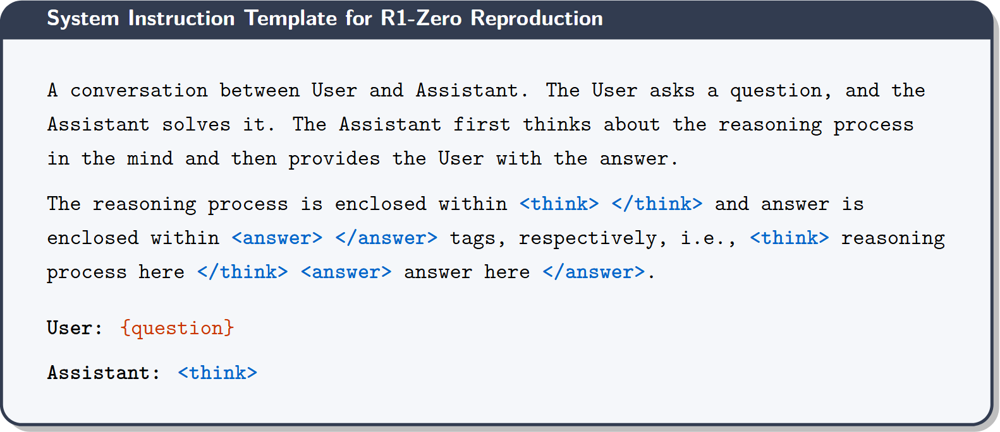
<p align="center">图1 为复现R1-zero构建的System Prompt</p>


Prompt 的设计在本复现中并非简单的文本提示，而是**RL训练的“契约”**。我们构建了一个**强结构化（Structurally Enforced）**的 System Prompt，其核心包含两个维度的约束:

1. **拓扑约束 (Topological Constraint)**：强制模型输出 <think> 和 <answer> 标签对。这不仅是为了格式整洁，更重要的是为后续的 **Format Reward** 提供了可计算的**锚点（Anchor）**，使奖励模型能精确区分‘推理流（CoT）’和‘最终结论’
2. **思维触发 (Reasoning Trigger)**：通过指令显式要求 *'think about the solution process'*，在 SFT 阶段诱导模型生成长思维链，从而为 RL 阶段的**GRPO**提供了可被优化的**搜索空间（Search Space）**。


这种‘硬约束’Prompt 是 R1 能够在不依赖**大量**符合think tag xml标签的结构化数据进行微调的情况下，涌现出自我反思能力的第一推动力。


### 2.1 **阶段一：格式对齐与冷启动**

<a id="section-2-1"></a>

SFT 阶段并非旨在向模型注入新知识，而是通过**行为克隆**为后续的强化学习提供高质量的“逻辑种子”与“风格基底”。

- **核心目标**：使基座模型学会 `User/Assistant` 对话模板，并熟练掌握 `<think>...</think>` 与 `<answer>...</answer>` 的 XML 标签规范

- **数据驱动的消融策略**：
  - 通过对 1.7 万条原始数据进行“去毒”处理，剔除了导致模型习得“啰嗦”和“死循环”的长上下文样本。
  - 最终采用 **SFT v6（3,000 条白金样本）**，通过格式清洗和逻辑蒸馏（强制答案极简），实现了 **44.10%** 的准确率，为 RL 阶段提供了最“诚实”的起点。
  
- **工程配置**：采用 Full Finetuning 模式，设置最大序列长度为 4096，确保逻辑链条的完整性。

- **协议自触发机制**：通过调整 SFT 阶段的 Loss Masking 策略，将 `<think>` 引导符从“Prompt 引导区”移入“Loss 计算区”。这一改进强制模型在没有任何格式暗示的情况下，从零开始自主预测思考链的起始标识，实现了从“被动接收指令”向“主动触发逻辑协议”的质变，旨在验证标签预测的契约深度对复杂推理潜力的启发作用。

  

### 2.2  **阶段二：逻辑强化与演进**

<a id="section-2-2"></a>

强化学习阶段旨在通过**组内相对优势 (Group Relative Advantage)** 激发模型的自我修正能力，使其从“机械模仿”进化为“深度推理”。

- **算法选择与适配**：

  - **复现 Dr.GRPO**：针对单卡（RTX 4090 48GB）小 Batch 训练不稳定的痛点，我们参考 Sea AI Lab 的研究，移除了 Advantage 计算中的**标准差归一化**与**动态长度归一化**。

  - **优势**：相比于标准 GRPO，Dr.GRPO 在高难度任务（如 AIME）中表现出更强的鲁棒性，有效避免了小规模采样下的梯度方向偏移。

    

- **多维度奖励函数设计 (Reward Designing)**：
  - **严格 XML 耦合奖励 (Coupled Reward Logic)**：
  
    - **逻辑**：奖励计算完全依赖于 XML 解析器。若 `<think>` 或 `<answer>` 标签格式不规范，系统将直接判定为“无法提取答案”并给予 **0 分** 的 Answer Reward 。
    - **意义**：这建立了一个“全有或全无”的硬约束环境。模型必须首先内化格式规范，才有机会通过正确逻辑获取更高的奖励分值，从而实现了格式规范与逻辑推理的协同阶跃式进化。
  
  - **长度敏感型惩罚 (Length-Aware Penalty)**：
  
    - **策略**：为超过 **3,072 Tokens** 的响应引入与长度呈正相关的非线性负奖励。
    
    - **设计初衷与逻辑优化**：
      - **现象观测**：实验数据表明发现，格式错误样本的 Token 长度普遍逼近 4,096 的物理上限（均值 > 3,500）。
      
      - **算法偏见**：这种“长而错”的现象揭示了标准 GRPO 在处理负样本时存在的**长度偏差 (Length Bias)** 风险。当模型因逻辑死循环而无法输出 EOS 终止符时，极长的无效生成不仅耗尽了计算资源导致物理截断 ，还可能在组内优势计算中因长度与奖励的非良性耦合而产生误导信号 。
      
      - **干预效果**：通过引入 **3,072 Token 惩罚项**，我们对超长响应施加了显著的负向激励 。这一举措有效遏制了模型通过无限逻辑循环来逃避得出结论的 **Length Hacking** 行为 ，迫使模型在安全长度区间内进行“内化压缩”，从而实现了更高的逻辑密度与更稳健的推理行为 。
      
        
  
- **稳定性机制**：引入 PPO 风格的 **Trust Region Clipping**，在单卡环境下无需持续运行昂贵的reference模型即可维持训练稳定。

  

### 2.3 **行为演化观测**

<a id="section-2-3"></a>

通过这一流水线，我们观察到了模型推理行为的质变：

- **“去肥增肌”演化**：RL 阶段充当了逻辑剪枝器，剔除了 SFT 阶段因模仿而引入的冗余复读，将平均思维链长度从 ~1,102 优化至更具逻辑密度的 ~817 Tokens 

- **效率与精度同步提升**：GRPO 不仅将 Pass@1 准确率推至 **83.4%**，更在保持高精度的同时使推理成本降低了约 25% 。


<div align="right"><a href="#toc-anchor">返回目录</a></div>

## Chapter 3 SFT 数据治理

<a id="section-3"></a>

利用现有数据，我们对SFT 数据的构建进行了系统性的消融实验，探究不同的长度，思考风格，以及prompt细节对于 1.5B 小参数模型推理能力的影响 。实验结果确凿地证明：**数据的纯度（正确性与格式规范）远比数量重要**，且对于小模型而言，噪声数据（有毒样本）不仅无用，甚至有害。


### 3.1 SFT 数据策略演变与影响

<a id="section-3-1"></a>

<p align="center">表1 各数据策略SFT后性能总览表（MATH全验证集 PASS@1）</p>

| 模型版本                          | 数据源策略                | 规模/训练步数 | **准确率** | 格式错误率 | 平均长度  | 关键特征描述                                                 |
| --------------------------------- | :------------------------ | :-----------: | :--------: | :--------: | :-------: | :----------------------------------------------------------- |
| **SFT v1 (E5)**                   | 随机抽取 5k (含噪)        |    5k/25k     |   18.00%   |   77.64%   |   2,913   | **噪声模仿与截断**。模型不仅学会了推理，也学会了原始数据中的冗余废话。由于缺乏筛选，大部分过长的数据样本在输出正确tag格式前就被物理截断。 |
| **SFT v2 (E2)**                   | 长度小于4k过滤            |    9k/18k     |   15.64%   |   76.86%   |   2,849   | **死循环现象**。在去除长样本后，模型反而表现出一种病态的重复行为（如反复输出 "Wait..."），这表明模型在长程推理中容易迷失方向，导致上下文耗尽。 |
| **SFT v2 (E2, 加入重复惩罚1.05)** | 长度小于4k过滤            |  9k/**18k**   | **45.54%** |   35.72%   |   1,890   | **强行干预推理**。重复惩罚作为一种推理时的外部干预，强行打断了模型的死循环。虽然挽救了准确率，但这掩盖了模型本身未能学会“何时停止”的缺陷。 |
| **SFT v3 (E1)**                   | v2+格式清洗*              |     5k/5k     |   40.02%   |   45.30%   |   2,425   | **截断主导错误**。模型已具备解题能力，但严重缺乏停止机制。数据显示格式错误样本的中位数长度达 **3931**（逼近上限），表明绝大多数错误并非逻辑崩坏，而是单纯因未预测到 EOS 导致的物理截断。 |
| **SFT v3 (E2)**                   | v2+格式清洗               |  5k/**10k**   | **49.48%** |   37.06%   |   2,403   | **风格过拟合**。准确率提升的同时，**正确样本的中位数长度从 1374 膨胀至 1520**。模型似乎习得了“冗长=正确”的偏见，导致即便在做对的题目上也更加啰嗦，且截断风险依然处于高位。。 |
| **SFT v4.1 (E1)**                 | v3+**思考清洗+答案蒸馏*** |     3k/3k     |   42.30%   |   46.16%   |   2,422   | **结构化分离**。通过数据蒸馏移除了思考过程中的答案泄露，并强制 `<answer>` 极简。这种强约束迫使模型学会了“思考”与“表达”的明确界限，生成的正样本极其干净。 |
| SFT v4.2 (E1)                     | v4.1+**调整mask处理***    |   **3k/3k**   | **44.10%** | **42.16%** | **2,158** | **(final)指令自触发**。进一步调整了 Loss 计算策略。在SFT训练时，调整Loss mask，使得prompt中的\<think> tag 从不参与loss计算变为参与loss计算.这种改动强化了模型对思考逻辑的内化与自发触发能力，进一步提升了指令遵循稳定性。 |
| SFT v5(筹)                        | 加入精选优质长推理        |               |            |            |           | 由于第四版数据清洗较为极端，保留的形式偏单一，模型在分布外难样本上的泛化性不足，极易产生模式崩塌。 |

> $^*$:格式清洗，指对于所有样本调用reward_fn进行评分，选出那些通过格式检查，format_reward = 1, 即think tag和answer tag对干净规整的样本
>
> 思考清洗，指筛选出所有符合“纯粹"思考标准的样本，即think tag内不包含\\boxed{}样式的样本，通过该标准删减掉了2000条样本。
>
> 答案蒸馏，指对answer tag中的内容，选择删除其他过程，只保留\\boxed{}包裹的答案
>
> 调整mask处理，指出于“引导模型主动预测think tag能否提升模型指令遵循/思考能力”这一动机，在SFT训练时，调整loss mask，使得prompt中的\<think> tag 从不参与loss计算变为参与loss计算，从而让模型从被动接受prompt中的think tag输入转向主动预测think tag。


**基于数据的核心发现：**

**训练效率阶跃**：SFT v4 (Platinum) 仅需 3,000 步即可在 MATH 上取得 44.1% 的准确率 ，相比 v1 版本，在减少 88% 训练量的同时，准确率提升了约 2.4 倍 。

**Epoch 的负面效应**：对比 SFT v3 的演化（Epoch 1 -> 2），虽然准确率提升了 9%，但正确样本的中位数长度从 1374 膨胀至 1520 。这表明持续训练会导致模型习得“冗长 = 正确”的偏见，而非真正的逻辑进步。

**格式错误与物理截断的强相关**：数据记录显示，格式错误样本的长度中位数（3931）极度接近 4096 的上限 。这为我们后续在 RL 阶段引入 **3072 Token 长度惩罚** 以遏制 Length Hacking 提供了量化支持。


实验通过对1.5B小参数模型的系统性消融研究，证实了核心论点：**数据的纯度（正确性与格式规范）远比数量重要。** 以下是SFT数据策略从“粗放”到“精细”的完整演变路径：

##### 1. 早期探索：噪声干扰与长程迷失 (v1 - v2)

- **初始状态 (v1)：** 采用随机抽取的5k数据（含噪）。模型不仅学习了推理，也由噪声数据学会了冗余废话，导致输出过长而被物理截断，准确率仅18.00%，且格式错误率极高。

- **长度过滤尝试 (v2)：** 为解决截断问题，简单过滤掉长度大于4k的样本。结果引发了**“死循环现象”**（如反复输出"Wait..."），准确率跌至15.64%。这表明单纯截断长样本会导致模型在长程推理中迷失方向。虽然通过引入1.05的重复惩罚强行提升了准确率（至45.54%），但这掩盖了模型本身未能学会“何时停止”的缺陷。

  

##### 2. 格式规范化：截断与过拟合的博弈 (v3)

- **格式清洗 (v3 E1)：** 引入reward_fn评分，仅保留格式干净（Tag完整）的样本。模型具备了解题能力（准确率回升至40.02%），但缺乏停止机制。数据显示，格式错误样本的中位长度逼近4096上限，说明大多数错误是因未预测到EOS导致的**物理截断**。

- **增加训练 (v3 E2)：** 试图通过增加Epoch提升效果，虽准确率提升至49.48%，但出现了**“风格过拟合”**。正确样本长度从1374膨胀至1520，模型习得了“冗长=正确”的错误偏见，变得更加啰嗦，且截断风险依然高企。

  

##### 3. 结构重塑与逻辑内化：质的飞跃 (v4)

- **结构化分离 (v4.1)：** 实施“思考清洗”与“答案蒸馏”。剔除思考过程中的答案泄露，并强制精简<answer>标签内容。这一强约束使模型学会了“思考”与“表达”的明确界限，生成的正样本极其干净。

- **指令自触发 (v4.2 - 最终选用版)：** 进一步调整Loss计算策略，将<think>起始标签纳入Loss计算。这一微小的改动将模型从“被动接受Prompt引导”转变为“主动预测思考标签”，极大地强化了思维逻辑的内化与自发触发能力。
  
  - **最终成效：** SFT v4.2仅需 **3,000步** 训练，便在MATH上取得了 **44.10%** 的准确率。相比v1版本，在 **减少88%训练量** 的同时，准确率提升了约 **2.4倍**，且平均长度大幅优化至2,158，实现了高效与精准的双重突破。
  
    

##### 4. 后续展望 (v5)

鉴于v4版本清洗过于极致，且SFT数据来源单一，导致清洗出的数据缺乏内容和形式上的多样性，模型泛化性不足（易产生模式崩塌）。

v5 计划重新引入精选的优质长推理数据，包括推理风格多样化和来源于难度多样化题目的规范化CoT，以提升泛化能力与多样性表现。


### 3.2 SFT前后格式变化表 (选取format reward为1的部分)

<a id="section-3-2"></a>

<p align="center">表2 SFT前后xml标签约束情况对比</p>


<table>
  <tr>
    <th width="10%">对比维度</th>
    <th width="45%">Baseline (原始输出)：低约束的自由生成</th>
    <th width="45%">SFT (初步对齐)：高强度的模式收敛</th>
  </tr>
  <!-- 视觉呈现 -->
  <tr>
    <td style="vertical-align: top;"><b>视觉呈现</b></td>
    <td style="vertical-align: top;">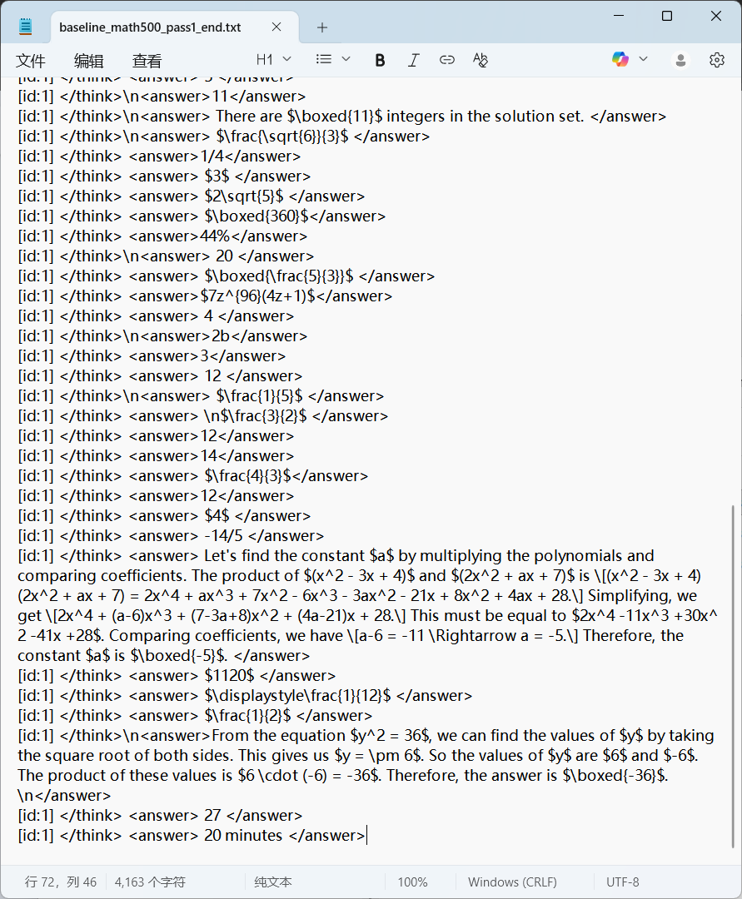</td>
    <td style="vertical-align: top;">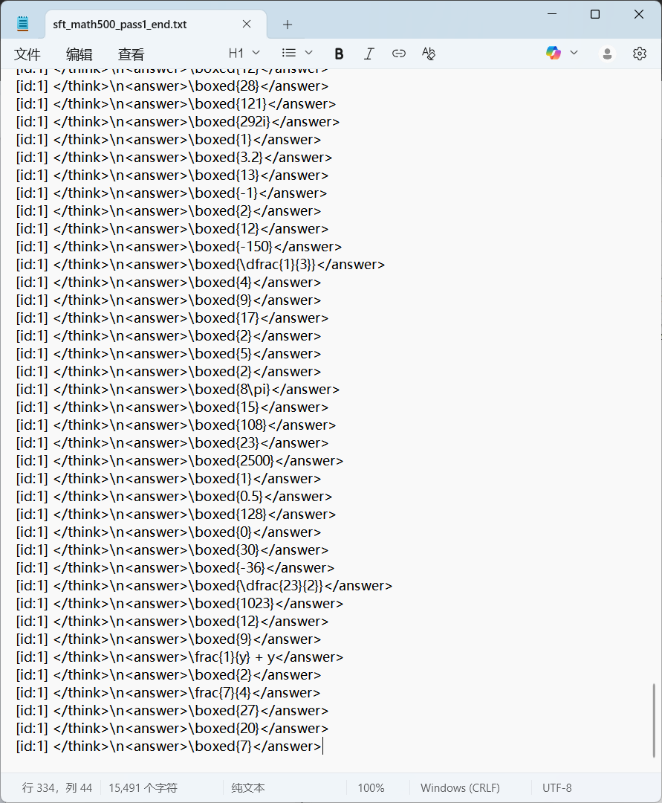</td>
  </tr>
  <!-- 格式特征 -->
  <tr>
    <td style="vertical-align: top;"><b>格式特征</b></td>
    <td style="vertical-align: top;">
        <b>无序发散状态</b><br><br>
        由于缺乏指令微调的约束，模型仅凭预训练的概率直觉生成标签。这导致 XML 结构<b>极不稳定</b>，常出现标签拼写错误、闭合符号缺失，甚至完全遗漏边界符的情况，像是在“随意涂鸦”
    </td>
    <td style="vertical-align: top;">
        <b>高度机械收敛</b><br><br>
        建立了严格的格式纪律。模型将 <code>&lt;/think&gt;\n&lt;answer&gt;\boxed{...}&lt;/answer&gt;</code> 内化为一种<b>“肌肉记忆”</b>。无论题目如何变化，其输出结构都如同填充固定模板一般精确，几乎消除了格式波动。
    </td>
  </tr>
  <!-- 内容特征 -->
  <tr>
    <td style="vertical-align: top;"><b>内容特征</b></td>
    <td style="vertical-align: top;">
        <b>自然语言混杂</b><br><br>
        答案标签内混杂了自然语言叙述、中间推理步骤、原始 LaTeX 公式甚至换行符。难以实现核心结论的有效提取和提纯。
    </td>
    <td style="vertical-align: top;">
        <b>纯净数值结果</b><br><br>
        答案区被强制压缩为“纯粹终值”，剥离了所有冗余文本、解释说明和推理过程，信息密度极高。
    </td>
  </tr>
  <!-- 数量特征 -->
  <tr>
    <td style="vertical-align: top;"><b>数量特征</b></td>
    <td style="vertical-align: top;">
        <b>Pass@1通过数量：72</b><br><br>
        作为预训练基座，模型处于“知识丰富但能力未对齐”的状态。它倾向于以<b>“文本补全”的直觉模式</b>响应，往往在未展开推理前就通过概率预测草率给出结论（表现为长度短），难以应对需要长程逻辑规划的复杂问题。
    </td>
    <td style="vertical-align: top;">
        <b>Pass@1通过数量：334</b><br><br>
        3000条小样本下，SFT 的核心作用不是也不能灌输知识，而是通过格式协议和风格对齐<b>“激活”</b>了模型潜在的推理与计算能力。
    </td>
  </tr>
</table>


#####  结论 

**实验确凿地证明：数据治理是 SFT 性能的首要驱动力。通过将数据集蒸馏为高质量的‘白金’子集 (SFT v6)，我们仅用 3,000 条训练样本就达到了 44.1% 的高准确率，超越了使用 5 倍原始混乱数据训练的模型。**

**此外，我们发现“长度截断”是小模型格式错误的主要原因，这可以通过严格的格式清洗来缓解。**

**但是如果要提高不同难度下模型的泛化性，则需要更多样化的，且难度分布合理的数据来做到这点。**


### 3.3 惯性与语义的冲突——Prompt修正实验

<a id="section-3-3"></a>

​	细心的话可以发现，System Prompt中，\</think> 和 \<answer>之间实际上是空格，然而在数据清洗时，所有数据都被洗成了\</think>\n\<answer>（换行分隔）。这构成了一个微小的“指令-数据”语义 GAP。其虽然微小，却是一个探究SFT数据细节之处对模型的影响程度与方向的绝佳切入点。

​	我们设计了对照实验：分别在微调和推理阶段，将 Prompt 修正为与训练数据逻辑一致的**换行符**，试图“帮助”模型消除歧义，SFT思维链清洗维持不变`\n`的换行符格式，并在推理阶段分别选用空格版和换行版的Prompt。实验结果极具颠覆性：

<p align="center">表3 SFT与推理时不同Prompt组合下模型MATH500表现对比</p>

| 模型 & Prompt*        | 指标            | 准确率    | 格式错误率 | 平均长度    | 答案正确平均长度 | 格式错误平均长度 | 现象关键词     | 现象特征速写                                                 |
| --------------------- | --------------- | --------- | ---------- | ----------- | ---------------- | ---------------- | -------------- | ------------------------------------------------------------ |
| Baseline & 空格Prompt | MATH500(Pass@1) | 11.4%     | 62.2%      | 445.12      | 160.91           | 615.14           | **直觉延续**   | 依靠预训练语感的惯性，在模糊指令下勉强维持生成的“顺滑感”     |
| Baseline & 换行Prompt | MATH500(Pass@1) | 5.2%      | 81.8%      | 441.15      | 147.88           | 501.67           | **语义断崖**   | 强硬的换行符切断了概率流，造成上下文的物理阻断，逻辑直接坠落 |
| 空格SFT & 空格Prompt  | MATH500(Pass@1) | **51.6%** | **36.8%**  | **2086.54** | **1135.80**      | 3699.17          | **认知共振**   | **(最优组合)** 基座的“阅读偏好”（喜欢空格）与 SFT 的“写作规范”（输出换行）达成完美的**互补共生** |
| 空格SFT & 换行Prompt  | MATH500(Pass@1) | 45.6%     | 41.4%      | 2144.76     | 1084.27          | **3596.65**      | **特征异化**   | 修正了逻辑却破坏了特征索引。模型感知到环境的微小异样，表现出“犹豫”与“熵增” |
| 换行SFT & 空格Prompt  | MATH500(Pass@1) | 20.0%     | 43.8%      | 2318.41     | 1225.80          | 3715.82          | **鲁棒性丧失** | 过于纯净的训练环境导致模型“洁癖”。一旦遇到 OOD 信号（空格），能力即刻坍塌 |
| 换行SFT & 换行Prompt  | MATH500(Pass@1) | 46.2%     | 41.2%      | 2269.81     | 1173.45          | 3770.32          | **本能抵抗**   | 尽管实现了逻辑闭环，但模型被迫在 Prompt 阶段就对抗基座的语言本能，内耗严重 |

> 空格SFT和换行SFT 分别指用 空格分隔 和 \n分隔</think><answer> tag对的 Prompt 进行1epoch 3k条(v4.2)样本SFT微调
>
> 空格Prompt 和 换行Prompt 分别指测试时Prompt模板用 空格分隔的版本 和 \n分隔的版本

##### 结果解析：一场关于“顺应”与“对抗”的博弈

上述六组实验结果，实质上揭示了大模型在微调过程中，**预训练本能（Nature）** 与 **后天对齐（Nurture）** 之间的深层博弈。从基座模型的角度出发，可以看到其对Prompt中的\n和空格的区分极为敏感，当提示词中的</think>和<answer>之间被\n这个预训练中语境割裂意味极重的token割裂开来时，预训练的文本补全本能难以捕捉到两者间的关联，便难以建立起好的指令遵循能力。相比之下，空格作为一个软过渡的token就能让模型更好的捕捉到两个tag之间的衔接关系。

##### 1. 顺势而为：为什么“原版SFT”是版本答案？

**原版 SFT (Prompt空格 + Data换行)** 之所以能取得 **51.6%** 的最高分，是因为它巧妙地达成了一种“认知分工”：

- **输入端（Prompt）：** 保留空格。这顺应了 Base Model 对自然语言“流连贯性”的偏好。模型读到空格时，注意力机制能更顺畅地将 System Prompt 的语义传递给后续生成的 Token。
- **输出端（Data）：** 强制换行。这利用 SFT 的强监督信号，强行建立了结构化的输出规范。
- **结论：** 这是一种**“外圆内方”**的策略——对输入宽容（符合直觉），对输出严格（符合规范）。这种策略最小化了模型处理 Prompt 时的认知负担。

##### 2. 过犹不及：为什么“改版SFT”反而变弱了？

**改版 SFT (全链路换行)** 试图在逻辑上追求绝对的“训练-推理一致性”，结果却遭遇了滑铁卢（最高仅 46.2%）：

- **对抗归纳偏置：** 当我们把 Prompt 中的空格也改为换行，我们实际上是在强迫模型去**“遗忘”**它在预训练中学到的通用语言规律（即：空格是连接词，换行是断句）。
- **参数浪费：** 模型被迫分配宝贵的参数容量去适应这个两个逻辑相同的tag用换行隔开的“反直觉”的 Prompt 格式，而不是专注于数学推理本身。这就是所谓的**“归纳摩擦 (Inductive Friction)”**。

##### 3. 鲁棒性的悖论：噪声即抗体

对比 **原版SFT** 和 **改版SFT** 在面对“原版Prompt（空格）”时的表现（51.6% vs 20.0%），我们可以看到：

- **原版SFT** 因为训练时存在“Prompt空格 vs Data换行”的错位，这种错位充当了一种**天然的数据增强（Data Augmentation）**。它教会了模型：“无论 Prompt 怎么写，我都要按标准格式输出”。

- **改版SFT** 在温室中长大，从未见过这种不一致，因此极度脆弱，丧失了泛化能力。

  

##### 结论

在小参数模型的工程实践中，**最好的微调策略不是去“纠正”基座的直觉，而是去“利用”它。** 哪怕这在人类看来包含一点逻辑上的小瑕疵（如 Prompt 中的空格），只要它符合模型的概率分布本能，就是提升性能的关键支点。


### 3.4 SFT阶段结论：一场精密的“行为外科手术”

<a id="section-3-4"></a>

综合以上三个层面的系统性消融实验，我们可以得出结论：对于1.5B这样的小参数模型，监督微调（SFT）阶段的核心逻辑并非传统的**“知识注入”**，而是一场旨在**“激活潜力”**与**“塑造行为”**的精密外科手术。这一阶段的成功，为后续强化学习（RL）算法的高效探索和潜力兑现奠定了坚实的基础。其核心逻辑可被提炼为以下三点：

1. **数据的纯度重要性远超数量:** 我们的数据策略演变路径（v1至v4）明确证实，对于小参数模型，噪声数据不仅无益，甚至有害。通过将数据集从5k含噪样本极致蒸馏至3k“白金”逻辑样本，我们不仅将训练量减少了88%，更实现了**从18.0%到44.1%的准确率飞跃**。这揭示了SFT的核心作用是提供一个**清晰、无歧义的“行为范本”**，而非知识的堆砌。
2. **格式即协议，纪律是基石 :** SFT的核心任务是为模型建立一套**高度机械化、可预测的输出“肌肉记忆”**。如SFT前后格式对比所示，通过强制的格式清洗与答案蒸馏，模型将 </think>\n<answer>\boxed{...}</answer> 的结构内化为一种行为协议。这不仅是为了输出的整洁，更是为后续强化学习（RL）阶段提供了**稳定、可解析的奖励锚点**，从根本上解决了奖励信号的归因难题，是逻辑链条得以“内化压缩”的先决条件。
3. **顺应而非对抗，化“摩擦”为鲁棒 :** “Prompt空格 vs. Data换行”的实验揭示了深刻的“**归纳摩擦 ”现象**。最佳策略并非强迫模型在输入端（Prompt）违背其预训练本能（Nature），而是**顺应其“阅读偏好”，同时在输出端（Data）强力塑造其“行为规范”（Nurture）**。这种“外圆内方”的策略不仅最小化了模型的认知负担，其固有的“指令-数据”错位甚至充当了一种天然的数据增强，显著提升了模型对微小扰动的泛化能力和鲁棒性。

<div align="right"><a href="#toc-anchor">返回目录</a></div>

## Chapter 4 强化学习算法思辨：无偏估计与泛化性的博弈


### 4.1 引言：1.5B模型的泛化困境与算法选择

SFT阶段的成功，证明了即便是1.5B这样的小参数模型，也能通过高质量的数据学会模仿，掌握严谨的格式与初步的思维链。然而，模仿并非真正的推理。为了激发其自我修正与逻辑探索能力，我们引入了强化学习（RL）阶段。

此阶段的核心挑战是双重的。首先，我们必须正视 **1.5B模型的内在容量局限**：它不可能像百亿、千亿级模型那样穷尽所有知识，其性能高度依赖于对核心逻辑的有效压缩与泛化。其次，我们的训练数据 `Bespoke-Stratos-17k`本身是**高度有偏**的，它集中于高难度竞赛题，形成了一个“专才”训练环境。

这两个限制共同指向了一个尖锐的矛盾，并在我们的实验中催生了一个关键的反常现象：旨在提供更稳定、无偏信号的Dr.GRPO算法，在引导这个“**容量有限的专才模型**”去应对全面的测试集时，其泛化能力反而不如标准GRPO。理论上的算法优势，在实践中似乎变成了泛化能力的“枷锁”。

本章将深入探究这一现象，剖析RL算法设计、小模型的能力边界、与有偏数据环境三者间的复杂交互，旨在回答一个核心问题：**对于一个小参数模型，当训练数据存在显著偏差时，什么样的RL策略才能最大限度地激发其宝贵的泛化潜力？**


### 4.2 实验设计：有限容量下的有偏训练与全面评测

我们的实验设计旨在严格评估一个**1.5B小参数模型**，在接受了**专业化、高难度训练**后，向一个**全面、多层次的测试环境**进行泛化的能力。这一设计旨在揭示小模型在知识迁移过程中的脆弱性，并考察不同RL算法对其泛化边界的影响。

**训练数据的偏差与小模型的敏感性：**

训练数据源自 `Bespoke-Stratos-17k`，其高难度的内在偏差对1.5B模型提出了严峻考验。由于容量有限，模型无法“记忆”所有解法，必须努力从这些难题中归纳出可迁移的逻辑模式。这种训练环境迫使模型进行高强度的“逻辑压缩”，但也极易导致其对训练数据的分布产生**过拟合**，从而损害在分布外任务上的表现。

**评测体系的全面性与基线预期：**

我们构建了一个三梯度评测矩阵，以全面衡量模型的泛化能力。特别重要的是，我们为每个梯度的测试集都建立了**Baseline模型的性能基准**，以校准我们对一个未经优化的1.5B模型的初始预期：

- **基础能力层 (GSM8K):** 测试模型在解决了复杂问题后，是否还能保持对简单逻辑的**基础稳定性**。这是对知识“向下兼容”能力的检验。
- **核心能力层 (MATH, AMC12):** 作为**泛化能力的核心观测区**。我们预期模型在此会有显著提升，但由于其容量限制和训练偏差，可能难以企及大模型的性能高度。
- **知识上限层 (AIME):** 难度分布与训练集最接近，用于探测模型在“舒适区”内的**知识天花板**。即便在此，由于1.5B模型的容量瓶颈，我们也预期其性能会存在一个难以突破的上限。

**评估指标设置：**

我们选择使用 `Pass@k` 指标，因为它能精细地刻画小模型的学习状态：

1. **Pass@1** 反映了模型的**收敛能力**——它能否稳定地将学到的知识转化为首选的正确答案。
2. **Pass@k 曲线** 则揭示了模型的**潜力边界**——在其有限的参数空间内，究竟“蕴藏”了多少知识。


### 4.3 核心发现：单卡 1.5B 模型在压力下的性能分化

下表展示了不同训练阶段/算法下的模型在各测试集Pass@1/Pass@64表现。

在我们的实验框架下，数据揭示了一个与算法理论预期相悖的关键现象：旨在通过移除标准差归一化来获得更无偏奖励信号的Dr.GRPO，在引导1.5B模型进行泛化时，并未展现出普适的优势，反而在多个关键测试集上落后于标准GRPO变体。这一节将首先观察各GRPO变体的宏观表现与推理长度特征，深入剖析现象，并提出我们的核心假设。

<a id="table3-anchor"></a>

<p align="center">表(图)3 不同训练阶段/算法下模型各测试集表现汇总 (Pass@1 & Pass@64)</p>

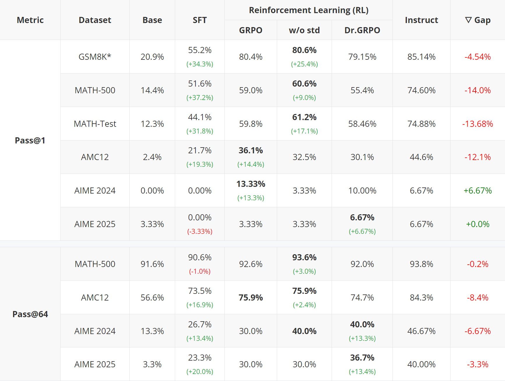


#### 4.3.1 GRPO变体随数据集的正确率/格式错误率表现分析

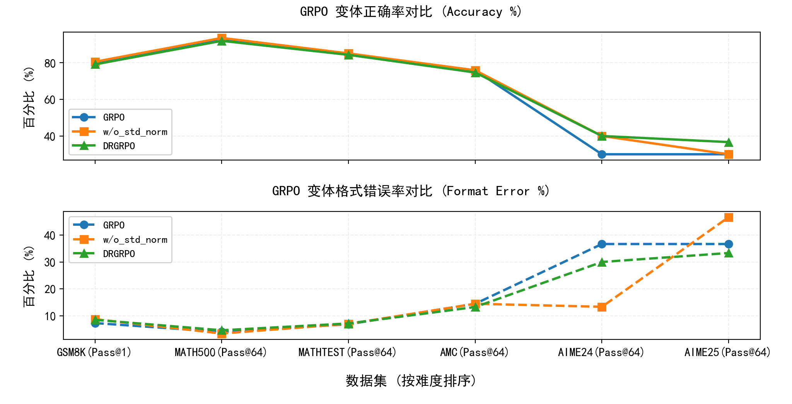
<p align="center">图2 GRPO变体在不同难度下正确率/格式错误率演变图</p> 


上图展示了三种GRPO变体在不同难度任务上的性能演进。值得注意的是，我们采用了一种**分阶段的评估策略**：对于作为**基础能力基线**的GSM8K，我们使用Pass@1指标来衡量其单次推理的稳定性和准确性；对于后续更难的数据集，我们则切换到Pass@64指标，以探索模型的**知识边界和泛化上限**。


##### 正确率部分分析

上半张图展现了随着题目难度变化，三种GRPO在对应任务上的正确率演变。

首先，观察折线的整体走向与分岔，可以观察到一个明显的两阶段区分。

**第一阶段 (核心能力稳定区：GSM8K, MATH500, MATHTEST, AMC):**

- 在从基础的GSM8K到难度显著提升的AMC这整个广阔的难度区间内，所有三种变体的性能表现都呈现出**惊人的一致性，曲线几乎完全重合**。
- 无论是GSM8K的Pass@1基准，MATH系列的Pass@64峰值，还是AMC上的表现，三者都亦步亦趋，难分伯仲。
- 这有力地证明，在涵盖了从基础到高中竞赛核心难度的大部分问题域中，模型的性能表现是**稳健的**，且对这三种RL算法变体的细微差异**几乎不敏感**。这是一个广阔的“**算法稳定区**”。

**第二阶段 (高压分化区：AIME24, AIME25):**

- 系统的稳定性在进入AIME数据集后开始受到考验。从AMC到AIME24的过渡，是整个性能曲线的一个**关键转折点**。
- 在此区间，之前高度一致的曲线**开始呈现出显著的性能差异**。例如，GRPO（蓝线）的性能相较于另外两个变体，出现了更明显的下滑趋势。
- 而在AIME25这个最终的压力测试下，各变体间的性能差异被进一步放大，排名也变得不再稳定。其中，w/o_std_norm（橙线）的性能出现了**大幅下滑**，尤其是格式错误率剧增，与DRGRPO（绿线）的相对稳健表现形成了鲜明对比。


##### 格式错误率部分分析

与正确率分析相辅相成，**格式错误率（下半）** 则从另一个维度揭示了模型在压力下的行为稳定性。

观察折线的整体走向与分岔，同正确率的两阶段区分展现出了高度的一致性。

**第一阶段 (核心能力稳定区): GSM8K, MATH500, MATHTEST, AMC**

- 在从GSM8K到AMC的整个核心能力区内，格式控制的**鲁棒性非常高**。所有变体的错误率都维持在相对较低的水平，且随着难度提升，增长也较为平缓。
- 在此阶段，w/o_std_norm（橙线）甚至表现出最低的格式错误率，这与其稳健的正确率表现相符，共同印证了它在模型核心能力圈内的可靠性。

**第二阶段 (高压分化区): AIME24, AIME25**

- 与正确率曲线的转折相对应，格式错误率在进入AIME数据集后也出现了**剧烈的分化**。

- 最引人注目的现象同样来自于w/o_std_norm（橙线）。在AIME25上，其格式错误率**急剧飙升**，从AIME24的约15%激增至超过40%，成为一个显著的异常点。

- 这一现象与它在同一数据集上的**正确率断崖式下跌**形成了强有力的**交叉印证**。这表明，w/o_std_norm变体在面对其能力边界之外的全新挑战时，其主要的失败模式并非简单的逻辑错误，而是**推理结构的系统性崩溃**，最终导致无法维持基本的输出格式规范。

  

**总结**

综合正确率与格式错误率这两张图表，我们可以得出一个**高度一致且相互印证的核心结论**：模型的性能演进存在一个清晰的**临界点**，即从AMC到AIME的难度跨越。

- **在临界点之前（核心能力稳定区）：** 模型展现出强大的**鲁棒性**。无论是在正确率还是格式控制上，所有GRPO算法变体的表现都高度一致且稳定。这表明在模型的核心知识圈内，系统的性能对算法的细微差异几乎不敏感。
- **在跨越临界点之后（高压分化区）：** 系统的稳定性被打破，**脆弱性**开始显现。不同算法间的性能差异被急剧放大，表现出混沌和不一致性。


#### 4.3.2 GRPO变体随数据集的推理长度行为表现分析


<p align="center">图3 GRPO变体在不同难度下正确采样长度/格式错误采样长度演变图</p>


除了结果的正确与否，模型的**推理过程本身（即思维链的长度）**，为我们诊断其在压力下的行为模式提供了另一个关键维度。值得注意的是，成功样本与失败样本的长度演进，展现出了截然不同的规律，揭示了算法差异性的作用边界。

##### **成功样本长度（上图）：一致且可预测的资源投入**

- **高度一致性与算法不敏感性：** 观察成功样本的长度曲线，最显著的特征是**三条曲线在几乎所有难度区间内都高度重合**。从GSM8K到AIME24，所有变体都以几乎相同的方式，稳定地增加推理长度以应对不断提升的难度。
- **清晰的正相关趋势：** 成功的推理长度与任务难度呈现出清晰的正相关，并在AIME24达到峰值。
- **结论：** 这有力地证明，当模型能够成功解决问题时，其所采取的“正确”推理路径在长度上是相对稳定和可预测的。**通往成功的路径，在很大程度上与算法的细微差异无关**，而更多地由问题本身的内在复杂度决定。


##### **失败样本长度（下图）：算法差异的放大器与崩溃诊断**

- **早期分化与混沌行为：** 与成功样本的稳定表现形成鲜明对比，**失败样本的长度曲线在更早的阶段（从MATHTEST和AMC开始）就出现了明显的分化**。进入AIME高压区后，这种分化演变成了完全的**混沌**，三条曲线的走势毫无规律，相互交错。
- **核心洞见：** 这揭示了一个核心现象——**不同GRPO类算法的内在差异，主要体现在它们各自的“失败模式”上**。当模型不知道如何解决问题时，不同的算法会引导模型陷入截然不同的、无效的冗长推理循环中。失败样本的长度，成为了**算法特性的“放大器”**。
- **与系统性崩溃的交叉印证：** 这一观察在w/o_std_norm（橙线）于AIME25上的表现中得到了最终的验证。其失败样本长度的显著回升，与其**正确率的断崖式下跌**和**格式错误率的急剧飙升**，共同构成了对同一种“系统性崩溃”现象的三重诊断。


#### 4.3.3 综合结论

综合正确率、格式错误率与推理长度这三组图表，我们可以得出一个高度一致且相互印证的核心结论：

**RL算法的差异性主要体现在模型面对其能力边界之外的、全新的挑战时的“失败模式”上，而非其解决能力范围内问题的“成功模式”上。**

特别地，w/o_std_norm变体在AIME25上的反常行为，成为了整个观察中一个关键的信号。其**正确率的断崖式下跌、格式错误率的急剧飙升、以及失败推理长度的显著回升**，这三个现象同时发生，共同描绘了一幅清晰的“**系统性崩溃**”画像。这表明，该变体在面对极限压力时，其主要的失败模式并非简单的逻辑错误，而是**开放式的、无尽的、最终导致推理结构本身瓦解的无效探索**。

这一系列强有力的交叉证据，将我们的分析焦点引向了`AIME`数据集，尤其是2024与2025两个年份之间存在的性能差异，因为这正是检验模型在“已知”与“未知”边界上行为模式的最佳试金石。


<div align="right"><a href="#toc-anchor">返回目录</a></div>

## Chapter 5  泛化真相：基于“推理留存率”的行业多维诊断

### 5.1 AIME 24 vs. AIME 25: 一个揭示泛化真相的“自然实验”

对于一个1.5B的小参数模型而言，其性能在面对高难度基准测试时出现下滑，是反映其内在能力局限的正常预期。然而，真正引人深思的并非这一普遍性的衰减趋势，而是在 **AIME 2024 与 AIME 2025 这两个数据集之间，模型表现出的显著性能差异**。

**最强有力的证据来自于Baseline模型（即未经任何SFT/RL微调的Qwen-2.5-Math-1.5B）的表现：**

- 从[**表3**](#table3-anchor)中可以清晰地看到，Baseline模型在AIME 2024上的Pass@64达到了**13.3%**。

- 相比之下，它在AIME 2025上的Pass@64仅为**3.3%**，两者相差整整**4倍**。

  

一个未经任何针对性微调的模型，为何在理论难度相当的两个测试集上表现出如此悬殊的差异？这引出了两个主要的**竞争性假说**：

**假说一（数据污染假说）：其预训练数据中已经包含了AIME 2024的题目或高度相似的解题讨论，而AIME 2025则是其从未见过的全新数据。**

**假说二（数据分布适配假说）： AIME 2024的数据分布（例如，题目类型、所需知识领域）可能偶然地、系统性地比AIME 2025更适合Qwen-Math系列模型的“能力甜点区”**。

为了探究哪个假说更具解释力，我们进行了一系列外部证据的检索与分析。


### 5.2 指标构建：推理留存率的定义与经济学释义

#### 5.2.1 推理稳定性指标设计

为了系统性地检验“数据污染”假说，我们需要一个能够科学地量化模型在“已知”（AIME 24）与“未知”（AIME 25）数据集之间性能稳定性的指标。一个核心的挑战在于，AIME 2024的性能指标本身可能已经因潜在的数据污染而成为一个**有偏的估计量**。

这类似于经济学和社会科学中著名的**古德哈特定律（Goodhart's Law）**：*“当一个度量本身成为目标时，它便不再是一个好的度量。”* 如果模型在预训练时已将AIME 2024的数据作为优化目标，那么其在该数据集上的高分则无法完全代表其真实的推理能力。

因此，基于Perf_24的简单度量，如**绝对性能差异 (Perf_24 - Perf_25)**，会因**基数效应**而产生误导，无法在不同模型之间进行公正的比较。

为了解决这一问题，我们借鉴了经济学中评估**资产保值能力**的思路，将模型在AIME 2024上展现的能力视为一种“初始价值”，并衡量其在AIME 2025这个新环境中能够“留存”下多少。我们为此定义了一个核心度量指标——**“推理留存率”**。

- **计算方式：** 留存率 = Perf_25 / Perf_24
- **经济学释义：** 这个指标在概念上，等同于衡量一项 **无形资产** 在经历了一个周期的市场变化后，其 **剩余价值与初始价值的比率** 。一个高留存率，意味着这项“知识资本”的 **折旧率低** ，其内在价值是稳固且可迁移的。反之，一个低留存率，则意味着其初始的高价值很可能只是泡沫，无法抵御真实的市场考验。

为了更精细地诊断这项“知识资本”的不同层面，我们进一步将其分层为两个指标：

- **Greedy 留存率 (Pass@1):**
  - **经济学类比：** 这可以看作是衡量企业**“核心业务的运营效率”**的稳定性。它反映了模型最常用的、最自信的“生产线”（推理路径）在面对新市场时的保值能力。
- **Upper 留存率 (Pass@16):**
  - **经济学类比：** 这更像是衡量企业的 **“总资产价值”** 或 **“长期潜力”** 的稳定性。它反映了模型全部“知识储备”的鲁棒性，即使这些储备没有被高效地利用。


### 5.3 实证分析：主流 LLMs 的留存率分布特征

基于我们设计的“分层推理留存率”指标，我们基于开源论文中的数据，对一系列业界顶尖的开源及闭源模型进行了留存率横向对比，结果如表4和表5所示。这张表不仅揭示了单个模型的性能，更像一张“压力测试”下的行业热力图，清晰地展示了**推理不稳定**是当前小参数大语言模型普遍面临的严峻挑战。


<p align="center">表4：模型确定性推理稳定性检测（Greedy/Pass@1 泛化评估）</p>

| **模型分类**   | **模型名称 (LLMs)**    | **24 Greedy** | **25 Greedy** | **留存率 (Rg)** | **诊断 (CS 视角)** | **诊断 (经济视角)** |
| -------------- | ---------------------- | ------------- | ------------- | --------------- | ------------------ | ------------------- |
| **自训练模型** | SFT                    | 0             | 0             | **0%**          | 搜索空间坍缩       | 潜在资产归零        |
|                | GRPO                   | 13.3          | 3.3           | **25%**         | OOD 真实基准       | 市场底线价值        |
|                | w/o std norm           | 3.3           | 3.3           | **100%**        | 鲁棒解空间覆盖     | 优质保值资产        |
|                | Dr.GRPO                | 10.0          | 6.7           | **67%**         | 疑似样本记忆       | 估值过高风险        |
|                |                        |               |               |                 |                    |                     |
| **Qwen 数学**  | Qwen2.5-Math-7B-I *    | 11.1          | 20.0          | **180.2%**      | 泛化边界突破       | 潜力资产爆发        |
|                | Qwen2.5-Math-72B-I     | 20.0          | 13.3          | **66.5%**       | 过拟合泄露风险     | 知识资本折旧        |
|                |                        |               |               |                 |                    |                     |
| **Qwen 原生**  | Qwen2.5-32B-Instruct * | 11.1          | 20.0          | **180.2%**      | 架构迭代红利       | 资产强势溢价        |
|                | Qwen2.5-72B-Instruct   | 13.3          | 20.0          | **150.4%**      | 架构迭代红利       | 资产强势溢价        |
|                | Qwen2.5-7B-Instruct    | 11.1          | 6.7           | **60.4%**       | 疑似样本记忆       | 投机性泡沫          |
|                | Qwen2.5-Max *          | 22.2          | 13.3          | **59.9%**       | 疑似样本记忆       | 投机性泡沫          |
|                |                        |               |               |                 |                    |                     |
| **推理模型**   | OpenAI o1-mini *       | 60.3          | 46.7          | **77.4%**       | 性能分布偏移       | 资产良性折旧        |
|                | QwQ-32B-Preview *      | 44.4          | 26.7          | **60.1%**       | 疑似样本记忆       | 投机性泡沫          |
|                | DS Distill Qwen-1.5B * | 17.8          | 26.7          | **150.0%**      | 泛化边界突破       | 潜力资产爆发        |
|                | DS Distill Qwen-32B    | 62.2          | 46.7          | **75.1%**       | 性能分布偏移       | 资产良性折旧        |
|                |                        |               |               |                 |                    |                     |
| **基准参考**   | Mistral-Large-2411 *   | 13.3          | 13.3          | **100.0%**      | 鲁棒逻辑迁移       | 优质保值资产        |
|                | InternLM-3-8B-I *      | 11.1          | 13.3          | **119.8%**      | 架构迭代红利       | 资产强势溢价        |
|                | Skywork-o1 *           | 11.1          | 13.3          | **119.8%**      | 架构迭代红利       | 资产强势溢价        |
|                | Llama-3.1-70B-I *      | 15.6          | 6.7           | **42.9%**       | OOD 真实基准       | 市场底线价值        |
|                | Llama-3.3-70B-I *      | 22.2          | 6.7           | **30.2%**       | OOD 真实基准       | 市场底线价值        |
|                | DS-Math-7B-RL *        | 2.2           | 0.0           | **0.0%**        | OOD 零样本底线     | 原始账面原值        |
|                | NuminaMath-72B-CoT *   | 2.2           | 0.0           | **0.0%**        | OOD 零样本底线     | 原始账面原值        |

<p align="center">表5：推理能力上限与搜索鲁棒性检测（Upper/Pass@16 潜力评估）</p>

| **模型分类**   | **模型名称 (LLMs)**     | **24 Upper** | **25 Upper** | **留存率 (Ru)** | $\nabla R$ | **诊断 (CS 视角)** | **诊断 (经济视角)** |
| -------------- | ----------------------- | ------------ | ------------ | --------------- | ---------- | ------------------ | ------------------- |
| **自训练模型** | SFT                     | 16.7         | 16.7         | **100.0%**      | +100%      | 鲁棒解空间覆盖     | 优质保值资产        |
|                | GRPO                    | 20           | 23.3         | **116.7%**      | +91.7%     | 泛化上限突破       | 潜力资产爆发        |
|                | w/o std norm            | 36.7         | 23.3         | **63.6%**       | -36.7%     | 疑似样本记忆       | 估值过高风险        |
|                | Dr.GRPO                 | 26.7         | 30.0         | **112.5%**      | +45.5%     | 解空间溢价         | 资产良性增值        |
|                |                         |              |              |                 |            |                    |                     |
| **Qwen 数学**  | Qwen2.5-Math-7B-I       | 20.8         | 36.8         | **176.9%**      | -3.3%      | 泛化上限突破       | 潜力资产爆发        |
|                | Qwen2.5-Math-72B-I      | 35.2         | 30.1         | **85.5%**       | +19.0%     | 性能小幅衰减       | 资产轻微折旧        |
|                |                         |              |              |                 |            |                    |                     |
| **Qwen 原生**  | Qwen2.5-32B-Instruct    | 32.0         | 33.3         | **104.1%**      | -76.1%     | 鲁棒解空间覆盖     | 优质保值资产        |
|                | Qwen2.5-72B-Instruct    | 33.7         | 33.2         | **98.5%**       | -51.9%     | 鲁棒解空间覆盖     | 优质保值资产        |
|                | Qwen2.5-7B-Instruct     | 26.3         | 25.2         | **95.8% **      | +35.4%     | 鲁棒解空间覆盖     | 优质保值资产        |
|                | Qwen2.5-Max (300B+？)   | 44.4         | 39.9         | **89.9%**       | +30.0%     | 性能小幅衰减       | 资产轻微折旧        |
|                |                         |              |              |                 |            |                    |                     |
| **推理模型**   | OpenAI o1-mini          | 86.7         | 62.0         | **71.5%**       | -5.9%      | 疑似样本记忆       | 估值过高风险        |
|                | QwQ-32B-Preview         | 74.3         | 60.5         | **81.4%**       | +21.3%     | 分布外性能收缩     | 良性折旧资产        |
|                | DS Distill Qwen-1.5B    | 68.7         | 54.6         | **79.5%**       | -70.5%     | 分布外性能收缩     | 良性折旧资产        |
|                | DS Distill Qwen-32B     | 86.3         | 72.6         | **84.1%**       | +9.0%      | 分布外性能收缩     | 良性折旧资产        |
|                |                         |              |              |                 |            |                    |                     |
| **基准参考**   | Mistral-Large-2411-123B | 15.4         | 19.7         | **127.9%**      | +27.9%     | 解空间溢价         | 资产良性增值        |
|                | InternLM-3-8B-I         | 20.5         | 30.3         | **147.8%**      | +28.0%     | 泛化上限突破       | 潜力资产爆发        |
|                | Skywork-o1-8B           | 22.1         | 31.2         | **141.2%**      | +21.4%     | 泛化上限突破       | 潜力资产爆发        |
|                | Llama-3.1-70B-I         | 41.2         | 21.3         | **51.7%**       | +8.8%      | OOD 真实基准       | 市场底线价值        |
|                | Llama-3.3-70B-I         | 37.1         | 13.6         | **36.7%**       | +6.5%      | OOD 真实基准       | 市场底线价值        |
|                | DS-Math-7B-RL           | 16.3         | 0.0          | **0.0%**        | 0.0%       | 搜索空间坍缩       | 潜在资产归零        |
|                | Numina-72B-CoT          | 21.3         | 21.0         | **98.6%**       | +98.6%     | 鲁棒解空间覆盖     | 高保值核心资产      |

> \*注：留存率计算方式：$R_g$ =  (2025 Greedy / 2024 Greedy) $ \times $100%, $R_u$ = (2025 Upper / 2024 Upper) $ \times $100%
>
> 上表数据来自论文:  [Are Your LLMs Capable of Stable Reasoning? - ACL Anthology](https://aclanthology.org/2025.findings-acl.905/) (Appendix F table8 & table9)
>
> Qwen2.5Math  (24.09.19)系列: https://huggingface.co/Qwen/Qwen2.5-Math-72B-Instruct
>
> Qwen2.5系列 (24.09.19): https://qwenlm.github.io/blog/qwen2.5/
>
> Qwen2.5Max (25.01.28)系列: https://qwenlm.github.io/blog/qwen2.5-max/
>
> QwQ-32B-Preview (24.11.28): [Qwen/QwQ-32B-Preview · Hugging Face](https://huggingface.co/Qwen/QwQ-32B-Preview)
>
> DS Distill 32B (25.01.22): [[2501.12948\] DeepSeek-R1: Incentivizing Reasoning Capability in LLMs via Reinforcement Learning](https://arxiv.org/abs/2501.12948)
>
> DS-Math-7B-RL (24.02.05): [[2402.03300\] DeepSeekMath: Pushing the Limits of Mathematical Reasoning in Open Language Models](https://arxiv.org/abs/2402.03300)
>
> Numina-72B-CoT (24.07.??): [AI-MO/NuminaMath-72B-CoT · Hugging Face](https://huggingface.co/AI-MO/NuminaMath-72B-CoT)
>
> Llama-3.1-70B-Instruct (24.07.23): [meta-llama/Llama-3.1-70B-Instruct · Hugging Face](https://huggingface.co/meta-llama/Llama-3.1-70B-Instruct)
>
> OpenAI o1-mini (24.09.12): [OpenAI o1-mini | OpenAI](https://openai.com/index/openai-o1-mini-advancing-cost-efficient-reasoning/)


基于上述图表，我们可以观察到留存率指标所揭示的，关于当前大语言模型（LLMs）内在稳定性的一些核心规律。

1.  **基于推理能力的“马太效应”：强者愈稳，弱者愈脆**

	从表4和表5的数据分布来看，模型的留存率与其基础性能（准确率）呈现出显著的“强者恒强”趋势，性能分化严重。

- **精英模型的“价值锚定”**：以 OpenAI o1-mini 和 DS Distill 32B 为代表的高性能模型，其“Greedy留存率 (Rg)”不仅没有衰减，反而大幅超越100%，展现出强大的“泛化红利”。同时，其“Upper留存率 (Ru)”也高度收敛于100%的稳定线，表现为一种“资产的良性巩固”。

- **底层模型的“能力蒸发”**：处于性能基座的底层模型（如 DS-Math-7B-RL），其留存率常常表现为断崖式的 0%（能力未涌现），或巨大的价值波动。这说明其推理路径极度脆弱，如同“原始账面价值”般，稍有扰动便会“价值归零”。

- **结论**：这揭示了留存率的偏差值 **ΔR = |R - 100%|**，实际上是衡量模型推理逻辑是否“内化”为稳定结构的核心负向指标。偏差越大，模型的内在逻辑越脆弱。

  
2. **参数规模的“压舱石”效应：规模提升带来稳定性收敛**

	以 Qwen2.5 系列为例，我们可以观察到随着参数规模（7B $\to$ 32B $\to$ 72B）的增长，留存率展现出的“收敛动力学”：

- **Greedy留存率 (Rg) 的“降噪”**：Qwen2.5-7B-I 的 *Rg* 为 60.4%，表现出较大的不确定性。而 32B 和 72B 尽管存在架构红利带来的溢价（*Rg* 分别为 180.2% 和 150.4%），但其搜索上限 *Ru* 表现出极强的稳定性（104.1% 与 98.5%），显示出噪音被有效抑制。
- **推理空间的“确定性”增强**：参数量越大的模型，其能力上限 *Ru* 越接近 100% 的理想稳定线。这说明大参数模型形成的推理“解空间”更加致密，对样本扰动的容忍度和鲁棒性也更高。


3. **时间维度的“范式演进”：从“混沌探索”到“逻辑求稳”**

	从 2024 年 2 月到 2025 年 1 月的时间轴上看，模型分布经历了从左下角向“100% 理想稳定线”集群移动的过程：

- **早期阶段**：2024 年上半年的模型（如 Llama-3.1-70B-I）多处于 50% 以下的低留存率区域，推理能力表现出高度的 OOD（分布外）脆弱性。

- **后强化学习时代**：2024 年 9 月后的推理模型（o1 系列、Qwen 数学系列、DeepSeek 蒸馏系列）开始在 70%-100% 区间密集分布。

- **演化本质**：时间轴上的向心力反映了行业后训练技术（Post-training）的共同取向——即牺牲不可控的性能爆发，追求可预测、可复现的逻辑稳定性。


### 5.4 统计动机：基于推理能力本源的二重性假设

基于上述分布特征的分析，我们提出一个核心假设：**“推理准确率”与“泛化稳定性”** 本质上是 **模型内在推理能力** 的一体两面。

- **准确率**衡量的是模型推理逻辑的**深度与覆盖度**；
- **稳定性（留存率）** 衡量的是模型推理逻辑的 **纯度与独立性**。

我们预设：真正的“本源推理能力”应当表现为准确率与稳定性的高度正相关——即逻辑越本质，其对题目分布的依赖就越小，表现就越趋于稳定。

为了量化证明这一假设，我们基于表4和表5的数据，绘制了覆盖行业主流模型（1.5B 至 400B+）的**全局相关性热力图（图 4）**。

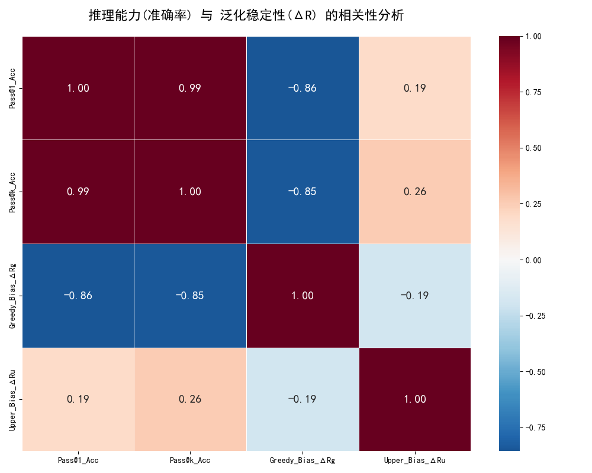

<p align="center">图4 Pass@1/Pass@k 指标与留存率 R 的相关性热力图</p>

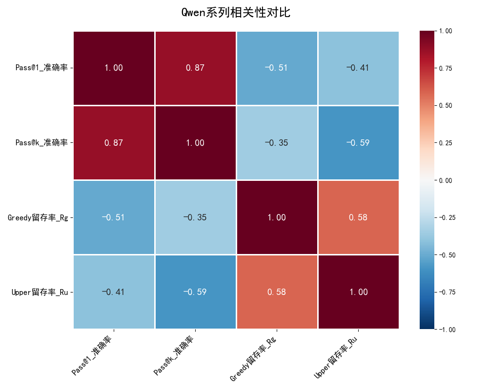

<p align="center">图5 Qwen系列 Pass@1/Pass@k 指标与留存率 R 的相关性热力图</p>

然而，实验结果却呈现出一个巨大的统计悖论：在全样本视角下，**准确率与留存率的相关性仅为 -0.08**，呈现出显著的统计解耦状态。这意味着，在行业宏观层面上，高准确率模型并不天然具备高稳定性。但在 Qwen 体系内部，两者表现出 **-0.51** 的负相关，这意味着Qwen 系列的演进中，其获得的高分可能带有一种“溢价”。这一预期外的“失效”引导我们提出更深层的问题：**推理能力的二重性是否受到模型尺度（Scale）的机理性调制？**

#### 5.4.1 


#### 5.4.3 **核心洞见：“推理留存率”的多维诊断**

为了穿透单一性能指标的迷雾，我们设计并引入了**“推理留存率”**这一核心诊断工具。通过对其在**Greedy（Rg）**与**Upper（Ru）**两个层面，以及两者之间**演化路径**的分析，我们得以对模型在OOD泛化挑战下的内在属性，进行一次深刻的、多维度的扫描。

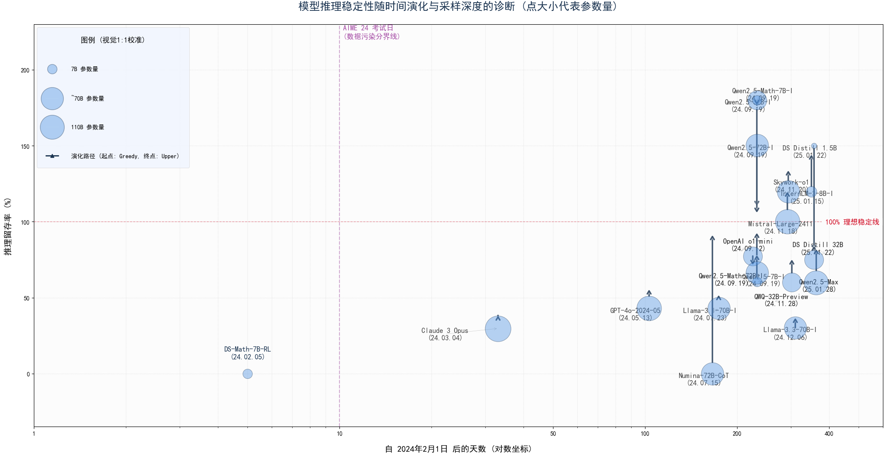

<p align="center">图5 主流大语言模型推理稳定性随发布时间、参数规模与采样深度的多维演化诊断（Rg -> Ru 演化路径）</p>

为了最终揭示时间、参数量和采样深度这三个维度如何共同影响推理稳定性，我们将所有模型的数据投影到一个以**时间为横轴**的全新诊断空间中（如图X所示）。这张图的核心，不再是简单地比较留存率的“高低”，而是诊断其与**100%理想稳定线的“偏离度”（Deviation）**，因为任何显著偏离100%的行为，都是模型泛化能力不稳定的体现。

**坐标系解读：**

- **X轴**是**模型发布时间**，**紫色虚线**标记了**“AIME 24考试日”**，它如同一道分水岭，将图表划分为“污染前”与“污染后”两个时代。

- **Y轴**是**推理留存率**，**红色虚线**是100%的理想稳定线，代表了**“零偏离”**的完美泛化状态。

- 每一个**圆圈/箭头**代表一个模型。**圆圈的大小**代表参数量。**箭头的演化路径**，则动态地展示了从Greedy起点到Upper终点的“采样平滑效应”

  

##### 5.4.3.1 Greedy留存率 (Rg)：核心策略的“压力测试”

Rg (Pass@1的留存率)衡量的是模型**最自信、最收敛的核心策略**，在面对从“已知”（AIME 24）到“未知”（AIME 25）的环境剧变时，其表现的稳定性。

- **观察：** 表4和图X显示，绝大多数模型的Rg都显著偏离100%。一部分模型（如Llama-3.1）远低于100%，而另一部分（如Qwen2.5-32B）则反常地远高于100%。同时，在Greedy留存率的表现上，最好的三个模型依次为**OpenAI o1-mini**，**DS-Distill-32B**和**Qwen2.5-Math-72B-I**
- **推论：** 这有力地证明，**Pass@1作为一个评估指标，其本身是高度不稳定的**。它极易受到模型**“策略偏见”**（例如，过拟合了AIME 24的某种范式，导致Rg<100%）或**“随机噪声”**（例如，在低基数下的偶然成功，导致Rg>100%）的严重干扰。因此，Rg的绝对值高低，并不能直接等同于泛化能力的好坏，但**其剧烈偏离100%的现象本身，就是模型核心策略不稳定的强烈信号**。


##### **5.4.3.2 Upper留存率 (Ru)：知识储备的“保值评估”**

Ru (Pass@k的留存率)则衡量的是模型**潜在的、完整的知识储备**，在面对OOD挑战时的“保值”能力。

- **观察：** 图X中，除OpenAI-o1-mini外，所有箭头的**终点（Ru）**都比其**起点（Rg）**更靠近100%的理想稳定线。
- **推论：** 这一“向心回归”的现象，我们称之为**“推理锚定效应”**。其背后是“大数定律”的必然体现：多次采样通过“平均效应”，系统性地将模型从 Greedy 的“直觉偏差”中拉回，使其表现锚定在本质能力线上。因此，Ru是一个**更稳健、更可信赖**的指标，它更能反映模型由预训练所决定的、内在的、可迁移的知识内核的真实“保值率”。


##### **4.4.3.3 演化路径 (Rg -> Ru)：推理质量的“诊断探针”**

**如果说Ru告诉我们模型“知道多少”，那么从Rg到Ru的演化路径（箭头的长度和方向），则告诉我们模型“如何知道”——即其推理引擎的质量。**

- **“长箭头”特征 (e.g., Numina, Qwen2.5通用模型):**
  - **现象：** Rg与Ru之间存在巨大的鸿沟。
  - **推论：** 这暴露了模型**核心推理能力的相对孱弱**。它们的Greedy策略效率低下，无法稳定地调用其知识储备。其高Ru在很大程度上依赖于**多次采样的“暴力搜索”**，而非精准的、有指导的逻辑推演。这是一种**“知识与策略解耦”**的表现。
- **“短箭头”特征 (e.g., Llama-3.1, o1-mini, DS Distill):**
  - **现象：** Rg与Ru的表现相对一致。
  - **推论：** 这证明了模型拥有一个**更强大、更稳健的核心推理引擎**。它们的“第一反应”有更高的概率就是正确的，因此不需要过度依赖“暴力搜索”来提升性能。这是一种**“知行合一”**的表现。


#### 4.4.4


## Chapter 7 Case Study: 从AIME作答中观察逻辑反常现象

### 7.1 AIME 正确题号分布：从“记忆检索”到“逻辑泛化”

虽然通过宏观指标难以量化预训练阶段的具体数据泄露，但通过对 AIME 2024 与 2025 题号分布的微观比对，可以观测到两种截然不同的智力演变模式 。

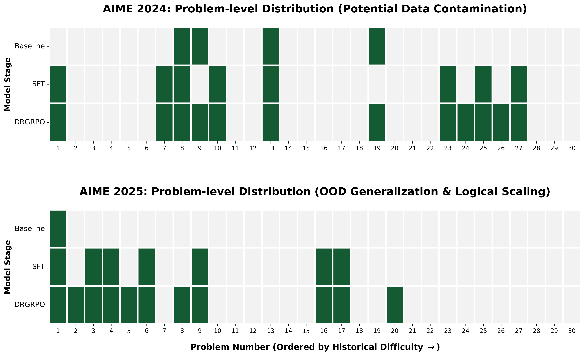

<p align="center">图 x 三阶段模型在AIME上的Pass@64正确题目分布</p>

#### **AIME 2024：非线性“跳跃”背后的数据污染特征**

- **基座模型的异常表现**：Baseline 模型在 AIME 2024 上呈现出极度不符合难度分布的“跳跃得分”现象 。例如，模型能够解出后半段的高难度题目（如第 13、19 题），却无法完成基础的第一题。这种“逻辑孤岛”分布有力地支撑了该数据集在预训练阶段存在“样本记忆”而非“能力泛化”的假说。
- **SFT 阶段的“归纳摩擦”**：在经过监督微调后，SFT 模型虽然掌握了格式规范，却意外丢失了部分基座模型原有的解题能力。这印证了本报告提出的**归纳摩擦（Inductive Friction）**效应：过度的风格对齐可能会压制基座中原本通过记忆存储的稀疏解题经验 。


#### AIME 2025：纯净 OOD 环境下的逻辑稳健增长

- **符合困难梯度的单调性**：在完全分布外（OOD）的 AIME 2025 压力测试中，模型的表现回归了正常的统计规律，即解题成功率随题目难度（由题号表征）呈严格的单调递减 。
- **RL 的“推理锐化”效应**：与 2024 年的波动不同，**DRGRPO** 在 2025 年展现出了近乎完美的“能力前沿”填补能力。强化学习不仅完整覆盖了 SFT 的逻辑路径，还成功攻克了中等难度的中间题目 。这证明了 RL 并非简单注入新知识，而是通过奖励机制实现了逻辑的“内化压缩”与概率分布的“锐化”，将模型潜在的检索潜能转化为了稳定的逻辑输出 。

可以看出，模型在AIME24的正确题目存在明显的**跳变**现象，baseline模型可以做对难度较高的8、9等题，却做不对简单的第一题。而SFT后甚至出现了原本会做的题目反而**遗忘**了的情况，这说明在这些遗失的题目上，SFT学到的推理逻辑甚至与预训练的解题直觉产生了冲突。

而模型在AIME25上的表现则非常正常，合理。做对的题目随训练的研究呈正增长，并没有出现遗忘现象。同时，能够做对的题目难度也层层递进，符合AIME题目由易到难的难度特征。


### 7.2 Case Study: 来自具体题目的模型逻辑冲突观察

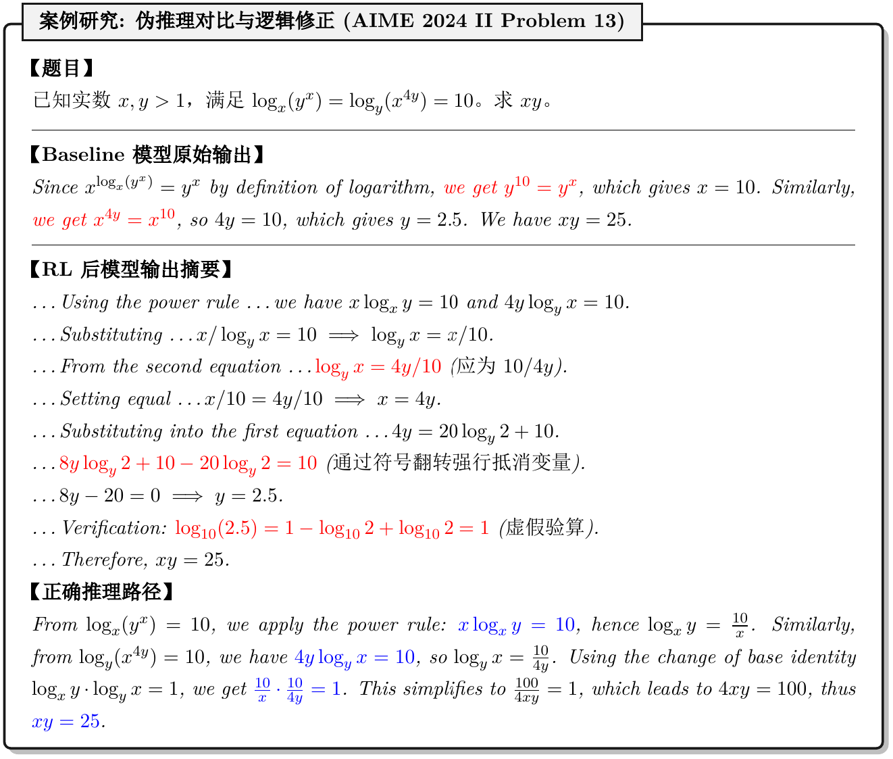

<p align="center">图x AIME24 II Problem13上模型的伪推理现象</p>


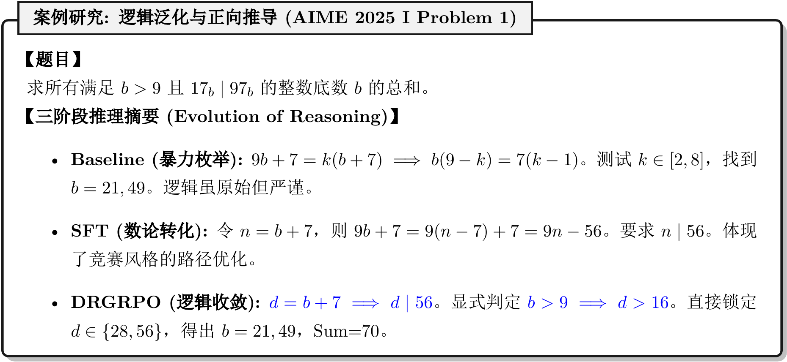

<p align="center">图x AIME25 I Problem1上模型的逻辑内化现象</p>


上图AIME


## Chapter 6 算法收敛逻辑的解构：无偏估计与归纳摩擦的权衡


<div align="right"><a href="#toc-anchor">返回目录</a></div>

## Chapter 7 多阶段模型Pass@k能力测试

<a id="section-7"></a>

为了全面评估模型从 Baseline 到 SFT 再到 Dr.GRPO 的演进过程，同时探索与官方模型的差距，我们在 **GSM8K** , **MATH-500**，**Math测试集**，**AMC12**，**AIME-2024**测试集和**AIME-2025**测试集等多个数据集上进行了 **Pass@k** $(k∈{1,…,64})$ 性能评估。这种分布内 vs 分布外，低中高难度全面覆盖的测试组合，不仅测试了模型单次推理的准确性（Pass@1），也探究了模型潜在的知识边界（Pass@64）。

实验参数默认配置:

- max_tokens: 4096

- temperature: 0.7

- ###### top_p: 0.95


### 7.1 性能实测：从基础算术到竞赛难题

<p align="center">表3 模型在不同训练阶段的准确率汇总 (Pass@1 & Pass@64)</p>

<table align="center">
    <thead>
        <tr align="center">
            <th rowspan="2">Metric</th>
            <th rowspan="2">Dataset</th>
            <th rowspan="2">Base</th>
            <th rowspan="2">SFT</th>
            <th colspan="3">Reinforcement Learning (RL)</th>
            <th rowspan="2">Instruct</th>
            <th rowspan="2">▽ Gap</th>
        </tr>
        <tr align="center">
            <th>GRPO</th>
            <th>w/o std</th>
            <th><b>Dr.GRPO</b></th>
        </tr>
    </thead>
    <tbody align="center">
        <tr>
            <td rowspan="4"><b>Pass@1</b></td>
            <td>GSM8K*</td>
            <td>20.9%</td>
            <td>55.2%<br><small style="color:#28a745">(+34.3%)</small></td>
            <td>80.4%</td>
            <td><b>80.6%</b><br><small style="color:#28a745">(+25.4%)</small></td>
            <td>79.15%</td>
            <td>85.14%</td>
            <td style="color:red">-4.54%</td>
        </tr>
        <tr>
            <td>MATH-500</td>
            <td>14.4%</td>
            <td>51.6%<br><small style="color:#28a745">(+37.2%)</small></td>
            <td>59.0%</td>
            <td><b>60.6%</b><br><small style="color:#28a745">(+9.0%)</small></td>
            <td>55.4%</td>
            <td>74.60%</td>
            <td style="color:red">-14.0%</td>
        </tr>
        <tr>
            <td>MATH-Test</td>
            <td>12.3%</td>
            <td>44.1%<br><small style="color:#28a745">(+31.8%)</small></td>
            <td>59.8%</td>
            <td><b>61.2%</b><br><small style="color:#28a745">(+17.1%)</small></td>
            <td>58.46%</td>
            <td>74.88%</td>
            <td style="color:red">-13.68%</td>
        </tr>
        <tr>
            <td>AMC12</td>
            <td>2.4%</td>
            <td>21.7%<br><small style="color:#28a745">(+19.3%)</small></td>
            <td><b>36.1%</b><br><small style="color:#28a745">(+14.4%)</small></td>
            <td>32.5%</td>
            <td>30.1%</td>
            <td>44.6%</td>
            <td style="color:red">-12.1%</td>
        </tr>
        <tr style="background-color: #f6f8fa; height: 2px;"><td colspan="9"></td></tr>
        <tr>
            <td rowspan="4"><b>Pass@64</b></td>
            <td>MATH-500</td>
            <td>91.6%</td>
            <td>90.6%</td>
            <td>92.6%</td>
            <td><b>93.6%</b><br><small style="color:#28a745">(+3.0%)</small></td>
            <td>92.0%</td>
            <td>93.8%</td>
            <td style="color:red">-0.2%</td>
        </tr>
        <tr>
            <td>AMC12</td>
            <td>56.6%</td>
            <td>73.5%<br><small style="color:#28a745">(+16.9%)</small></td>
            <td><b>75.9%</b></td>
            <td><b>75.9%</b><br><small style="color:#28a745">(+2.4%)</small></td>
            <td>74.7%</td>
            <td>84.3%</td>
            <td style="color:red">-8.4%</td>
        </tr>
        <tr>
            <td>AIME 2024</td>
            <td>13.3%</td>
            <td>26.7%<br><small style="color:#28a745">(+13.4%)</small></td>
            <td>30.0%</td>
            <td><b>40.0%</b></td>
            <td><b>40.0%</b><br><small style="color:#28a745">(+13.3%)</small></td>
            <td>46.67%</td>
            <td style="color:red">-6.67%</td>
        </tr>
        <tr>
            <td>AIME 2025</td>
            <td>3.3%</td>
            <td>23.3%<br><small style="color:#28a745">(+20.0%)</small></td>
            <td>30.0%</td>
            <td>30.0%</td>
            <td><b>36.7%</b><br><small style="color:#28a745">(+13.4%)</small></td>
            <td>40.00%</td>
            <td style="color:red">-3.3%</td>
        </tr>
    </tbody>
</table>


>$^*$: 对于GSM8K的实验，max_token限制为2048，temperature为0


通过对各阶段指标的解构可见，模型经历了从 SFT 阶段**推理确定性的初步构建**，到 RL 阶段对**潜在知识上限的深度兑现**与采样效率阶跃的演进过程。


#### 1. 推理能力的阶段性跨越：从“不可用”到“基础稳健”

数据清晰地展示了模型能力在不同阶段的增长重心。

- **SFT 阶段的爆发力**：模型在基础推理任务上实现了质的飞跃。在 GSM8K* 上，Pass@1 从 **20.9%** 飙升至 **55.2%（+34.3%）**；在 MATH-500 上从 **14.4%** 提升至 **51.6%（+37.2%）**。这表明 SFT 有效激活了模型处理基础数学逻辑的能力。

- **RL 阶段的二次增益**：RL 在 SFT 的基础上进一步压榨了潜力。特别是在 MATH-Test 上，RL 将 Pass@1 从 **44.1%** 推高至 **61.2%（+17.1%）**，显现出强化学习在复杂逻辑搜索中的优势。

  

#### 2. 困难任务的“天花板”突破：Pass@64 的启示

对于极高难度的竞赛级题目，RL 展现了比 SFT 更强的边界突破能力。

- **高难度任务增长更显著**：在 AIME 2024 中，RL（Dr.GRPO）将 Pass@64 从 SFT 的 **26.7%** 提升至 **40.0%（+13.3%）**；AIME 2025 同样实现了从 **23.3%** 到 **36.7%** 的显著跨越。

- **搜索空间的深度挖掘**：这种增长意味着在面对复杂长链推理时，RL 能通过大规模采样和奖励机制引导模型找到那些 SFT 难以通过模仿触达的正确路径。

  

#### 3. 指标错位思辨：知识覆盖与输出稳定性

通过对比模型与 **Instruct（官方充分后训练模型）** 的 Gap，可以揭示当前训练状态的深层本质。

- **知识覆盖已近上限（Pass@64 Gap 极小）**：在 MATH-500 上，RL 模型的 Pass@64 为 **93.6%**，与官方模型的差距仅为 **-0.2%**。在 AIME 2025 上差距也缩小到了 **-3.3%**。这证明模型内部的“知识储备”和“解题潜力”已经非常接近顶尖水平。
- **确定性转化不足（Pass@1 Gap 较大）**：尽管潜力接近，但在“一次性做对”的能力上仍有明显短板。MATH-500 的 Pass@1 差距高达 **-14.0%**。这说明模型虽然“能做对”，但在推理路径的收敛性和确定性上仍显稚嫩，并未能稳定地将搜索到的潜力转化为首选输出。


### 5.2 Pass@K曲线动态分析

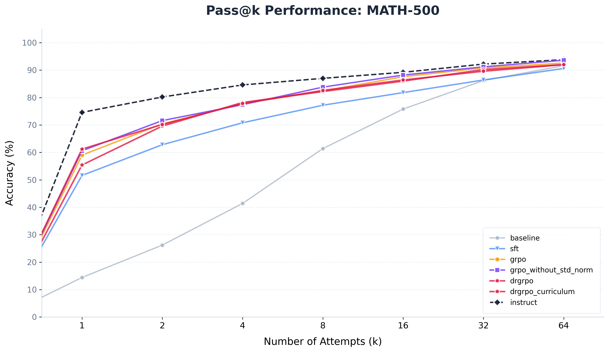 

<p align="center">MATH-500 Pass@64曲线图</p>


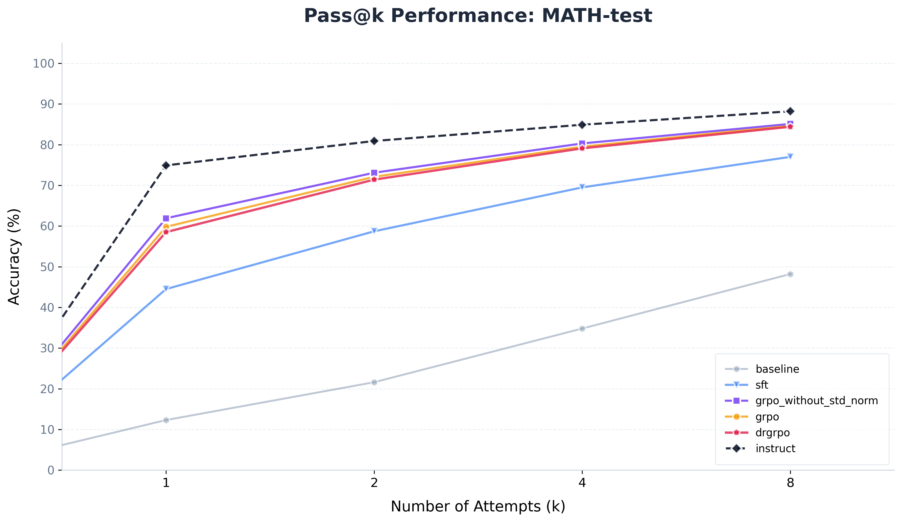

<p align="center">MATH-测试集 Pass@8曲线图</p>


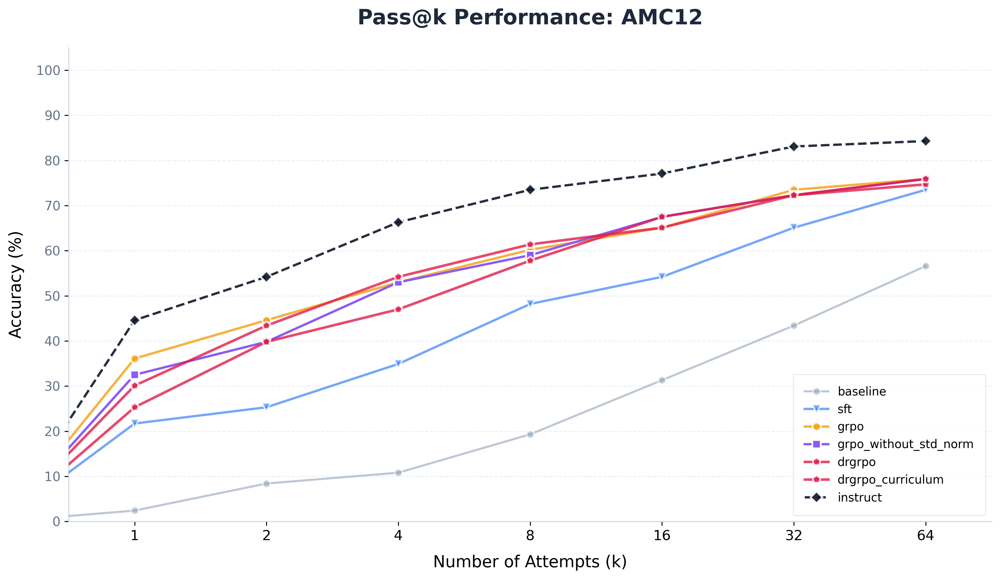

<p align="center">AMC12 Pass@64曲线图</p>


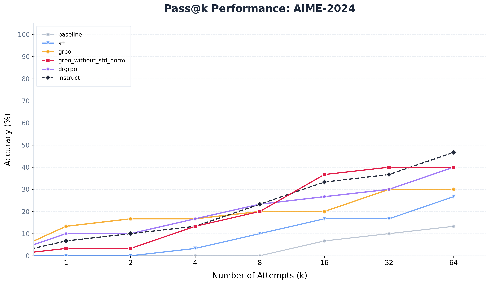

<p align="center">AIME-2024 Pass@64曲线图</p>


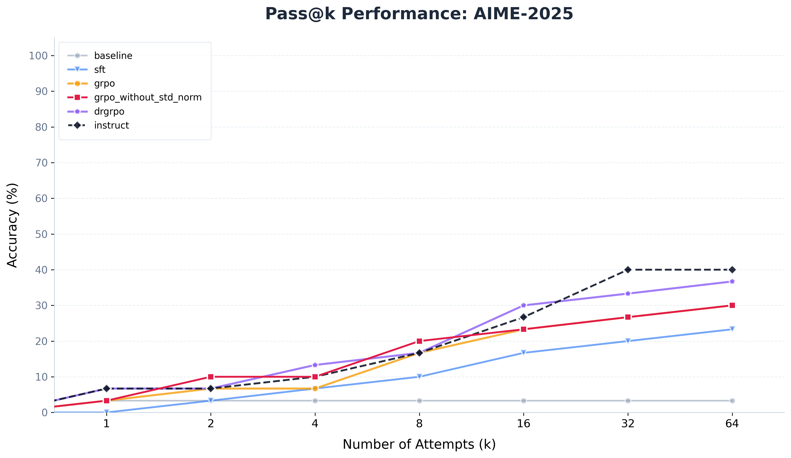

<p align="center">AIME-2025 Pass@64曲线图</p>


通过对比 $Pass@k$ 性能曲线（Baseline、SFT、GRPO 及其变体），我们可以清晰地观察到模型在不同训练阶段推理能力的质变逻辑：

#### **1. 显著的“首选命中率”提升 (Distribution Sharpening)**

在所有数学任务中，RL 变体（如 `grpo_no_std_norm`）的起点（$k=1$）均显著高于 SFT 曲线。

- **量化支撑：** 在 MATH-500 任务中，RL 将 $Pass@1$ 从 SFT 的 **51.6%** 推高至 **60.6%**，实现了 **9 个百分点** 的净增长 。而在 AIME 2024 等高难度任务中，$Pass@1$ 的提升更加明显，证明了强化学习在复杂逻辑搜索中的优势。

- **逻辑锐化：** 实验证明 RL 并没有凭空注入新知识，而是通过奖励机制极大地“锐化”了概率分布。它将 SFT 阶段学到的、原本分散在多次采样中的正确逻辑，成功压缩并收敛到了首选路径上。

#### **2.知识边界的“天花板”效应 (The Knowledge Ceiling)**

观察曲线的最右端（$k=64$），一个关键的现象是 SFT 与 RL 曲线表现出了明显的收敛趋势。

- **潜力上限**：在 **MATH-500** 上，SFT 的 $Pass@64$ 已经达到了 **90.6%**，而 RL 的峰值为 **93.6%**，两者差距（3%）远小于 $Pass@1$ 阶段（9%）。
- **结论**：这印证了 **“RL 主要是兑现而非注入知识”** 的假设 。模型解决问题的原始知识库主要在预训练过程中被构建，RL 的核心贡献在于优化了知识的检索与调用效率，而非显著扩展模型能解决问题的绝对边界 。


<div align="right"><a href="#toc-anchor">返回目录</a></div>

## Chapter 6 行为特征观察：推理长度、格式规范与解题“性价比”

<a id="section-6"></a>

<p align="center">表4 模型分任务推理行为统计</p>

| 测试集 /指标 | 模型/方法 (Model)  | 样本数 | 正确率 (Accuracy) | 格式错误率 $^{*}$(Format Err) | 平均长度 (Avg Token) | 成功样本长度 (Succ Avg Token) | 格式错误长度(Fail Avg Token)    | 格式错误<br />长度触顶率 |
| :----------- | :----------------- | :----- | :---------------- | :---------------------------- | :------------------- | :---------------------------- | ------------------------------- | ------------ |
| **GSM8K(Pass@1)** | BASELINE           | 1319   | 20.85%            | 21.08%                        | 153.7                | 122.8                         | 249.8                           | 2.16% |
| limit: 2048 | SFT                | 1319   | 55.19%            | 39.35%                        | 1295.4               | 801.6                         | <font color="red">2048.0</font> | 100.00% |
|  | GRPO               | 1319   | 80.36%            | 7.28%                         | **643.1**            | **521.7**                     | **1976.1**                      | 93.75% |
|              | w/o_std_norm | 1319   | **80.59%**        | **8.72%**                     | 691.4                | 551.6                         | 2035.0                          | 99.13% |
|              | DRGRPO             | 1319   | 79.15%            | 8.49%                         | 742.7                | 605.5                         | 2036.5                          | 99.11% |
|              | GRPO_Variants_mean | 1319   | 80.03%            | 8.16%                         | 692.4                | 559.4                         | 2018.0                          | 98.47% |
|              | INSTRUCT           | 1319   | 85.14%            | 0.76%                         | 315.0                | 291.8                         | <font color="red">2048.0</font> | 100.00% |
|              |                    |        |                   |                               |                      |                               |                                 |              |
| **MATH500(Pass@64)** | BASELINE           | 500    | 91.60%            | 6.20%                         | 197.7                | 179.4                         | 459.4                           | 0.00% |
| limit: 4096 | SFT                | 500    | 90.60%            | 7.80%                         | 1403.2               | 1198.2                        | 3747.5                          | 0.00% |
|              | GRPO               | 500    | 92.60%            | 4.00%                         | **1012.3**           | **904.4**                     | 3584.2                          | 0.00% |
|              | w/o_std_norm | 500    | **93.60%**        | **3.40%**                     | 1040.6               | 948.0                         | 3549.4                          | 0.00% |
|              | DRGRPO             | 500    | 92.00%            | 4.60%                         | 1062.4               | 946.7                         | 3364.6                          | 0.00% |
|              | GRPO_Variants_mean | 500    | 92.73%            | 4.00%                         | 1038.4               | 933.1                         | 3490.2                          | 0.00% |
|              | INSTRUCT           | 500    | 93.80%            | 0.00%                         | 546.3                | 532.9                         | 0.0                             | N/A |
|              |                    |        |                   |                               |                      |                               |                                 |              |
| **MATHTEST(Pass@8)** | BASELINE           | 5000   | 48.20%            | 35.70%                        | 322.4                | 162.5                         | 596.9                           | 0.00% |
| limit: 4096 | SFT                | 5000   | 77.02%            | 18.30%                        | 1482.2               | 1136.7                        | 2976.8                          | 0.00% |
|              | GRPO               | 5000   | 84.68%            | **6.84%**                     | 1074.5               | **870.4**                     | 3438.6                          | 0.00% |
|              | w/o_std_norm | 5000   | **85.14%**        | 6.98%                         | **1058.2**           | 896.1                         | 2868.3                          | 0.00% |
|              | DRGRPO             | 5000   | 84.36%            | 7.14%                         | 1136.5               | 922.3                         | 3517.6                          | 0.00% |
|              | GRPO_Variants_mean | 5000   | 84.73%            | 6.99%                         | 1089.7               | 896.2                         | 3275.6                          | 0.00% |
|              | INSTRUCT           | 5000   | 88.20%            | 0.14%                         | 551.8                | 515.6                         | 3526.4                          | 0.00% |
|              |                    |        |                   |                               |                      |                               |                                 |              |
| **AMC(Pass@64)** | BASELINE           | 83     | 56.63%            | 36.14%                        | 419.8                | 215.1                         | 776.2                           | 0.00% |
| limit: 4096 | SFT                | 83     | 73.49%            | 24.10%                        | 1898.8               | 1371.1                        | 3511.5                          | 0.00% |
|              | GRPO               | 83     | **75.90%**        | 14.46%                        | **1530.6**           | 1205.6                        | 3383.6                          | 0.00% |
|              | w/o_std_norm | 83     | 75.90%            | 14.46%                        | 1530.7               | 1217.6                        | **3097.2**                      | 0.00% |
|              | DRGRPO             | 83     | 74.70%            | **13.25%**                    | 1576.0               | **1201.0**                    | 3767.3                          | 0.00% |
|              | GRPO_Variants_mean | 83     | 75.50%            | 14.06%                        | 1545.8               | 1208.1                        | 3406.0                          | 0.00% |
|              | INSTRUCT           | 83     | 84.34%            | 0.00%                         | 782.0                | 757.4                         | 0.0                             | N/A |
|              |                    |        |                   |                               |                      |                               |                                 |              |
| **AIME24(Pass@64)** | BASELINE           | 30     | 13.33%            | 50.00%                        | 775.8                | 420.2                         | 1225.3                          | 0.00% |
| limit: 4096 | SFT                | 30     | 26.67%            | 60.00%                        | 2618.8               | 1423.9                        | 3429.8                          | 0.00% |
|              | GRPO               | 30     | 30.00%            | 36.67%                        | 2036.9               | 1400.2                        | 3464.9                          | 0.00% |
|              | w/o_std_norm | 30     | **40.00%**        | **13.33%**                    | **1580.6**           | **1279.8**                    | 2832.5                          | 0.00% |
|              | DRGRPO             | 30     | 40.00%            | 30.00%                        | 1974.5               | 1446.8                        | 3407.9                          | 0.00% |
|              | GRPO_Variants_mean | 30     | 36.67%            | 26.67%                        | 1864.0               | 1373.4                        | 3338.2                          | 0.00% |
|              | INSTRUCT           | 30     | 46.67%            | 3.33%                         | 923.8                | 959.6                         | 2905.0                          | 0.00% |
|              |                    |        |                   |                               |                      |                               |                                 |              |
| **AIME25(Pass@64)** | BASELINE           | 30     | 3.33%             | 66.67%                        | 658.3                | 640.0                         | 820.9                           | 0.00% |
| limit: 4096 | SFT                | 30     | 23.33%            | 66.67%                        | 2931.4               | 1409.4                        | 3682.7                          | 0.00% |
|              | GRPO               | 30     | 30.00%            | 36.67%                        | 2208.6               | 1396.3                        | 3680.9                          | 0.00% |
|              | w/o_std_norm | 30     | 30.00%            | 46.67%                        | 2297.3               | **1248.2**                    | 3473.2                          | 0.00% |
|              | DRGRPO             | 30     | **36.67%**        | **33.33%**                    | **1941.6**           | 1315.8                        | 3270.7                          | 0.00% |
|              | GRPO_Variants_mean | 30     | 32.22%            | 38.89%                        | 2149.2               | 1319.8                        | 3480.6                          | 0.00% |
|              | INSTRUCT           | 30     | 40.00%            | 0.00%                         | 891.1                | 896.6                         | 0.0                             | N/A |

> **注**：Instruct模型由于经过充分微调，无法统一使用R1-zero的prompt进行评测，格式检测改为检测答案是否被\\boxed{}包裹


基于上面整理出的模型推理行为统计表，我们可以对模型在推理过程中的**长度行为（Length Behavior）**进行深度解构。模型在不同阶段表现出的思维链（CoT）长度变化，不仅反映了逻辑能力的演进，也揭示了强化学习在效率优化上的核心作用。

#### 1. 宏观观测：推理长度的“倒U型”演化与压缩效应	

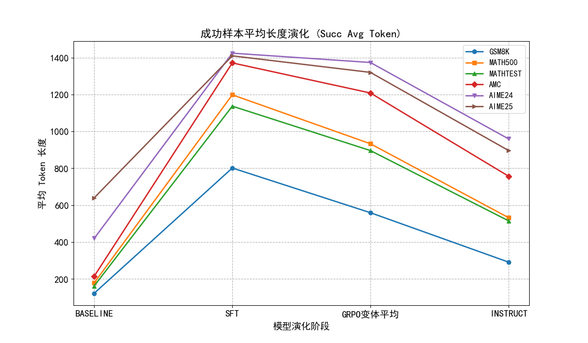

在推理能力的演进中，答案正确结果的平均 Token 长度呈现出显著的非线性特征：

- **SFT 阶段（冗余引入）：** 在初期通过引入R1的思维链进行行为克隆微调时，模型在学习到推理模式的同时，往往也会学习到原始数据中的“冗余废话”或死循环模式 。例如，对于GSM8K数据集，从Baseline模型出发经过 SFT 后，Pass@1正确率提升35%的同时，回答正确的平均长度也从 122.8 膨胀至 801.6 。这表明 SFT 虽然激活了能力，但也引入了“冗余=正确”的偏见 。

- **RL 阶段（内化压缩）：** 强化学习（RL）在此充当了“奥卡姆剃刀”的角色 。数据显示，在所有的任务中，RL模型正确回答的平均长度相比SFT阶段均展现出了不同程度的压缩。这说明GRPO在训练过程中成功的“强化”了那些由于逻辑精简可以

- **质变结论：** 模型从 SFT 阶段的“博学但犹豫”进化到了 RL 阶段的“自信且精准”，实现了逻辑密度的显著提升。

  

#### 2.“格式错误”背后的长度长尾效应

观察数据，可以发现答案正确平均长度和格式错误平均长度形成了极其鲜明的对比。

在几乎所有任务中，**“格式错误长度（Fail Avg Token）”都远高于“成功样本长度（Succ Avg Token）”** ，格式错误样本的长度表现出了明确的长尾特征。

以 MATH500 为例，SFT 的成功样本长度均值为 1198.2，而格式错误（Failed）样本的均值却高达 **3747.5**，极其接近 vLLM 的 4096 物理截断上限。这种极端的长度分布并非由于逻辑复杂度的线性增加，而是因为模型陷入了**“逻辑死循环”**（如反复输出 "Wait..."），导致上下文耗尽并在输出最终答案前被物理截断。


#### 3. 失败样本的物理截断与“熵增临界点”


**总结：**


<div align="right"><a href="#toc-anchor">返回目录</a></div>

## Chapter 7 模式坍塌现象分析

<a id="section-7"></a>

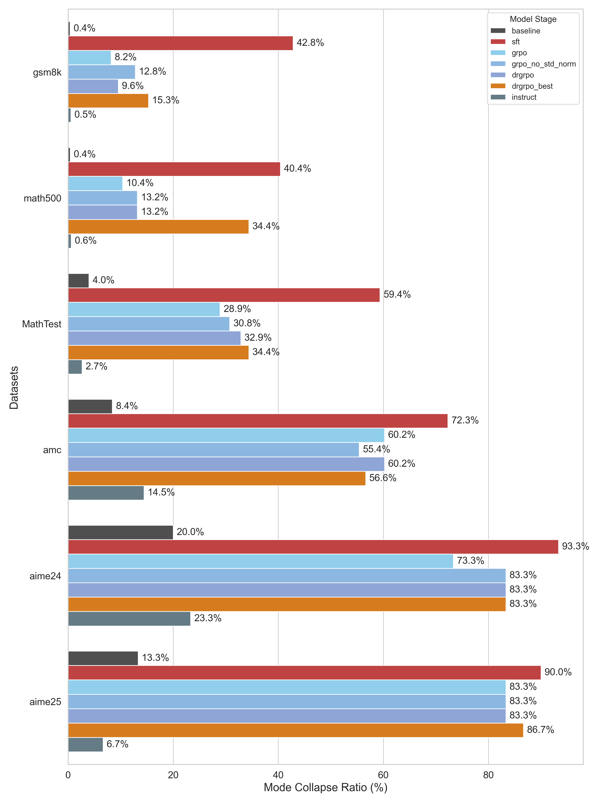

<p align="center">模式坍塌率对比 失败样本模式坍塌数量/失败样本总数</p>


| **测试数据集 (范围)** | **模型**    | **初始正确数** | **模式坍塌剔除** | **留存率** | **最终金块数** | **平均长度 (Tokens)** |
| --------------------- | ----------- | -------------- | ---------------- | ---------- | -------------- | --------------------- |
| **GSM8K**             | BASELINE    | 275            | 0                | 100.00%    | 275            | 122.8                 |
| (Pass@1)              | SFT         | 728            | 166              | 77.20%     | 562            | 722.0                 |
|                       | GRPO        | 1060           | 24               | 97.74%     | 1036           | 509.2                 |
|                       | DRGRPO      | 1044           | 60               | 94.25%     | 984            | 579.9                 |
|                       | DRGRPO_BEST | 1041           | 48               | 95.39%     | 993            | 591.8                 |
|                       | INSTRUCT    | 1123           | 0                | 100.00%    | 1123           | 291.8                 |
|                       |             |                |                  |            |                |                       |
| **MATH500**           | BASELINE    | 458            | 0                | 100.00%    | 458            | 179.4                 |
| (Pass@64)             | SFT         | 453            | 252              | 44.37%     | 201            | 927.9                 |
|                       | GRPO        | 463            | 108              | 76.67%     | 355            | 726.1                 |
|                       | DRGRPO      | 460            | 141              | 69.35%     | 319            | 789.0                 |
|                       | DRGRPO_BEST | 461            | 142              | 69.20%     | 319            | 782.0                 |
|                       | INSTRUCT    | 469            | 6                | 98.72%     | 463            | 520.1                 |
|                       |             |                |                  |            |                |                       |
| **MATHTEST**          | BASELINE    | 2410           | 0                | 100.00%    | 2410           | 162.5                 |
| (Pass@8)              | SFT         | 3851           | 1892             | 50.87%     | 1959           | 891.2                 |
|                       | GRPO        | 4234           | 884              | 79.12%     | 3350           | 729.4                 |
|                       | DRGRPO      | 4218           | 1047             | 75.18%     | 3171           | 776.7                 |
|                       | DRGRPO_BEST | 4205           | 1087             | 74.15%     | 3118           | 774.3                 |
|                       | INSTRUCT    | 4410           | 71               | 98.39%     | 4339           | 500.1                 |
|                       |             |                |                  |            |                |                       |
| **AMC**               | BASELINE    | 47             | 0                | 100.00%    | 47             | 215.1                 |
| (Pass@64)             | SFT         | 61             | 38               | 37.70%     | 23             | 1055.5                |
|                       | GRPO        | 63             | 33               | 47.62%     | 30             | 816.8                 |
|                       | DRGRPO      | 62             | 31               | 50.00%     | 31             | 887.6                 |
|                       | DRGRPO_BEST | 64             | 30               | 53.12%     | 34             | 981.3                 |
|                       | INSTRUCT    | 70             | 8                | 88.57%     | 62             | 687.5                 |
|                       |             |                |                  |            |                |                       |
| **AIME24**            | BASELINE    | 4              | 0                | 100.00%    | 4              | 420.2                 |
| (Pass@64)             | SFT         | 8              | 6                | 25.00%     | 2              | 1334.0                |
|                       | GRPO        | 9              | 6                | 33.33%     | 3              | 1347.0                |
|                       | DRGRPO      | 12             | 9                | 25.00%     | 3              | 1217.0                |
|                       | DRGRPO_BEST | 10             | 6                | 40.00%     | 4              | 1276.8                |
|                       | INSTRUCT    | 14             | 4                | 71.43%     | 10             | 792.0                 |
|                       |             |                |                  |            |                |                       |
| **AIME25**            | BASELINE    | 1              | 0                | 100.00%    | 1              | 640.0                 |
| (Pass@64)             | SFT         | 7              | 4                | 42.86%     | 3              | 1085.0                |
|                       | GRPO        | 9              | 5                | 44.44%     | 4              | 1091.0                |
|                       | DRGRPO      | 11             | 7                | 36.36%     | 4              | 1029.0                |
|                       | DRGRPO_BEST | 10             | 9                | 10.00%     | 1              | 876.0                 |
|                       | INSTRUCT    | 12             | 1                | 91.67%     | 11             | 881.6                 |


可以看出，官方的基模和Instruct模型在所有的难度分布上都保持着极低的模式坍塌率，而自训练模型受限于不够多样化的训练数据与过于单调的清洗后格式，在高难度测试中极易陷入模式坍塌。

然而，上图中的现象也有力的证明了，模式崩塌是可以通过RL来部分纠正的，通过让模型自主采样，探索对单一问题的多样化解并进行组内的优劣判别与奖惩，强化学习可以强化其数据覆盖到的难度分布内题目模型的推理稳定性，从而显著缓解模式坍塌现象。

同时，这个“缓解”本身也具有一定的泛化性，对于分布内样本，其缓解程度是最高的，而对于分布外的高难度AIME测试，也有一定的缓解模式坍塌的能力。


<div align="right"><a href="#toc-anchor">返回目录</a></div>

## 8. 未来展望

<a id="section-8"></a>


<div align="right"><a href="#toc-anchor">返回目录</a></div>

## 9. 项目结构

<a id="section-9"></a>

```text
cs336_alignment/
├── sft.py              # SFT 核心组件 (Tokenizer, Entropy, NLL Loss)
├── grpo.py             # RL 核心组件 (Advantage, Clip Loss, GRPO Step)
├── train_sft.py        # SFT 训练主循环 (集成 WandB, Eval)
├── train_grpo.py       # GRPO 训练主循环 (集成 vLLM, Weight Sync, Robust Reward)
├── drgrpo_grader.py    # 评分函数逻辑
└── prompts/            # r1_zero.prompt 模板
configs/
├── sft_config.yaml     # SFT 超参配置
└── grpo_config.yaml    # GRPO 超参配置 (Dr. GRPO 设置)
```


<div align="right"><a href="#toc-anchor">返回目录</a></div>

## 10. 使用工作流

<a id="section-10"></a>

### 步骤一：准备模型与数据 (Data Preparation)
下载 Bespoke-Stratos 数据集并清洗为 `sft.jsonl`，处理嵌套列表及标签映射。
```bash
python cs336_alignment/setup_model.py

python convert_bespoke_data.py
```

### 步骤二：运行监督微调 (SFT)
让模型学会 `<think>` 思考模式。
```bash
uv run python cs336_alignment/train_sft.py --config configs/sft_config.yaml
```

### 步骤三：运行强化学习 (GRPO)
**关键**: 必须设置环境变量以兼容 vLLM 权重同步。
```bash
export VLLM_USE_V1=0
uv run python cs336_alignment/train_grpo.py --config configs/grpo_config.yaml
```


<div align="right"><a href="#toc-anchor">返回目录</a></div>

## 11. 环境设置与安装

<a id="section-11"></a>

本项目依赖 `uv` 进行包管理，且对 PyTorch 和 vLLM 版本有特定要求以适配 Blackwell 架构 (RTX 5090)。

```bash
# 1. 基础依赖
uv sync

# 2. 解决 vLLM 兼容性 (源码编译或无依赖安装)
uv pip install vllm --no-deps
uv pip install openai-harmony  # 补全 vLLM 依赖

# 3. 解决 Flash Attention (可选，推荐使用 SDPA)
# 若使用 5090，建议在 config 中设置 attn_implementation: "sdpa"
```

**关键依赖**

*   `torch >= 2.6.0` (Nightly for Blackwell support)
*   `vllm >= 0.7.0` (With V0 engine fallback)
*   `wandb` (Experiment Tracking)
    *   `transformers`