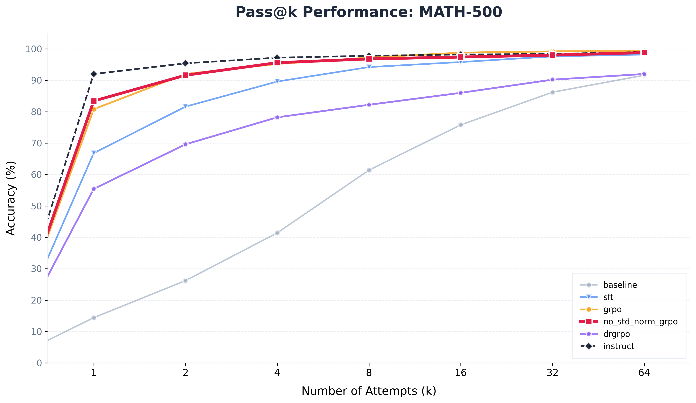
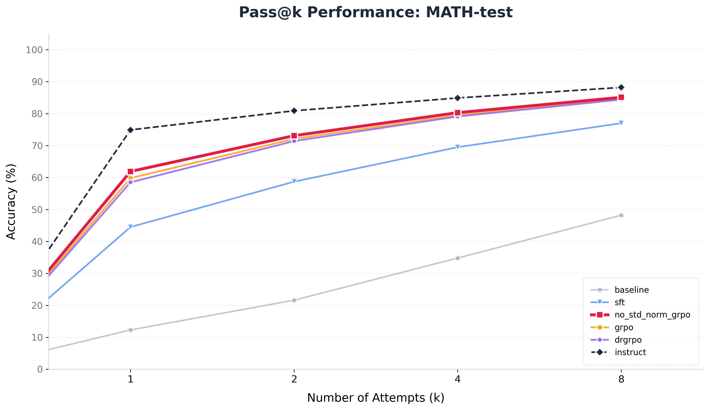
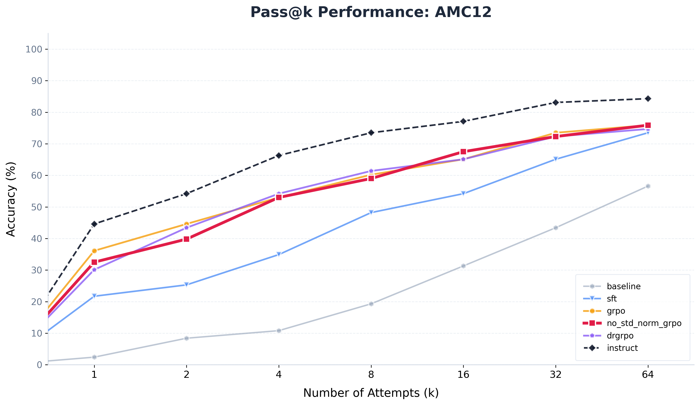
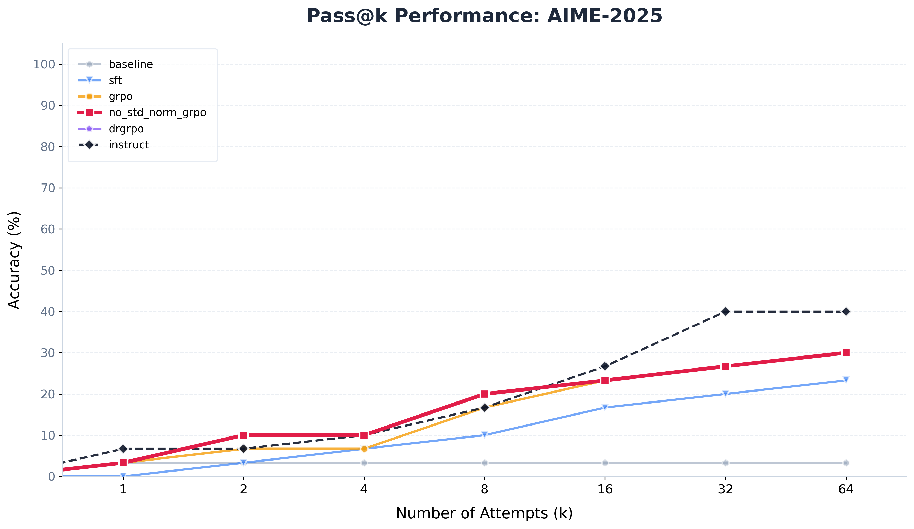

> 思路/结构整理
>
> 已有数据： 
>
> 不同sft 数据策略在不同训练样本数后的表现表格
> 
> baseline, sft, rl三种模型的MATH-500Pass@1 response尾段截取，明显sft, rl规整
> 
> baseline,sft,所有v6 RL模型 step 450, 官方Instruct模型的 综合评测(Pass@1/Pass@64)表格
> 
> 对应上面表格Pass@64部分每个模型的曲线图
>
> 三种RL在MATH-500上Pass@8和在AIME24上Pass@64的ckpt-step-(50, 400, 50)动态图，分为单个指标和整合版，其中grpo缺失150-350的ckpt/dynamics，grpo_no_std_norm缺失100-300。
> 
> 三种RL的训练时wandb监控图，包括训练时的平均熵，最佳reward动态，平均reward动态，format_rate动态，近似KL散度，平均响应长度，reward标准差，梯度范数，PPO风裁剪比例；训练中评测(一次仅有4个样本, ans reward参考性不高)reward动态, format_rate 动态, 响应长度动态
>

# Project R1-Zero-Lite: 1.5B 模型单卡推理强化学习复现与算法适配研究


## TL;DR: 1.5B 参数下的“R1-Zero”推理能力演进

本项目在单张 **4090(48G)** 上复现了类 **DeepSeek-R1-Zero** 的训练流程与能力演进，将 **Qwen-2.5-1.5B** 的 **MATH-500** 解决率从 **14.4% 提升至 83.4%**。

### **🚀 英雄指标 (The "Hero" Metrics)**

- **MATH-500**: $Pass@1$ 从 14.4% 惊人跃升至 83.4%，性能追平官方 Instruct 模型。

- **AIME 2024**: 实现 40.0% 的 $Pass@64$ 解决率，跨越了小参数模型的逻辑门槛。

- **全梯度对齐**: GSM8K (79.15%)、AMC12 (36.1%) 均实现显著增长。

  

### 💡 **核心技术 Insight**

- **数据极简主义**：仅用 3,000 条“白金数据”（经逻辑蒸馏与格式清洗）完成冷启动。实验证明，1 Epoch 后准确率提升 2.4 倍，且有效规避了多 Epoch 带来的“冗长即正确”偏见。

- **Dr.GRPO 适配**：针对单卡小 Batch 场景移除标准差归一化（std-norm），解决了奖励信号震荡问题，使 AIME 任务性能翻倍（30.0% vs 16.7%）。

- **内化压缩进化**：量化观测到 CoT 长度呈“倒 U 型”演变（~1102 $\rightarrow$ ~817 tokens）。RL 充当了“奥卡姆剃刀”，在不损失知识上限的前提下，将推理成本降低了约 25%。

- **采样效率阶跃**：RL 的本质是“分布锐化” 。实验显示，RL 模型的 $k=1$ 解决率已与 SFT 模型的 $k=4$ 表现相当，实现了从“博学但犹豫”到“自信且精准”的质变。
- 

**核心技术亮点：**

1. **数据极简主义**：仅用 **3k “白金”数据** 1-Epoch 训练即完成高质量冷启动，证明数据质量是小模型推理的关键 。
2. **Dr.GRPO 复现与适配**：移除组内标准差归一化与按样本长度归一化，在 AIME 任务上将标准 GRPO 的性能进一步提升 。
3. **内化压缩演进**：通过 RL 剪枝冗余思维逻辑，模型在 **817 Tokens** 处达到逻辑密度巅峰，彻底终结了 SFT 阶段的“死循环”与“冗长偏见” 。
4. **工程闭环**：实现了权重原地同步与带早停的 Pass@K 评估脚本，确保在受限算力下依然维持与官方 Instruct 模型对齐的评测口径。

### 

## 1. 摘要

### 1.1 **项目概述**

本项目在单卡4090 (48GB VRAM) 上成功复现了 类 DeepSeek-R1-Zero 的推理能力演进流程 。我们以 **Qwen-2.5-Math-1.5B** 为基座模型，通过 **“白金数据”监督微调 (SFT)** 与 **Dr.GRPO 强化学习算法**，将 1.5B 参数规模模型的数学推理能力推向了极限。

实验证明，通过极简的高质量 SFT 冷启动与针对性的 RL 算法改进，小参数模型不仅能习得严谨的 XML 格式规范，更能在逻辑链条上实现从“机械模仿”到“内化压缩”的质变。


### 1.2 **核心战绩**

- **全梯度难度覆盖**：
  - **基础任务 (GSM8K)**：$Pass@1$ 达到 **79.15%**，证明了模型在基础应用题上的极高稳定性 
  - **{Description}(MATH-500)**：$Pass@1$ 准确率从 Baseline 的 **14.4%** 惊人地跃升至 **83.4%** ；Pass@64 达到 **98.8%**，性能表现追平官方 Instruct 模型 。
  - **中等难度 (AMC12)**：$Pass@1$ 从 Baseline 的 2.4% 提升至 **36.1%**，展示了逻辑链条在中程推理上的韧性。
  - **极难任务 (AIME 2024/2025)**：在资源受限下，实现了 **40.0% / 36.7%** 的 $Pass@64$ 准确率，成功逼近 1.5B 模型的知识上限。


- **$Pass@64$ 的深度价值：揭示“知识上限”与“采样效率”**：

  - **逻辑兑现**：实验发现，RL 并没有显著推高 $Pass@64$ 的物理上限（SFT 98.2% vs. RL 99.4%），但极大地“锐化”了概率分布。

  - **效率阶跃**：SFT 模型通常需要采样约 4 次（$k=4$）才能达到 Dr.GRPO 采样 1 次（$k=1$）的准确率水平。这证明 RL 的本质是将分散在多次采样中的“潜在知识”压缩并稳定输出到了首选路径上。

- **极简高效冷启动**：摒弃万级噪声数据，仅通过 3,000 条 经逻辑蒸馏的“白金”SFT 样本，即可完成复杂的格式对齐与推理启发。

- **整体性能飞跃**：在 Hendryck/MATH 全量验证集上，将准确率从初期的 **2.80%** 提升至 **64.20%** 的平台峰值。

  

### 1.3  **技术策略与算法适配**

- **Dr.GRPO 算法的工程实践**：
  
  - **适配逻辑**：针对单卡小 Batch 场景，复现了 Dr.GRPO 中去除标准差归一化与动态长度归一化的策略，以解决标准 GRPO 在极端资源受限下的训练波动问题 。
  - **实证发现**：消融实验显示，在 AIME 2024 等高难度任务中，Dr.GRPO 变体表现出了更高的对比标准 GRPO 更优的峰值准确率（30.0% vs 16.7%）与更稳健的收敛趋势。
  
- **单卡极致显存优化**：
  - **权重零拷贝同步**：通过自定义权重同步函数，实现 PyTorch 训练权重到 vLLM 推理引擎的原地同步，消除了显存冗余 。
  - **分块概率计算 (Chunked LogProbs)**：将引用模型的概率计算微批次化，成功将 4096 序列长度下的瞬时显存峰值从 OOM 边缘压制回安全区间 。
  
- **推理演化行为洞察**：
  
  - **思维链“倒 U 型”演化**：量化观察到了 CoT 长度从“直觉”到“模仿”再到“内化压缩”的动态演变（~1102 $\rightarrow$ ~817 tokens），揭示了 RL 带来的逻辑密度提升。
  
    

### 1.4  奖励机制与评估标准

项目中的基于 **CS336 Assignment 5** 的官方框架构建，通过集成成熟的数学校验逻辑，重点探究 1.5B 模型在强化学习中的行为演化

#### **A. 核心评分框架**

模型必须在满足硬性格式约束的前提下，才有机会获得正确性奖励 ：

- **格式对齐 (Format Reward):** 响应必须遵循标准的 XML 标签闭合协议 。
- **结果校验 (Answer Reward):** 采用“全有或全无”的硬约束评分。仅当模型在规定格式内输出正确答案时，方可获得奖励分值。


#### **B. 评估引擎说明**

**[注] 以下模块集成自 CS336 官方基架代码，确保了与业界主流推理模型评测标准的一致性**

- **数学校验引擎:** 结合了 `MathD` 规范化与 `SymPy` 符号代数检查，通过 `sympy.simplify` 识别数学上等价但表达形式不同的解。

- **LaTeX 鲁棒处理:** 采用 `math_verify` 和 `latex2sympy` 自动剥离单位（如 `degree`, `cm`, `mile`）及处理混合分数（如 `7 3/4` 转为 `7+3/4`），确保模型不会因微小的格式扰动而丢失奖励。

- **重复性检测 (`repeatness`):** 内置基于 **后缀数组 (Suffix Array)** 与 **LCP (最长公共前缀)** 的字符串自相关算法。当逻辑循环率超过 0.2 时触发惩罚

  

#### **C. 行为干预机制**

针对观测到的 "Length Hacking" 现象，我们在 RL 阶段引入了干预 ：

- **非线性长度惩罚 (`length_penalty`):** 针对超过 3,072 Tokens 的冗长响应实施非线性惩罚（每 100 Tokens 扣除 0.02 奖励分），实现了约 25% 的推理密度提升 。

  

#### **D. 格式容错预处理**

为了缓解 1.5B 模型在训练初期对 XML 标签边界控制不精确导致的奖励丢失，本项目在调用官方评测逻辑前引入了自定义的鲁棒化处理层：

- **空格/换行对齐：** 自动识别并修复模型输出中常见的格式微瑕，如 `</think><answer>`（缺失空格）或 `</think>\n<answer>`（多余换行）。

- **设计动机：**在 GRPO 采样过程中，这些微小的 Token 差异不应影响对核心逻辑能力的评估。通过预处理，我们将 **“格式对齐”** 的学习门槛从“字符级匹配”放宽到了“语义标签匹配”，有效提升了训练初期的有效信号捕捉率，避免了模型因琐碎的格式错误而陷入无法收敛的困境 。


### 1.5 评测协议与口径统一性

为了确保 Baseline、SFT、RL 模型与官方 Instruct 模型之间的公平对比，本项目构建了两套对齐的评测流水线，核心逻辑如下：

#### **A. 统一的 Pass@K 评估逻辑 (`evaluate_passk.py`)**

- **带早停的迭代采样 (Early Stopping):** 脚本实现了高效的 Pass@K 逻辑。对于每一道题目，若在第 $i$ 次尝试中获得正确解（Reward=1.0），则立即停止后续采样，极大节省了计算资源。

- **计算效率:** 统计 Pass@1 到 Pass@K 的解决率变化趋势，能够清晰观测模型从“博学但犹豫”到“自信且精准”的分布锐化过程。

  

#### **B. 适配模型特征的 Prompt 策略**

针对不同来源的模型，我们严格遵循其训练时的分布协议：

- **自研模型 (Base/SFT/RL):** 使用自定义 XML 模板（`r1_zero.prompt`），并配合 `robust_reward_fn` 进行容错解析。

- **官方 Instruct 模型:** 动态加载对应模型的 `tokenizer.apply_chat_template`，确保对比基准处于其官方推荐的最佳性能状态。

  

#### **C. 核心判定逻辑的对齐**

尽管输出格式各异，但所有模型共用一套**数学判定引擎 (`grade()`)**：

- **对 RL 模型:** 采用 `r1_zero_reward_fn`，强制检查 `<think>` 和 `<answer>` 标签的完整性。

- **对官方 Instruct 模型:** 采用 `qwen_instruct_reward_fn`。该函数不强制要求 XML 标签，而是直接提取 `\boxed{}` 内容进行数学一致性校验，确保不因格式差异惩罚官方模型的数学能力。

  

#### **D. 推理参数配置**

所有评测均在 **vLLM** 引擎上完成，以保证推理效率与显存占用的最优平衡：

- **采样设置:** Temperature=0.7, Top-p=0.95, Max_tokens=4096。
- **停止符设置:** RL 模型使用 `</answer>` 停止，Instruct 模型适配 `<|im_end|>` 与 `\n\n\n` 等官方推荐标识符。


## 2. 训练流水线设计：从行为模仿到逻辑内化

本项目采用两阶段演进策略，旨在平衡 1.5B 小参数模型的“格式对齐”与“推理潜力激发”。

### 2.0 Prompt设计


<p align="center">图1 为复现R1-zero构建的System Prompt</p>

Prompt 的设计在本复现中并非简单的文本提示，而是**RL 训练的‘契约（Contract）’**。我们构建了一个**强结构化（Structurally Enforced）**的 System Prompt，其核心包含两个维度的约束:

1. **拓扑约束 (Topological Constraint)**：强制模型输出 <think> 和 <answer> 标签。这不仅是为了格式整洁，更重要的是为后续的 **Format Reward** 提供了可计算的**锚点（Anchor）**，使奖励模型能精确区分‘推理流（CoT）’和‘最终结论’
2. **思维触发 (Reasoning Trigger)**：通过指令显式要求 *'think about the solution process'*，在 SFT 阶段诱导模型生成长思维链，从而为 RL 阶段的**GRPO**提供了可被优化的**搜索空间（Search Space）**。


这种‘硬约束’Prompt 是 R1-Zero 能够在不依赖大量符合think tag xml标签的结构化数据进行微调的情况下，涌现出自我反思能力的第一推动力。


### 2.1 **阶段一：格式对齐与冷启动**

SFT 阶段并非旨在向模型注入新知识，而是通过**行为克隆 (Behavior Cloning)** 为后续的强化学习提供高质量的“逻辑种子”与“风格基底”。

- **核心目标**：使基座模型学会 `User/Assistant` 对话模板，并熟练掌握 `<think>...</think>` 与 `<answer>...</answer>` 的 XML 标签规范

- **数据驱动的消融策略**：
  - 通过对 2.5 万条原始数据进行“去毒”处理，剔除了导致模型习得“啰嗦”和“死循环”的长上下文样本。
  - 最终采用 **SFT v6（3,000 条白金样本）**，通过格式清洗和逻辑蒸馏（强制答案极简），实现了 **44.10%** 的准确率，为 RL 阶段提供了最“诚实”的起点。
  
- **工程配置**：采用 Full Finetuning 模式，设置最大序列长度为 4096，确保逻辑链条的完整性。

- **协议自触发机制**：通过调整 SFT 阶段的 Loss Masking 策略，将 `<think>` 引导符从“Prompt 引导区”移入“Loss 计算区”。这一改进强制模型在没有任何格式暗示的情况下，从零开始自主预测思考链的起始标识，实现了从“被动接收指令”向“主动触发逻辑协议”的质变，旨在验证标签预测的契约深度对复杂推理潜力的启发作用。

  

### 2.2  **阶段二：逻辑强化与演进**

强化学习阶段旨在通过**组内相对优势 (Group Relative Advantage)** 激发模型的自我修正能力，使其从“机械模仿”进化为“深度推理”。

- **算法选择与适配**：

  - **复现 Dr.GRPO**：针对单卡（RTX 4090 48GB）小 Batch 训练不稳定的痛点，我们参考 Sea AI Lab 的研究，移除了 Advantage 计算中的**标准差归一化**与**动态长度归一化**。

  - **优势**：相比于标准 GRPO，Dr.GRPO 在高难度任务（如 AIME）中表现出更强的鲁棒性，有效避免了小规模采样下的梯度方向偏移。

    

- **多维度奖励函数设计 (Reward Designing)**：
  - **严格 XML 耦合奖励 (Coupled Reward Logic)**：
  
    - **逻辑**：奖励计算完全依赖于 XML 解析器。若 `<think>` 或 `<answer>` 标签格式不规范，系统将直接判定为“无法提取答案”并给予 **0 分** 的 Answer Reward 。
    - **意义**：这建立了一个“全有或全无”的硬约束环境。模型必须首先内化格式规范，才有机会通过正确逻辑获取更高的奖励分值，从而实现了格式规范与逻辑推理的协同阶跃式进化。
  
  - **长度敏感型惩罚 (Length-Aware Penalty)**：
  
    - **策略**：为超过 **3,072 Tokens** 的响应引入与长度呈正相关的非线性负奖励。
    
    - **设计初衷与逻辑优化**：
      - **现象观测**：实验数据表明发现，格式错误样本的 Token 长度普遍逼近 4,096 的物理上限（均值 > 3,500）。
      
      - **算法偏见**：这种“长而错”的现象揭示了标准 GRPO 在处理负样本时存在的**长度偏差 (Length Bias)** 风险。当模型因逻辑死循环而无法输出 EOS 终止符时，极长的无效生成不仅耗尽了计算资源导致物理截断 ，还可能在组内优势计算中因长度与奖励的非良性耦合而产生误导信号 。
      
      - **干预效果**：通过引入 **3,072 Token 惩罚项**，我们对超长响应施加了显著的负向激励 。这一举措有效遏制了模型通过无限逻辑循环来逃避得出结论的 **Length Hacking** 行为 ，迫使模型在安全长度区间内进行“内化压缩”，从而实现了更高的逻辑密度与更稳健的推理行为 。
      
        
  
- **稳定性机制**：引入 PPO 风格的 **Trust Region Clipping**，在单卡环境下无需持续运行昂贵的reference模型即可维持训练稳定。

  

### 2.3 **行为演化观测**

通过这一流水线，我们观察到了模型推理行为的质变：

- **“去肥增肌”演化**：RL 阶段充当了逻辑剪枝器，剔除了 SFT 阶段因模仿而引入的冗余复读，将平均思维链长度从 ~1,102 优化至更具逻辑密度的 ~817 Tokens 

- **效率与精度同步提升**：GRPO 不仅将 Pass@1 准确率推至 **83.4%**，更在保持高精度的同时使推理成本降低了约 25% 。

  

## 3. SFT 数据治理比对

我们对利用现有数据对SFT 数据的构建进行了系统性的消融实验，探究其对 1.5B 小参数模型推理能力的影响 。实验结果确凿地证明：**数据的纯度（正确性与格式规范）远比数量重要**，且对于小模型而言，噪声数据（有毒样本）不仅无用，甚至有害。

#### 1. 性能总览表（PASS@1 MATH全验证集）

| 模型版本                          | 数据源策略                   | 规模/训练步数 | **准确率** | 格式错误率 | 平均长度  | 关键特征描述                                                 |
| --------------------------------- | :--------------------------- | :-----------: | :--------: | :--------: | :-------: | :----------------------------------------------------------- |
| **SFT v1 (E5)**                   | 随机抽取 5k (含噪)           |    5k/25k     | **18.00%** |   77.64%   |   2,913   | **噪声模仿与截断**。模型不仅学会了推理，也学会了原始数据中的冗余废话。由于缺乏筛选，过长的生成导致大部分样本在输出最终答案前被物理截断。 |
| **SFT v2 (E2)**                   | 长度小于4k过滤               |    9k/18k     |   15.64%   |   76.86%   |   2,849   | **死循环现象**。在去除长样本后，模型反而表现出一种病态的重复行为（如反复输出 "Wait..."），这表明模型在长程推理中容易迷失方向，导致上下文耗尽。 |
| **SFT v2 (E2, 加入重复惩罚1.05)** | 长度小于4k过滤               |    9k/18k     | **45.54%** |   35.72%   |   1,890   | **强行干预推理**。重复惩罚作为一种推理时的外部干预，强行打断了模型的死循环。虽然挽救了准确率，但这掩盖了模型本身未能学会“何时停止”的缺陷。 |
| **SFT v3 (E1)**                   | v2+格式清洗$^*$              |     5k/5k     | **40.02%** |   45.30%   |   2,425   | **截断主导错误**。模型已具备解题能力，但严重缺乏停止机制。数据显示格式错误样本的中位数长度达 **3931**（逼近上限），表明绝大多数错误并非逻辑崩坏，而是单纯因未预测到 EOS 导致的物理截断。。 |
| **SFT v3 (E2)**                   | v2+格式清洗                  |    5k/10k     | **49.48%** |   37.06%   |   2,403   | **风格过拟合**。准确率提升的同时，**正确样本的中位数长度从 1374 膨胀至 1520**。模型似乎习得了“冗长=正确”的偏见，导致即便在做对的题目上也更加啰嗦，且截断风险依然处于高位。。 |
| **SFT v4.1 (E1)**                 | v3+**思考清洗+答案蒸馏$^*$** |     3k/3k     |   42.30%   |   46.16%   |   2,422   | **结构化分离**。通过数据蒸馏移除了思考过程中的答案泄露，并强制 `<answer>` 极简。这种强约束迫使模型学会了“思考”与“表达”的明确界限，生成的正样本极其干净。 |
| SFT v4.2 (E1)                     | v4.1+**调整mask处理$^{*}$**  |   **3k/3k**   | **44.10%** | **42.16%** | **2,158** | **指令自触发**。进一步调整了 Loss 计算 Mask 策略 。在SFT训练时，调整prompt mask，使得prompt中的\<think> tag 从不参与loss计算变为参与loss计算.这种改动强化了模型对思考逻辑的内化与自发触发能力，进一步提升了指令遵循稳定性。 |
| SFT v5(筹)                        | 加入精选优质长推理           |               |            |            |           | 由于第四版数据清洗过于极端，保留的形式过于单一，模型在难样本上的泛化性不足，极易产生模式崩塌。 |

> $^*$:格式清洗，指对于所有样本调用reward_fn进行评分，选出那些通过格式检查，format_reward = 1, 即think tag和answer tag对干净规整的样本
>
> 思考清洗，指筛选出所有符合“纯粹"思考标准的样本，即think tag内不包含\\boxed{}样式的样本，通过该标准删减掉了2000条样本。
>
> 答案蒸馏，指对answer tag中的内容，选择删除其他过程，只保留\\boxed{}包裹的答案
>
> 调整mask处理，指处于验证是否能提升模型指令遵循/思考能力的猜想，在SFT训练时，调整prompt mask，使得prompt中的\<think> tag 从不参与loss计算变为参与loss计算，从而让模型从被动接受转向主动预测think tag。

**基于实验数据的核心发现：**

**训练效率阶跃**：SFT v4 (Platinum) 仅需 3,000 步即可在 MATH 上取得 44.1% 的准确率 ，相比 v1 版本，在减少 88% 训练量的同时，准确率提升了约 2.4 倍 。

**Epoch 的负面效应**：对比 SFT v3 的演化（Epoch 1 -> 2），虽然准确率提升了 9%，但正确样本的中位数长度从 1374 膨胀至 1520 。这表明持续训练会导致模型习得“冗长 = 正确”的偏见，而非真正的逻辑进步。

**格式错误与物理截断的强相关**：数据记录显示，格式错误样本的长度中位数（3931）极度接近 4096 的上限 。这为我们后续在 RL 阶段引入 **3072 Token 长度惩罚** 以遏制 Length Hacking 提供了量化支持。


实验通过对1.5B小参数模型的系统性消融研究，证实了核心论点：**数据的纯度（正确性与格式规范）远比数量重要。** 以下是SFT数据策略从“粗放”到“精细”的完整演变路径：

#### 1. 早期探索：噪声干扰与长程迷失 (v1 - v2)

- **初始状态 (v1)：** 采用随机抽取的5k数据（含噪）。模型不仅学习了推理，也由噪声数据学会了冗余废话，导致输出过长而被物理截断，准确率仅18.00%，且格式错误率极高。
- **长度过滤尝试 (v2)：** 为解决截断问题，简单过滤掉长度大于4k的样本。结果引发了**“死循环现象”**（如反复输出"Wait..."），准确率跌至15.64%。这表明单纯截断长样本会导致模型在长程推理中迷失方向。虽然通过引入1.05的重复惩罚强行提升了准确率（至45.54%），但这掩盖了模型本身未能学会“何时停止”的缺陷。

#### 2. 格式规范化：截断与过拟合的博弈 (v3)

- **格式清洗 (v3 E1)：** 引入reward_fn评分，仅保留格式干净（Tag完整）的样本。模型具备了解题能力（准确率回升至40.02%），但缺乏停止机制。数据显示，格式错误样本的中位长度逼近4096上限，说明大多数错误是因未预测到EOS导致的**物理截断**。
- **增加训练 (v3 E2)：** 试图通过增加Epoch提升效果，虽准确率提升至49.48%，但出现了**“风格过拟合”**。正确样本长度从1374膨胀至1520，模型习得了“冗长=正确”的错误偏见，变得更加啰嗦，且截断风险依然高企。

#### 3. 结构重塑与逻辑内化：质的飞跃 (v4)

- **结构化分离 (v4.1)：** 实施“思考清洗”与“答案蒸馏”。剔除思考过程中的答案泄露，并强制精简<answer>标签内容。这一强约束使模型学会了“思考”与“表达”的明确界限，生成的正样本极其干净。
- **指令自触发 (v4.2 - Platinum版)：** 进一步调整Loss计算策略，将<think>起始标签纳入Loss计算。这一微小的改动将模型从“被动接受Prompt引导”转变为“主动预测思考标签”，极大地强化了思维逻辑的内化与自发触发能力。
  - **最终成效：** SFT v4.2仅需 **3,000步** 训练，便在MATH上取得了 **44.10%** 的准确率。相比v1版本，在 **减少88%训练量** 的同时，准确率提升了约 **2.4倍**，且平均长度大幅优化至2,158，实现了高效与精准的双重突破。

#### 4. 后续展望 (v5)

鉴于v4版本清洗过于极致，且SFT数据来源单一，导致清洗出的数据缺乏内容和形式上的多样性，模型在极难样本上泛化性不足（易产生模式崩塌）。v5计划重新引入精选的优质长推理数据与来源与难度多样化题目的规范化CoT，以提升泛化能力与多样性表现。


#### 2. SFT前后格式变化表 (选取format reward为1部分)

---

| 对比维度 | Baseline (原始输出)：低约束的自由生成                        | SFT (初步对齐)：高强度的模式收敛                             |
| -------- | :----------------------------------------------------------- | :----------------------------------------------------------- |
| 视觉呈现 |  |  |
| 格式特征 | 无序发散状态                                                 | 高度机械收敛                                                 |
|          | 由于预训练中缺乏统一的起始/终止符约束，标签语法极度混乱，    | 严格遵循 `\n<answer>\boxed{...}</answer>` 的标准范式。格式呈现出一种“像素级”的机械复制，波动性极低。 |
| 内容特征 | 高噪声混合体                                                 | 原子化终值蒸馏                                               |
|          | 答案标签内混杂了自然语言叙述、中间推理步骤、原始 LaTeX 公式甚至换行符。难以实现核心结论的有效提取和提纯。 | 答案区被强制压缩为“纯粹终值”，剥离了所有冗余文本、解释说明和推理过程，信息密度极高。 |
| 数量特征 | Pass@1通过数量：72                                           | Pass@1通过数量：334                                          |

###  结论 

**实验确凿地证明：数据治理是 SFT 性能的首要驱动力。通过将数据集蒸馏为高质量的‘白金’子集 (SFT v6)，我们仅用 3,000 条训练样本就达到了 44.1% 的高准确率，超越了使用 5 倍原始混乱数据训练的模型。此外，我们发现“长度截断”是小模型格式错误的主要原因，这可以通过严格的格式清洗来缓解，但是如果要提高不同难度下模型的泛化性，则需要更多样化的，难度分配合理排布的数据来做到这点。**


## 4. 多阶段模型Pass@k性能测试

为了全面评估模型从 Baseline 到 SFT 再到 Dr.GRPO 的演进过程，同时探索与官方模型的差距，我们在 **GSM8K** , **MATH-500**，**Math测试集**，**AMC12**，**AIME-2024**测试集和**AIME-2025**测试集等多个数据集上进行了 **Pass@k** $(k∈{1,…,64})$ 性能评估。这种分布内vs分布外，低中高难度全面覆盖的测试组合，不仅测试了模型单次推理的准确性（Pass@1），也探究了模型潜在的知识边界（Pass@64）。

实验参数默认配置:

- max_tokens: 4096

- temperature: 0.7

- top_p: 0.95

  

|    Dataset    | Metric  | 🔵Base | 🟠 SFT |   🔴GRPO   | 🟢no-std-normGRPO |  Dr.GRPO  | 官方Inst.  |                $\nabla$Gap                 |
| :-----------: | :-----: | :---: | :---: | :-------: | :--------------: | :-------: | :--------: | :----------------------------------------: |
| **GSM8K$^*$** | Pass@1  | 20.9% | 45.5% |   79.0%   |    **79.6%**     |  79.15%   | **85.14%** |     <font color="red">**-5.5%**</font>     |
| **MATH-500**  | Pass@1  | 14.4% | 66.8% |   80.8%   |    **83.4%**     |   55.4%   | **92.00%** |  <span style="color:red">**-8.6%**</span>  |
| **MATH-Test** | Pass@1  | 12.3% | 44.1% |   59.8%   |    **61.2%**     |  58.46%   | **74.88%** | <span style="color:red">**-13.68%**</span> |
|   **AMC12**   | Pass@1  | 2.4%  | 21.7% | **36.1%** |      32.5%       |   30.1%   | **44.6%**  | <span style="color:red">**-12.1%**</span>  |
|               |         |       |       |           |                  |           |            |                                            |
| **MATH-500**  | Pass@64 | 91.6% | 98.2% | **99.4%** |      98.8%       |   92.0%   | **99.0%**  |  <span style="color:red">**-0.2%**</span>  |
|   **AMC12**   | Pass@64 | 56.6% | 73.5% |   75.9%   |    **75.9%**     |   74.7%   | **84.3%**  |  <span style="color:red">**-8.4%**</span>  |
| **AIME 2024** | Pass@64 | 13.3% | 26.7% |   30.0%   |    **40.0%**     |   40.0%   | **46.67%** | <span style="color:red">**-6.67%**</span>  |
| **AIME 2025** | Pass@64 | 3.3%  | 23.3% |   30.0%   |      30.0%       | **36.7%** | **40.00%** | <span style="color:red">**-10.0%**</span>  |

>$^*$: GSM8K max_token限制为1024，temperature为0


 

<p align="center">MATH-500 Pass@64曲线图</p>




<p align="center">MATH-测试集 Pass@8曲线图</p>




<p align="center">AMC12 Pass@64曲线图</p>


<p align="center">AIME-2024 Pass@64曲线图</p>




<p align="center">AIME-2025 Pass@64曲线图</p>


#### 4.1 核心发现：RL 带来的质变

通过对比三条曲线（Baseline、SFT、Dr.GRPO），可以得出了关于小参数量模型（1.5B）推理能力进化的三个关键结论：

**1. 极大的效率提升 (Efficiency Gain)**
Dr.GRPO (绿线) 在 Pass@1 上取得了 **83.4%** 的成绩，相比 SFT (蓝线) 的 66.8% 提升了 **17.4%**。

*   **采样加速**：SFT 模型需要采样 **约3次** ($k=2$, 81.6%, $k = 4$, 89.6%) 才能达到 Dr.GRPO 采样 **1次** 的准确率水平。
*   这表明 RL 并没有凭空创造知识，而是极大地**“锐化”了模型的概率分布**，将原本分散在多次采样中的正确解，强行收敛到了首选路径上。模型从“博学但犹豫”进化为了“自信且精准”。

**2. 思维长度的“倒 U 型”进化 (The "Inverted-U" Evolution)**
统计数据显示，模型的平均思维链（CoT）长度经历了一个显著的先升后降过程：
*   **Baseline (~197 tokens)**: 直觉式推理，步骤简略，缺乏深度思考能力。
*   **SFT (~1102 tokens)**: 模仿式推理。模型学会了 R1 的 CoT 模式，但陷入了“机械模仿”，表现为过度啰嗦和复读，长度膨胀了 5.5 倍。
*   **Dr.GRPO (~817 tokens)**: **内化式推理**。RL 的奖励机制充当了“奥卡姆剃刀”，剔除了 SFT 阶段引入的冗余步骤和自我重复。**800 Tokens** 似乎成为了 1.5B 模型解决 MATH 问题的“最优思维密度”——既保留了必要的逻辑跳板，又避免了无效计算。

**3. 错误性质的本质突变**
对错误样本的深入分析揭示了 RL 对格式控制的完美修正：

*   **SFT 的错误**：包含大量非截断导致的格式错误（如标签拼写错误、逻辑混乱），错误样本最小长度仅为 1438 tokens。
*   **Dr.GRPO 的错误**：错误样本的最小长度为 **3888 tokens**（接近 4096 上限）。
这意味着 **Dr.GRPO 模型在显存允许范围内，格式正确率几乎达到了 100%**。现存的错误不再是“能力缺陷”，而是单纯的“物理截断”——模型在解决极难问题时耗尽了上下文窗口。

#### 4.2 知识边界探讨 (The Knowledge Ceiling)

观察曲线的最右端 ($k=64$)：
*   **SFT Pass@64**: ~98.2%
*   **Dr.GRPO Pass@64**: 98.8%

两者最终收敛到了几乎相同的点。这印证了强化学习的一个核心假设：**RL（在当前设置下）并没有显著扩展模型的“知识边界”，而是最大化了模型调用已有知识的能力。** SFT 阶段通过数据注入完成了知识的扩展（从 Baseline 的 91% 提升至 98%），而 RL 则负责将这些知识兑现为稳定的输出。


#### 4.3 模型微调阶段对比统计总表

| 任务集合 (Dataset) | 模型/方法 (Model) | 指标 (Metric) | 样本数 | 正确率 (Accuracy) | 格式错误率 $^{*}$(Format Err) | 平均长度 (Avg Token) | 成功样本长度 (Succ Avg Token) | 格式错误长度(Fail Avg Token) |
| :----------------- | :---------------- | :------------ | :----- | :---------------- | :---------------------------- | :------------------- | :---------------------------- | ---------------------------- |
| **GSM8K**          | BASELINE          | Pass@1        | 1319   | 20.85%            | 21.08%                        | 153.7                | 122.8                         | 249.8                        |
|                    | SFT               | Pass@1        | 1319   | 55.19%            | 39.35%                        | 888.8                | 746.7                         |                              |
|                    | GRPO              | Pass@1        | 1319   | 79.00%            | 9.55%                         | **568.3**            | **511.8**                     |                              |
|                    | GRPO_NO_STD_NORM  | Pass@1        | 1319   | **80.59%**        | **8.72%**                     | 691.4                | 551.6                         |                              |
|                    | DRGRPO            | Pass@1        | 1319   | 79.61%            | 10.08%                        | 599.4                | 541.9                         |                              |
|                    | INSTRUCT          | Pass@1        | 1319   | 85.14%            | 0.76%                         | 315.0                | 291.8                         |                              |
|                    |                   |               |        |                   |                               |                      |                               |                              |
| **MATH500**        | BASELINE          | Pass@64       | 500    | 91.60%            | 6.20%                         | 197.7                | 179.4                         |                              |
|                    | SFT               | Pass@64       | 500    | 98.20%            | 1.00%                         | 1102.1               | 1077.3                        |                              |
|                    | GRPO              | Pass@64       | 500    | **99.40%**        | **0.00%**                     | **788.7**            | **788.6**                     |                              |
|                    | GRPO_NO_STD_NORM  | Pass@64       | 500    | 98.80%            | 0.40%                         | 817.4                | 803.8                         |                              |
|                    | DRGRPO            | Pass@64       | 500    | 98.80%            | 0.40%                         | 817.4                | 803.8                         |                              |
|                    | INSTRUCT          | Pass@64       | 500    | 99.00%            | 0.00%                         | 436.3                | 434.4                         |                              |
|                    |                   |               |        |                   |                               |                      |                               |                              |
| **MATHTEST**       | BASELINE          | Pass@8        | 5000   | 48.20%            | 35.70%                        | 322.4                | 162.5                         |                              |
|                    | SFT               | Pass@8        | 5000   | 77.02%            | 18.30%                        | 1482.2               | 1136.7                        |                              |
|                    | GRPO              | Pass@8        | 5000   | **84.68%**        | **6.84%**                     | 1074.5               | **870.4**                     |                              |
|                    | GRPO_NO_STD_NORM  | Pass@8        | 5000   | 85.14%            | 6.98%                         | **1058.2**           | 896.1                         |                              |
|                    | DRGRPO            | Pass@8        | 5000   | 84.36%            | 7.14%                         | 1136.5               | 922.3                         |                              |
|                    | INSTRUCT          | Pass@8        | 5000   | 88.20%            | 0.14%                         | 551.8                | 515.6                         |                              |
|                    |                   |               |        |                   |                               |                      |                               |                              |
| **AMC**            | BASELINE          | Pass@64       | 83     | 56.63%            | 36.14%                        | 419.8                | 215.1                         |                              |
|                    | SFT               | Pass@64       | 83     | 73.49%            | 24.10%                        | 1898.8               | 1371.1                        |                              |
|                    | GRPO              | Pass@64       | 83     | **75.90%**        | 14.46%                        | **1530.6**           | 1205.6                        |                              |
|                    | GRPO_NO_STD_NORM  | Pass@64       | 83     | 75.90%            | 14.46%                        | 1530.7               | 1217.6                        |                              |
|                    | DRGRPO            | Pass@64       | 83     | 74.70%            | **13.25%**                    | 1576.0               | **1201.0**                    |                              |
|                    | INSTRUCT          | Pass@64       | 83     | 84.34%            | 0.00%                         | 782.0                | 757.4                         |                              |
|                    |                   |               |        |                   |                               |                      |                               |                              |
| **AIME24**         | BASELINE          | Pass@64       | 30     | 13.33%            | 50.00%                        | 775.8                | 420.2                         |                              |
|                    | SFT               | Pass@64       | 30     | 26.67%            | 60.00%                        | 2618.8               | 1423.9                        |                              |
|                    | GRPO              | Pass@64       | 30     | 30.00%            | 36.67%                        | 2036.9               | 1400.2                        |                              |
|                    | GRPO_NO_STD_NORM  | Pass@64       | 30     | **40.00%**        | **13.33%**                    | **1580.6**           | **1279.8**                    |                              |
|                    | DRGRPO            | Pass@64       | 30     | 40.00%            | 30.00%                        | 1974.5               | 1446.8                        |                              |
|                    | INSTRUCT          | Pass@64       | 30     | 46.67%            | 3.33%                         | 923.8                | 959.6                         |                              |
|                    |                   |               |        |                   |                               |                      |                               |                              |
| **AIME25**         | BASELINE          | Pass@64       | 30     | 3.33%             | 66.67%                        | 658.3                | 640.0                         |                              |
|                    | SFT               | Pass@64       | 30     | 23.33%            | 66.67%                        | 2931.4               | 1409.4                        |                              |
|                    | GRPO              | Pass@64       | 30     | 30.00%            | 36.67%                        | 2208.6               | 1396.3                        |                              |
|                    | GRPO_NO_STD_NORM  | Pass@64       | 30     | 30.00%            | 46.67%                        | 2297.3               | **1248.2**                    |                              |
|                    | DRGRPO            | Pass@64       | 30     | **36.67%**        | **33.33%**                    | **1941.6**           | 1315.8                        |                              |
|                    | INSTRUCT          | Pass@64       | 30     | 40.00%            | 0.00%                         | 891.1                | 896.6                         |                              |

> **注**：Instruct模型由于经过充分微调，无法统一使用R1-zero的system prompt进行评测，改为检测答案是否被\\boxed{}包裹


**总结：**

## 5. 模式坍塌现象分析


<p align="center">模式坍塌率对比 失败样本模式坍塌数量/失败样本总数</p>

可以看出，官方的基模和Instruct模型在所有的难度分布上都保持着极低的模式坍塌率，而自训练模型受限于不够多样化的训练数据与过于单调的清洗后格式，在高难度测试中极易陷入模式坍塌。

然而，上图中的现象也有力的证明了，模式崩塌是可以通过RL来部分纠正的，通过让模型自主采样，探索对单一问题的多样化解并进行组内的优劣判别与奖惩，强化学习可以强化其数据覆盖到的难度分布内题目模型的推理稳定性，从而显著缓解模式坍塌现象。

同时，这个“缓解”本身也具有一定的泛化性，对于分布内样本，其缓解程度是最高的，而对于分布外的高难度AIME测试，也有一定的缓解模式坍塌的能力。


### 4.1 实验设置 (Single-GPU Optimization)
针对单卡 RTX 5090 (32GB) 进行了深度的系统级优化：
*   **vLLM Hack**: 强制回退 vLLM V0 引擎，编写自适应的 `sync_policy_to_vllm` 函数，通过 `copy_()` 实现 PyTorch 训练权重到 vLLM 推理引擎的**零显存开销原地同步**。
*   **显存防爆 (OOM Prevention)**:
    *   **Chunked LogProbs**: 将 Reference Model 的概率计算切分为 Micro-batch 处理，避免了 37GB+ 的瞬间显存申请。
    *   **Gradient Checkpointing**: 开启梯度检查点以支持 4096 序列长度。
*   **配置**: Micro-batch=1, Gradient Accumulation=128 (Global Batch=128)。

### 4.2 训练动态对比
*   **SFT Loss**: 呈现标准的下降曲线 (2.5 -> 0.8)，表明模型正在记忆模式。
*   **GRPO Reward**: 呈现震荡上升趋势，伴随着 KL 散度的低位稳定，证明模型在“安全区”内不断探索出更优解。

## 5. 项目结构

```text
cs336_alignment/
├── sft.py              # SFT 核心组件 (Tokenizer, Entropy, NLL Loss)
├── grpo.py             # RL 核心组件 (Advantage, Clip Loss, GRPO Step)
├── train_sft.py        # SFT 训练主循环 (集成 WandB, Eval)
├── train_grpo.py       # GRPO 训练主循环 (集成 vLLM, Weight Sync, Robust Reward)
├── drgrpo_grader.py    # 评分函数逻辑
└── prompts/            # r1_zero.prompt 模板
configs/
├── sft_config.yaml     # SFT 超参配置
└── grpo_config.yaml    # GRPO 超参配置 (Dr. GRPO 设置)
```

## 6. 使用工作流

### 步骤一：准备模型与数据 (Data Preparation)
下载 Bespoke-Stratos 数据集并清洗为 `sft.jsonl`，处理嵌套列表及标签映射。
```bash
python cs336_alignment/setup_model.py

python convert_bespoke_data.py
```

### 步骤二：运行监督微调 (SFT)
让模型学会 `<think>` 思考模式。
```bash
uv run python cs336_alignment/train_sft.py --config configs/sft_config.yaml
```

### 步骤三：运行强化学习 (GRPO)
**关键**: 必须设置环境变量以兼容 vLLM 权重同步。
```bash
export VLLM_USE_V1=0
uv run python cs336_alignment/train_grpo.py --config configs/grpo_config.yaml
```

## 7. 环境设置与安装

本项目依赖 `uv` 进行包管理，且对 PyTorch 和 vLLM 版本有特定要求以适配 Blackwell 架构 (RTX 5090)。

```bash
# 1. 基础依赖
uv sync

# 2. 解决 vLLM 兼容性 (源码编译或无依赖安装)
uv pip install vllm --no-deps
uv pip install openai-harmony  # 补全 vLLM 依赖

# 3. 解决 Flash Attention (可选，推荐使用 SDPA)
# 若使用 5090，建议在 config 中设置 attn_implementation: "sdpa"
```

## 8. 关键依赖
*   `torch >= 2.6.0` (Nightly for Blackwell support)
*   `vllm >= 0.7.0` (With V0 engine fallback)
*   `wandb` (Experiment Tracking)
    *   `transformers`