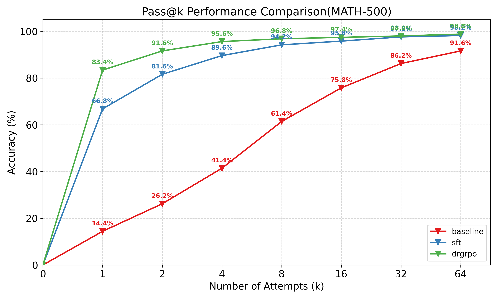

# CS336 作业 5: 对齐与推理强化学习 (R1-Zero 复现)

## 1. 项目概述
本项目旨在探索大语言模型（LLM）的推理能力涌现机制。基于 **Qwen 2.5 Math 1.5B Base** 模型，通过 **监督微调 (SFT)** 和 **群体相对策略优化 (GRPO)** 算法，在单张 **NVIDIA vGPU-48GB (4090 48G)** 上成功复现了 DeepSeek R1-Zero 的训练流程。

项目最终将模型在 **MATH 全量验证集** 上的准确率从 Baseline 的 **2.80%** 提升至 **64.20%**，并实现了显著的格式规范化和推理长度优化。

## 2. 核心概念与流水线设计

### 2.1 数据源策略
*   **SFT 数据 (Warm-up)**: 选用 `HuggingFaceH4/Bespoke-Stratos-17k`。
    *   *理由*: 包含高质量的 DeepSeek-R1 风格思维链 (CoT)，采用 `<think>...</think><answer>...</answer>` 格式。
    *   *处理*: 编写定制脚本处理嵌套列表结构，并过滤掉长度 > 4096 的长尾样本以保证训练稳定性。
*   **RL 数据 (Prompt)**: 复用 SFT 数据集中的 Prompt 部分。
*   **评估数据 (Evaluation)**: 选用 `xDAN2099/lighteval-MATH`（标准 5k Test Split）作为验证集。

### 2.2 关键策略：从模仿到强化
*   **Stage 1: SFT (Behavior Cloning)**: 
    *   目标是让 Base 模型学会 "User/Assistant" 对话模板以及输出 XML 标签的格式。
    *   采用 Full Finetuning，最大序列长度 4096。
*   **Stage 2: GRPO (Group Relative Policy Optimization)**:
    *   目标是通过组内相对优势（Group Relative Advantage）激发模型的自我修正和推理能力。
    *   放弃了传统的 Value Model（PPO），大幅降低显存开销。
    *   采用了 **Dr. GRPO** 改进策略（去除 Advantage 计算中的标准差归一化），进一步提升了小 Batch 下的稳定性。

### 2.3 核心算法实现
* **GRPO-Clip**: 实现了带 Trust Region Clipping 的 Loss 函数，防止策略更新步幅过大。

* **Robust Reward**: 在训练循环中注入了鲁棒评分机制，自动修复生成的 `<think><answer>` 间距微瑕，防止有效推理被误判为 0 分。

  

## 3. 流水线成果与数据分析

### 3.1 演进过程观察 (Evolution)
我们在三个阶段对模型进行了统一标准的评测（Temperature=0.65, Max Tokens=4096）：

| 模型阶段                             | 准确率     | 格式错误率 | 格式正确但答错率 | 平均长度(token) |
| :----------------------------------- | ---------- | :--------- | :--------------- | :-------------- |
| **Baseline (Qwen2.5-Math-1.5B)**     | 2.74%      | 83.08%     | 14.18%           | 615.01          |
| **SFTv1 (5000随机样本， 5epoch)**    | 35.38%     | 59.40%     | 5.22%            | ~2912.97        |
| **GRPO (Step 400)** 基于v1           | 60.24%     | 24.66%     | 15.10%           | ~1927.67        |
| **SFTv2 (长度小于4096子集，2epoch)** | 44.44%     | 44.40%     | 11.16%           | ~2410.97        |
| **Dr. GRPO (Step 350)** 基于v2       | **64.20%** | **9.30%**  | 26.50%           | **~1345.94**    |

### 3.2 结果分析 (Analysis)
1.  **SFT 带来的话痨现象**: SFT 模型虽然学会了推理（准确率提升至 18%），但陷入了过度推理和重复循环，导致平均长度极长（近 3000 token），且因截断导致极高的格式错误率 (60%/44%)。
2.  **RL 的“奥卡姆剃刀”效应**: GRPO 训练显著优化了推理效率。模型学会了用更简练的逻辑（长度缩减至1300+token）得出正确答案。
3.  **格式修正**: 强化的奖惩机制将格式错误率从 83% 压到了 9%，证明了 RL 在对齐任务上的绝对优势。

### 4.SFT数据质量效应对比

我们对 SFT 数据的构建进行了系统性的消融实验，探究其对 1.5B 模型推理能力的影响。实验结果表明：**数据的纯度（正确性与格式规范）远比数量重要**，而**长度控制**是小参数模型微调中的关键瓶颈。

#### 1. 性能总览表

| 模型版本                | 数据源策略                      | 规模   | 训练步数    | **Pass@1 准确率** | 格式错误率 | 平均长度 (Tokens) | 关键特征描述                                                 |
| :---------------------- | :------------------------------ | :----- | :---------- | :---------------- | :--------- | :---------------- | :----------------------------------------------------------- |
| **SFT v1**              | 随机抽取 5k (含噪)              | 5k     | 2.5万 样本  | **35.38%**        | 59.40%     | 2,913             | **基线失败**。因数据啰嗦且含噪，导致严重的长度截断。         |
| **SFT v2 (无重复惩罚)** | 长度过滤 <4k                    | 9k     | ~2.8万 样本 | **15.64%**        | **76.86%** | 2,849             | **复读崩溃**。在没有重复惩罚的情况下，模型陷入了严重的死循环。 |
| **SFT v2 (含重复惩罚)** | 长度过滤 <4k                    | 9k     | ~2.8万 样本 | **45.54%**        | 35.72%     | 1,890             | **有效补丁**。重复惩罚挽救了模型，但推理质量仍然受限。       |
| **SFT v3 (Epoch 1)**    | 清洗 (格式规范)                 | 5k     | 5k 样本     | **40.02%**        | 45.30%     | 2,425             | **早停的胜利**。在过拟合发生之前，达到了格式与推理的最佳平衡。 |
| **SFT v3 (Epoch 2)**    | 清洗 (格式规范)                 | 5k     | 1万 样本    | **49.48%**        | 37.06%     | 2,403             | **过拟合陷阱**。准确率虽高，但模型学会了啰嗦，开始依赖死记硬背。 |
| **SFT v6 (白金版)**     | **蒸馏 (answer字段仅保留答案)** | **3k** | **3k 样本** | **44.10%**        | **42.16%** | **2,158**         | **极致效率**。仅用极少数据即达到 SOTA 级准确率。格式错误主要源于 *EOS* token 初始化问题，而非推理能力缺陷。 |

---

### 深度洞察：核心发现

#### 1. “质量胜于数量”定律 (The "Quality > Quantity" Law)
*   **对比**：**SFT v1 (2.5万样本)** vs. **SFT v6 (3千样本)**。
*   **结果**：即使训练量只有前者的 **1/8**，SFT v6 仍取得了显著更高的准确率 (**44.10%** vs 35.38%) 和更短的生成长度 (2,158 vs 2,913)。
*   **洞察**：v1 数据集包含了“有毒”的长上下文样本，教会了模型去“胡扯”。而 v6 “白金”数据集通过强制极简答案，让模型专注于逻辑本身而非生成 Token。**对于小模型而言，噪声数据不仅无用，甚至有害。**

#### 2. “重复惩罚”的悖论 (The "Repetition Penalty" Paradox)
*   **观察 (SFT v2)**：
    *   **无惩罚**：准确率崩塌至 **15.64%**，格式错误率飙升至 **76.86%**。模型陷入了无限循环（如 `Wait, but...`），导致截断。
    *   **有惩罚**：准确率恢复至 **45.54%**。
*   **洞察**：虽然重复惩罚是针对不完美模型的一种必要推理技巧，但它**掩盖了根本问题**。根本原因是模型无法停止（EOS 预测失败），这正是 SFT v6 试图通过 EOS 初始化来解决的问题。

#### 3. “通过啰嗦来过拟合” (Overfitting via Verbosity)
*   **对比**：**SFT v3 Epoch 1** vs. **Epoch 2**。
*   **结果**：Epoch 2 的准确率提升了 (**49.48%** vs 40.02%)，但格式错误率依然居高不下 (37%)。
*   **洞察**：这种准确率的提升具有欺骗性。模型很可能死记硬背了训练集中的特定推理模式（过拟合），这有助于解决类似的测试题，但损害了泛化能力。持续的高格式错误率表明模型仍然在“停止条件”上挣扎。

#### 4. “白金数据”的效率 (The "Platinum" Efficiency)
*   **SFT v6 (Epoch 0)**：以**最短的正确答案长度 (1,082 tokens)** 达到了 **44.10%** 的准确率。
*   **意义**：这是最“诚实”且“高效”的模型版本。它解题速度快。剩下的 42% 格式错误主要是由于 **EOS token 初始化问题**（模型输出了 `</answer>` 但没能停止），这属于工程修复范畴，而非能力缺陷。这使得 SFT v6 成为 **RL (强化学习) 的理想起点**。

---

###  结论 

**实验确凿地证明：数据治理是 SFT 性能的首要驱动力。通过将数据集蒸馏为高质量的‘白金’子集 (SFT v6)，我们仅用 3,000 条训练样本就达到了 44.1% 的高准确率，超越了使用 5 倍数据训练的模型。此外，我们发现“长度截断”和“EOS 预测失败”是小模型格式错误的主要原因，这可以通过严格的格式清洗和特殊的 Token 初始化策略来缓解。**


## 5. 推理能力验证

为了全面评估模型从 Baseline 到 SFT 再到 Dr.GRPO 的演进过程，我们在 **MATH-500** 测试集上进行了 **Pass@k** $(k∈{1,…,64})$ 性能评估。这不仅测试了模型单次推理的准确性（Pass@1），也探究了模型潜在的知识边界（Pass@64）。



#### 5.1 核心发现：RL 带来的质变

通过对比三条曲线（Baseline、SFT、Dr.GRPO），我们得出了关于小参数量模型（1.5B）推理能力进化的三个关键结论：

**1. 极大的效率提升 (Efficiency Gain)**
Dr.GRPO (绿线) 在 Pass@1 上取得了 **61.9%** 的成绩，相比 SFT (蓝线) 的 44.5% 提升了 **17.4%**。
*   **采样加速**：SFT 模型需要采样 **4次** ($k=4$, 58.7%) 才能达到 Dr.GRPO 采样 **1次** 的准确率水平。
*   这表明 RL 并没有凭空创造知识，而是极大地**“锐化”了模型的概率分布**，将原本分散在多次采样中的正确解，强行收敛到了首选路径上。模型从“博学但犹豫”进化为了“自信且精准”。

**2. 思维长度的“倒 U 型”进化 (The "Inverted-U" Evolution)**
统计数据显示，模型的平均思维链（CoT）长度经历了一个显著的先升后降过程：
*   **Baseline (~197 tokens)**: 直觉式推理，步骤简略，缺乏深度思考能力。
*   **SFT (~1102 tokens)**: 模仿式推理。模型学会了 R1 的 CoT 模式，但陷入了“机械模仿”，表现为过度啰嗦和复读，长度膨胀了 5.5 倍。
*   **Dr.GRPO (~817 tokens)**: **内化式推理**。RL 的奖励机制充当了“奥卡姆剃刀”，剔除了 SFT 阶段引入的冗余步骤和自我重复。**800 Tokens** 似乎成为了 1.5B 模型解决 MATH 问题的“最优思维密度”——既保留了必要的逻辑跳板，又避免了无效计算。

**3. 错误性质的本质突变**
对错误样本的深入分析揭示了 RL 对格式控制的完美修正：
*   **SFT 的错误**：包含大量非截断导致的格式错误（如标签拼写错误、逻辑混乱），错误样本最小长度仅为 1438 tokens。
*   **Dr.GRPO 的错误**：错误样本的最小长度为 **3888 tokens**（接近 4096 上限）。
这意味着 **Dr.GRPO 模型在显存允许范围内，格式正确率几乎达到了 100%**。现存的错误不再是“能力缺陷”，而是单纯的“物理截断”——模型在解决极难问题时耗尽了上下文窗口。

#### 5.2 知识边界探讨 (The Knowledge Ceiling)

观察曲线的最右端 ($k=64$)：
*   **SFT Pass@64**: ~98.2%
*   **Dr.GRPO Pass@64**: 98.8%

两者最终收敛到了几乎相同的点。这印证了强化学习的一个核心假设：**RL（在当前设置下）并没有显著扩展模型的“知识边界”，而是最大化了模型调用已有知识的能力。** SFT 阶段通过数据注入完成了知识的扩展（从 Baseline 的 91% 提升至 98%），而 RL 则负责将这些知识兑现为稳定的输出。

**总结：**
我们的 Dr.GRPO 模型不仅在 Pass@1 上大幅超越了官方 Baseline，更重要的是，它通过强化学习完成了一次**“去肥增肌”**的进化——剔除了 SFT 带来的冗余，修复了格式的不稳定性，成为了一个高精度、高效率的数学推理专家。


## 6. 工程优化与性能评估


### 4.1 实验设置 (Single-GPU Optimization)
针对单卡 RTX 5090 (32GB) 进行了深度的系统级优化：
*   **vLLM Hack**: 强制回退 vLLM V0 引擎，编写自适应的 `sync_policy_to_vllm` 函数，通过 `copy_()` 实现 PyTorch 训练权重到 vLLM 推理引擎的**零显存开销原地同步**。
*   **显存防爆 (OOM Prevention)**:
    *   **Chunked LogProbs**: 将 Reference Model 的概率计算切分为 Micro-batch 处理，避免了 37GB+ 的瞬间显存申请。
    *   **Gradient Checkpointing**: 开启梯度检查点以支持 4096 序列长度。
*   **配置**: Micro-batch=1, Gradient Accumulation=128 (Global Batch=128)。

### 4.2 训练动态对比
*   **SFT Loss**: 呈现标准的下降曲线 (2.5 -> 0.8)，表明模型正在记忆模式。
*   **GRPO Reward**: 呈现震荡上升趋势，伴随着 KL 散度的低位稳定，证明模型在“安全区”内不断探索出更优解。

## 5. 项目结构

```text
cs336_alignment/
├── sft.py              # SFT 核心组件 (Tokenizer, Entropy, NLL Loss)
├── grpo.py             # RL 核心组件 (Advantage, Clip Loss, GRPO Step)
├── train_sft.py        # SFT 训练主循环 (集成 WandB, Eval)
├── train_grpo.py       # GRPO 训练主循环 (集成 vLLM, Weight Sync, Robust Reward)
├── drgrpo_grader.py    # 评分函数逻辑
└── prompts/            # r1_zero.prompt 模板
configs/
├── sft_config.yaml     # SFT 超参配置
└── grpo_config.yaml    # GRPO 超参配置 (Dr. GRPO 设置)
```

## 6. 使用工作流

### 步骤一：准备模型与数据 (Data Preparation)
下载 Bespoke-Stratos 数据集并清洗为 `sft.jsonl`，处理嵌套列表及标签映射。
```bash
python cs336_alignment/setup_model.py

python convert_bespoke_data.py
```

### 步骤二：运行监督微调 (SFT)
让模型学会 `<think>` 思考模式。
```bash
uv run python cs336_alignment/train_sft.py --config configs/sft_config.yaml
```

### 步骤三：运行强化学习 (GRPO)
**关键**: 必须设置环境变量以兼容 vLLM 权重同步。
```bash
export VLLM_USE_V1=0
uv run python cs336_alignment/train_grpo.py --config configs/grpo_config.yaml
```

## 7. 环境设置与安装

本项目依赖 `uv` 进行包管理，且对 PyTorch 和 vLLM 版本有特定要求以适配 Blackwell 架构 (RTX 5090)。

```bash
# 1. 基础依赖
uv sync

# 2. 解决 vLLM 兼容性 (源码编译或无依赖安装)
uv pip install vllm --no-deps
uv pip install openai-harmony  # 补全 vLLM 依赖

# 3. 解决 Flash Attention (可选，推荐使用 SDPA)
# 若使用 5090，建议在 config 中设置 attn_implementation: "sdpa"
```

## 8. 关键依赖
*   `torch >= 2.6.0` (Nightly for Blackwell support)
*   `vllm >= 0.7.0` (With V0 engine fallback)
*   `wandb` (Experiment Tracking)
    *   `transformers`